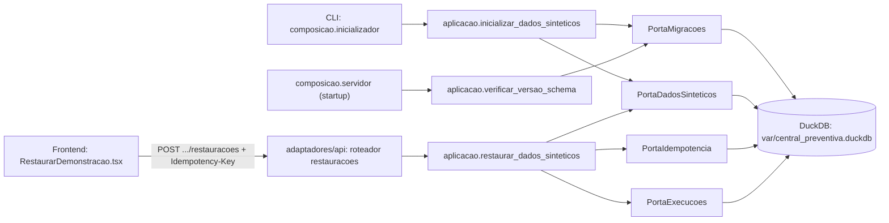

# Inicializar e Restaurar Dados Sintéticos Design

**Spec**: `.specs/features/1-2-inicializar-e-restaurar-dados-sinteticos/spec.md`
**Context**: `.specs/features/1-2-inicializar-e-restaurar-dados-sinteticos/context.md`
**Status**: Approved (Approach A)

---

## Architecture Overview

A CLI entrypoint (`composicao.inicializador`) applies pending schema migrations and seeds the synthetic reference dataset, following the existing ports-and-adapters layering (`dominio` → `aplicacao` → `adaptadores/persistencia` → `composicao`). The server startup path reuses the same version-check logic to refuse starting against a pending or future schema, without auto-migrating. Restore is a synchronous REST command (`POST /api/v1/dados-sinteticos/restauracoes`) guarded by a generic idempotency store and the non-terminal-execution check, wired to a small self-contained frontend page.



---

## Code Reuse Analysis

### Existing Components to Leverage

| Component | Location | How to Use |
| --- | --- | --- |
| `Configuracao` / `obter_configuracao` | `src/backend/central_preventiva/composicao/configuracao.py` | Extend with a `caminho_banco` field (path to the DuckDB file), following the same `BaseSettings` + explicit-error pattern already used for `host_api`/`origem_frontend`. |
| FastAPI app factory | `src/backend/central_preventiva/composicao/api.py` | Register the new `restauracoes` router the same way `roteador_saude` is registered, under `/api/v1`. |
| `servidor.py` entrypoint pattern | `src/backend/central_preventiva/composicao/servidor.py` | Mirror its shape for the new `inicializador.py` CLI entrypoint (validate config/state, act, exit with a clear error). |
| Layered `aplicacao`/`adaptadores/http` split | `central_preventiva/aplicacao/saude.py` + `adaptadores/http/saude.py` | Same shape for `restauracao`: a pure `aplicacao` function returning a dataclass result, an `adaptadores/http` router translating it to a Pydantic response model. |
| `test_camadas.py` layering enforcement | `src/backend/testes/test_camadas.py` | No change needed for this story (it only checks `dominio`); extend it in a future story if `aplicacao` boundary rules need the same enforcement. |
| `@fontsource/*`, `@phosphor-icons/react` already installed | `src/frontend/package.json` | Reuse for the restore page/modal styling and icons instead of adding new UI dependencies. |

### Integration Points

| System | Integration Method |
| --- | --- |
| DuckDB file (`var/central_preventiva.duckdb`) | Opened via an explicit, short-lived connection per operation (`adaptadores/persistencia/conexao.py`), never a shared global connection — matches AD-2/"Persistência" convention. |
| FastAPI `/api/v1` | New plural resource `dados-sinteticos/restauracoes`; JSON in `snake_case`; errors as `application/problem+json` with `codigo`/`correlacao_id`, matching the existing app factory's conventions. |
| Frontend → Backend | Plain `fetch` in a small isolated module (`src/frontend/src/api/dadosSinteticos.ts`) — not the OpenAPI-generated client, which arrives in História 1.5. |

---

## Components

### `dominio/estados_execucao.py`

- **Purpose**: Canonical `ExecucaoPreventiva` state enum and terminal/non-terminal classification — the one piece of domain logic this story needs.
- **Location**: `src/backend/central_preventiva/dominio/estados_execucao.py`
- **Interfaces**:
  - `EstadoExecucao` (`StrEnum`) — the 12 states from `ARCHITECTURE-SPINE.md` AD-4: `coletando`, `falhou_coleta`, `sem_risco`, `avaliando_elegibilidade`, `sem_elegiveis`, `aguardando_geracao`, `falhou_preparacao_ia`, `processando_mensagens`, `aguardando_revisao`, `aguardando_confirmacao`, `simulando`, `falhou_simulacao`, `concluida`.
  - `ESTADOS_TERMINAIS: frozenset[EstadoExecucao]` — `falhou_coleta`, `sem_risco`, `sem_elegiveis`, `falhou_preparacao_ia`, `falhou_simulacao`, `concluida`.
  - `eh_terminal(estado: EstadoExecucao) -> bool`
- **Dependencies**: none (pure).
- **Reuses**: nothing; this is the first domain module in the project.

### `aplicacao/portas_persistencia.py`

- **Purpose**: `Protocol` definitions the use cases depend on, implemented by `adaptadores/persistencia`.
- **Location**: `src/backend/central_preventiva/aplicacao/portas_persistencia.py`
- **Interfaces**:
  - `PortaMigracoes.versao_registrada() -> int | None`
  - `PortaMigracoes.aplicar_pendentes() -> ResultadoMigracao` — raises `VersaoSchemaFutura` or `MigracaoFalhou`.
  - `PortaDadosSinteticos.esta_semeado() -> bool`
  - `PortaDadosSinteticos.semear() -> None`
  - `PortaDadosSinteticos.restaurar() -> None` — single transaction, delete + reinsert.
  - `PortaExecucoes.existe_execucao_nao_terminal() -> bool`
  - `PortaIdempotencia.buscar(chave: str, operacao: str) -> RespostaRegistrada | None`
  - `PortaIdempotencia.registrar(chave: str, operacao: str, hash_requisicao: str, status: int, corpo: str) -> None`
- **Dependencies**: `dominio.estados_execucao` (for typing only).
- **Reuses**: none — first ports module.

### `aplicacao/inicializacao.py`

- **Purpose**: Orchestrates migration + seed for the CLI entrypoint and the server startup's version check.
- **Location**: `src/backend/central_preventiva/aplicacao/inicializacao.py`
- **Interfaces**:
  - `inicializar_dados_sinteticos(portas: PortasInicializacao) -> ResultadoInicializacao` — applies pending migrations, seeds if not already seeded, returns whether work was done or `"ja_preparado"`.
  - `verificar_versao_schema(portas: PortasInicializacao) -> None` — read-only check used by `servidor.py`; raises `VersaoSchemaFutura` or `MigracoesPendentes` without mutating anything.
- **Dependencies**: `PortaMigracoes`, `PortaDadosSinteticos`.
- **Reuses**: `portas_persistencia`.

### `aplicacao/restauracao.py`

- **Purpose**: Orchestrates the restore command: idempotency check, active-execution guard, transactional restore, idempotency registration.
- **Location**: `src/backend/central_preventiva/aplicacao/restauracao.py`
- **Interfaces**:
  - `restaurar_dados_sinteticos(portas: PortasRestauracao, chave_idempotencia: str, hash_requisicao: str) -> ResultadoRestauracao` — raises `ExecucaoAtivaImpedeRestauracao`, `ConflitoIdempotencia`, or `NaoInicializado`.
- **Dependencies**: `PortaIdempotencia`, `PortaExecucoes`, `PortaDadosSinteticos`.
- **Reuses**: `portas_persistencia`, `dominio.estados_execucao` (via `PortaExecucoes`'s implementation).

### `adaptadores/persistencia/conexao.py`

- **Purpose**: Explicit, short-lived DuckDB connection helper — one per repository call, never a shared global.
- **Location**: `src/backend/central_preventiva/adaptadores/persistencia/conexao.py`
- **Interfaces**: `abrir_conexao(caminho: Path) -> AbstractContextManager[duckdb.DuckDBPyConnection]`
- **Dependencies**: `duckdb`.
- **Reuses**: none.

### `adaptadores/persistencia/migracoes.py` + `migracoes/0001_schema_inicial.sql`

- **Purpose**: Ordered, versioned list of DDL migrations and the executor that applies them.
- **Location**: `src/backend/central_preventiva/adaptadores/persistencia/migracoes.py` (+ a `migracoes/` folder of numbered `.sql` files loaded via `importlib.resources`)
- **Interfaces**: `ExecutorMigracoes` implementing `PortaMigracoes` — reads `schema_migracoes`, compares against the known migration list, applies pending ones in order, each inside its own `BEGIN`/`COMMIT`, recording success in `schema_migracoes` before moving to the next; on failure, rolls back the failing migration and halts (prior ones stay committed).
- **Dependencies**: `conexao`, `duckdb`.
- **Reuses**: `conexao`.

### `adaptadores/persistencia/semeador.py`

- **Purpose**: Canonical synthetic dataset (segurados, apólices, regras, eventos, elegibilidades históricas) as a pure Python data structure, plus the seed/restore operations.
- **Location**: `src/backend/central_preventiva/adaptadores/persistencia/semeador.py`
- **Interfaces**: `SemeadorDadosSinteticos` implementing `PortaDadosSinteticos`; internal `dataset_sintetico_v1() -> ConjuntoSintetico` reused by both `semear()` (insert-only, first run) and `restaurar()` (delete-then-reinsert within one transaction).
- **Dependencies**: `conexao`.
- **Reuses**: `conexao`; the same dataset function backs both operations so seed and restore can never drift apart.

### `adaptadores/persistencia/repositorio_execucoes.py`

- **Purpose**: Implements the restore guard's read.
- **Location**: `src/backend/central_preventiva/adaptadores/persistencia/repositorio_execucoes.py`
- **Interfaces**: `RepositorioExecucoes` implementing `PortaExecucoes.existe_execucao_nao_terminal` — `SELECT EXISTS(SELECT 1 FROM execucao_preventiva WHERE estado NOT IN (<ESTADOS_TERMINAIS>))`.
- **Dependencies**: `conexao`, `dominio.estados_execucao.ESTADOS_TERMINAIS`.
- **Reuses**: `conexao`.

### `adaptadores/persistencia/repositorio_idempotencia.py`

- **Purpose**: Generic key/hash/response store for `Idempotency-Key`, scoped by operation name so future endpoints (Epic 2/3 mutable `POST`s) can reuse the same table without redesign.
- **Location**: `src/backend/central_preventiva/adaptadores/persistencia/repositorio_idempotencia.py`
- **Interfaces**: `RepositorioIdempotencia` implementing `PortaIdempotencia`.
- **Dependencies**: `conexao`.
- **Reuses**: `conexao`.

### `adaptadores/api/dados_sinteticos.py`

- **Purpose**: HTTP surface for restore.
- **Location**: `src/backend/central_preventiva/adaptadores/api/dados_sinteticos.py`
- **Interfaces**: `POST /api/v1/dados-sinteticos/restauracoes` — requires `Idempotency-Key` header; `201` with `RespostaRestauracao {status, restaurado_em}` on success; `application/problem+json` for `409` (conflict/active execution) and `422`/`500` failure paths.
- **Dependencies**: `aplicacao.restauracao`, composed repositories from `composicao`.
- **Reuses**: the `saude.py` router's shape (Pydantic model + thin translation from the `aplicacao` result).

### `composicao/inicializador.py`

- **Purpose**: CLI entrypoint mirroring `servidor.py`'s shape — `uv run --directory src/backend python -m central_preventiva.composicao.inicializador`.
- **Location**: `src/backend/central_preventiva/composicao/inicializador.py`
- **Interfaces**: `executar() -> None`
- **Dependencies**: `Configuracao`, the concrete `adaptadores/persistencia` implementations, `aplicacao.inicializacao`.
- **Reuses**: `servidor.py`'s validate-then-act pattern.

### `composicao/servidor.py` (extended)

- **Purpose**: Add a startup call to `aplicacao.inicializacao.verificar_versao_schema` before `uvicorn.run`, so the server refuses to start against a pending or future schema instead of serving against a stale/mismatched database.
- **Location**: `src/backend/central_preventiva/composicao/servidor.py`
- **Dependencies**: adds `aplicacao.inicializacao`, the concrete persistence adapters.
- **Reuses**: existing `executar()` structure.

### Frontend: `src/api/dadosSinteticos.ts` + `src/componentes/Modal.tsx` + `src/funcionalidades/dados-sinteticos/RestaurarDemonstracao.tsx`

- **Purpose**: Minimal, self-contained restore surface: a page with a "Restaurar demonstração" action, a confirmation modal (focus trap, `Esc`, focus return per `UX-DR20`), and a `fetch`-based call carrying a generated `Idempotency-Key`.
- **Location**: `src/frontend/src/api/dadosSinteticos.ts`, `src/frontend/src/componentes/Modal.tsx`, `src/frontend/src/funcionalidades/dados-sinteticos/RestaurarDemonstracao.tsx`
- **Interfaces**: `restaurarDadosSinteticos(): Promise<ResultadoRestauracao>`; `<Modal titulo objeto impacto onConfirmar onFechar>`.
- **Dependencies**: `@phosphor-icons/react` for iconography (already installed).
- **Reuses**: existing `@fontsource` tokens/fonts already in `package.json`; no new dependency added.

---

## Data Models

```sql
-- Migration ledger (versioning + interrupted-migration recovery)
CREATE TABLE schema_migracoes (
    versao       INTEGER PRIMARY KEY,
    descricao    VARCHAR NOT NULL,
    aplicada_em  TIMESTAMP NOT NULL DEFAULT now()
);

-- Reference/master data the seed provides
CREATE TABLE segurados (
    id                    UUID PRIMARY KEY,
    nome                  VARCHAR NOT NULL,
    codigo_ibge_area      VARCHAR NOT NULL,
    canal_preferido       VARCHAR NOT NULL CHECK (canal_preferido IN ('whatsapp', 'email', 'sms')),
    participa_de_alertas  BOOLEAN NOT NULL DEFAULT true,
    criado_em             TIMESTAMP NOT NULL DEFAULT now(),
    atualizado_em         TIMESTAMP NOT NULL DEFAULT now()
);

CREATE TABLE apolices (
    id                        UUID PRIMARY KEY,
    segurado_id               UUID NOT NULL,  -- logical FK to segurados(id), see note below
    numero                    VARCHAR NOT NULL,
    tipo                      VARCHAR NOT NULL CHECK (tipo IN ('residencial', 'automovel')),
    situacao                  VARCHAR NOT NULL CHECK (situacao IN ('ativa', 'cancelada', 'suspensa')),
    vigencia_inicio           DATE NOT NULL,
    vigencia_fim              DATE NOT NULL,
    coberturas                VARCHAR[] NOT NULL,
    endereco_risco_sintetico  VARCHAR NOT NULL,
    codigo_ibge_area          VARCHAR NOT NULL,
    criado_em                 TIMESTAMP NOT NULL DEFAULT now(),
    atualizado_em              TIMESTAMP NOT NULL DEFAULT now()
);

CREATE TABLE regras (
    id                    UUID PRIMARY KEY,
    evento_tipo           VARCHAR NOT NULL CHECK (evento_tipo IN ('chuva_intensa', 'granizo')),
    limiar_meteorologico  DOUBLE NOT NULL,
    area_aplicavel        VARCHAR NOT NULL,
    apolice_tipo          VARCHAR NOT NULL CHECK (apolice_tipo IN ('residencial', 'automovel')),
    cobertura_exigida     VARCHAR NOT NULL,
    antecedencia_horas    INTEGER NOT NULL,
    canal                 VARCHAR NOT NULL,
    versao                INTEGER NOT NULL DEFAULT 1,
    estado                VARCHAR NOT NULL CHECK (estado IN ('ativa', 'substituida')) DEFAULT 'ativa',
    criado_em              TIMESTAMP NOT NULL DEFAULT now()
);

CREATE TABLE eventos_meteorologicos (
    id                  UUID PRIMARY KEY,
    tipo                VARCHAR NOT NULL CHECK (tipo IN ('chuva_intensa', 'granizo')),
    area                VARCHAR NOT NULL,
    periodo_inicio      TIMESTAMP NOT NULL,
    periodo_fim         TIMESTAMP NOT NULL,
    intensidade         DOUBLE NOT NULL,
    proveniencia        VARCHAR NOT NULL CHECK (proveniencia IN ('real_inmet', 'sintetico')),
    instante_observado  TIMESTAMP NOT NULL,
    criado_em           TIMESTAMP NOT NULL DEFAULT now()
);

CREATE TABLE elegibilidades_historicas (
    id            UUID PRIMARY KEY,
    evento_id     UUID NOT NULL,  -- logical FK to eventos_meteorologicos(id)
    regra_id      UUID NOT NULL,  -- logical FK to regras(id)
    segurado_id   UUID NOT NULL,  -- logical FK to segurados(id)
    apolice_id    UUID NOT NULL,  -- logical FK to apolices(id)
    elegivel      BOOLEAN NOT NULL,
    justificativa VARCHAR NOT NULL,
    criado_em     TIMESTAMP NOT NULL DEFAULT now()
);

-- Minimal shell; Epic 2/3 extend this table with its full aggregate structure
CREATE TABLE execucao_preventiva (
    id             UUID PRIMARY KEY,
    estado         VARCHAR NOT NULL,  -- values: dominio.estados_execucao.EstadoExecucao
    versao         INTEGER NOT NULL DEFAULT 1,
    criado_em      TIMESTAMP NOT NULL DEFAULT now(),
    atualizado_em  TIMESTAMP NOT NULL DEFAULT now()
);

-- Generic idempotency store, reusable by future mutable POST endpoints
CREATE TABLE chaves_idempotencia (
    chave            VARCHAR NOT NULL,
    operacao         VARCHAR NOT NULL,
    hash_requisicao  VARCHAR NOT NULL,
    resposta_status  INTEGER NOT NULL,
    resposta_corpo   VARCHAR NOT NULL,
    criado_em        TIMESTAMP NOT NULL DEFAULT now(),
    PRIMARY KEY (chave, operacao)
);
```

**Relationships**: `apolices.segurado_id → segurados.id`; `elegibilidades_historicas` references all four of `eventos_meteorologicos`, `regras`, `segurados`, `apolices` — it is pre-computed demo reference data, not something Epic 2's live risk/eligibility logic writes to (that logic, when built, will write its own `ELEGIBILIDADE` rows scoped to a real `execucao_preventiva`, per the architecture spine's ER diagram). `execucao_preventiva` has no children yet in this story; Epic 2/3 add them via later migrations against the same table.

**As implemented, none of these relationships are declared as DuckDB `REFERENCES` constraints** — see `AD-005` in `.specs/STATE.md` and `src/backend/central_preventiva/adaptadores/persistencia/README.md`. DuckDB does not defer FK checks within a transaction, which made the `SEED-09` single-transaction restore incompatible with enforced FKs (confirmed against `duckdb/duckdb#13819`). Relationships are documented (in the migration file's comments and the persistence README) and relied on as logical-only; the versioned seed is the sole writer of these tables in this story.

---

## Error Handling Strategy

| Error Scenario | Handling | User Impact |
| --- | --- | --- |
| DuckDB file missing/empty at init | Apply all migrations, then seed, in the CLI command | CLI reports success with what was created |
| Init re-run, nothing pending | No migrations applied, seed already present → no-op | CLI reports "dados já preparados" |
| `schema_migracoes` version newer than code knows | Refuse to start (CLI and server), no mutation | Explicit PT-BR error naming the mismatch |
| Migration N fails mid-sequence | Migrations 1..N-1 stay committed; N is not recorded; halt | CLI/server error identifies migration N; rerun after fix resumes from N |
| Restore requested, `execucao_preventiva` has a non-terminal row | Refuse, no mutation | `409` problem+json: "uma execução ativa impede a restauração" |
| Restore transaction fails partway | Transaction rolled back; previous dataset intact | `500`/terminal `Falha` state; frontend shows occurrence, impact, safe next action |
| `Idempotency-Key` replayed, same request hash | Return the stored response; no new restore runs | Identical response as the original request |
| `Idempotency-Key` reused, different request hash | Refuse | `409` problem+json, no effect |
| Restore requested before any successful init | Refuse | Explicit error directing the operator to run initialization first |

---

## Risks & Concerns

| Concern | Location | Impact | Mitigation |
| --- | --- | --- | --- |
| First DuckDB usage in the repo — no existing connection/transaction test fixtures | `src/backend/testes/` (none yet) | Tasks would each reinvent DB setup/teardown if not addressed early | Tasks phase creates one shared `tmp_path`-based DuckDB fixture before any table-specific task |
| Ad-hoc frontend `fetch` + hand-rolled `Modal` built ahead of História 1.5's OpenAPI client and 1.4's navigation shell | `src/frontend/src/api/dadosSinteticos.ts`, `src/frontend/src/componentes/Modal.tsx` | Some rework expected once 1.4/1.5 land (routing, generated types) | Keep the `fetch` call isolated to one small module (only its internals change under 1.5) and `Modal` generic/prop-driven (reusable, not restore-specific) — recorded as `AD-003` |
| DuckDB is single-writer; CLI init and a running server both opening the file could race | `composicao/inicializador.py`, `composicao/servidor.py` | A concurrent init while the server is up could fail or block | Document in the README that init must complete before starting the server; server startup's version check is read-only and fails safely rather than corrupting state if run concurrently |

> No security, unbounded-loop, or N+1 concerns identified — this story has no untrusted external input beyond the `Idempotency-Key` header, which is treated as an opaque string.

---

## Tech Decisions (only non-obvious ones)

| Decision | Choice | Rationale |
| --- | --- | --- |
| Seed dataset representation | A pure Python function (`dataset_sintetico_v1()`), not a raw SQL insert script | Reused verbatim by both `semear()` and `restaurar()` so they can never drift apart; easy to assert row shapes in tests |
| Migration format | Versioned `.sql` files + a small Python executor, no third-party migration library | DuckDB has no dominant migration framework in this stack; a versioned-list-of-SQL approach adds zero new dependencies |
| Restore HTTP status | `201 Created` on success (not `202 Accepted`) | Restore is synchronous and local-only (no INMET/OpenAI calls); AD-7's async/202 pattern is reserved for genuinely long operations, and NFR4's 1s p95 budget applies directly here |
| Init trigger | Explicit CLI command (`composicao.inicializador`), not automatic on every server boot | Matches "o mesmo comando" language in the BMAD acceptance criteria and NFR14's "reproduzível apenas pelos comandos documentados no README"; server startup only *verifies* schema currency, it never migrates implicitly |

> **Project-level decisions:** the migration-ledger mechanism, the generic idempotency store, the ad-hoc-frontend-ahead-of-1.5 trade-off, and the early `EstadoExecucao` domain module all set conventions future stories must follow — recorded as `AD-001`–`AD-004` in `.specs/STATE.md`.
