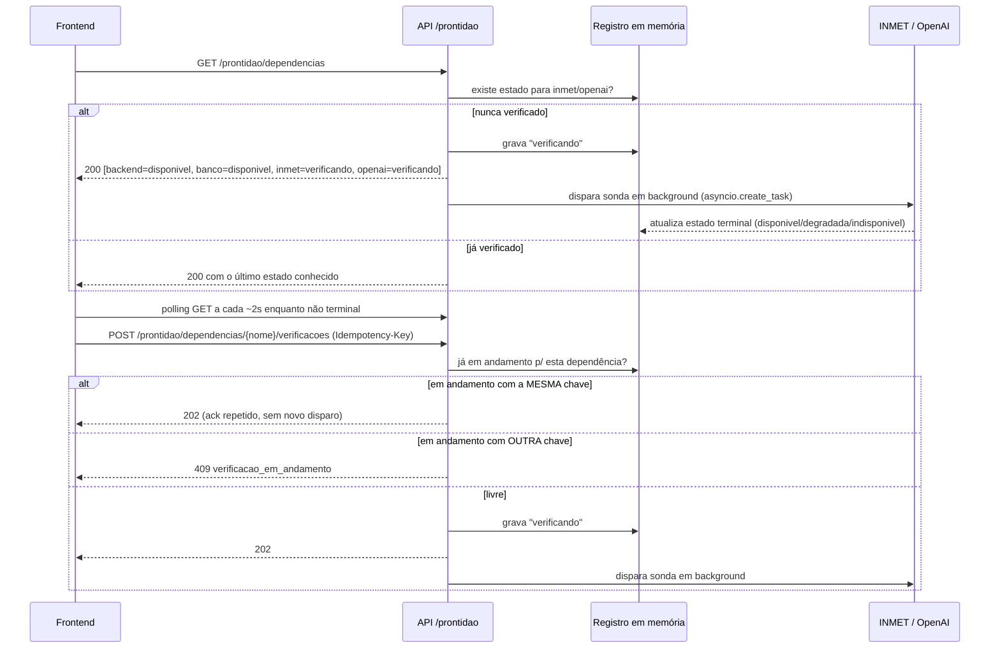

# História 1.3: Verificar a Prontidão das Dependências — Design

**Spec**: `.specs/features/1-3-verificar-a-prontidao-das-dependencias/spec.md`
**Context**: `.specs/features/1-3-verificar-a-prontidao-das-dependencias/context.md`
**Status**: Draft

---

## Architecture Overview

**Recommended approach: "GET inicializa, POST força."** `GET /prontidao/dependencias` é a única fonte de verdade da superfície: na primeira chamada, para cada dependência externa (INMET, OpenAI) sem estado ainda registrado, o próprio GET dispara a verificação em segundo plano (`asyncio.create_task`) e responde `Verificando`; chamadas seguintes só leem o estado em memória. `POST /prontidao/dependencias/{nome}/verificacoes` é a ação explícita de "verificar novamente", protegida por `Idempotency-Key` reaproveitando a tabela genérica `chaves_idempotencia` (AD-002). Backend e DuckDB são recomputados de forma síncrona e inline a cada GET (baratos, sem I/O de rede), nunca passam por `Verificando`.

Isto resolve a ambiguidade "quem dispara a checagem automática ao carregar a superfície" sem introduzir um hook de `startup` nem exigir que o frontend dispare um POST ao montar a tela: o primeiro `GET` já é a inicialização.

**Alternativas consideradas:**

1. **Backend dispara os 4 checks no `startup` do FastAPI.** Mais "automático", mas re-verifica só uma vez por processo — um `GET` numa aba nova horas depois nunca atualiza sozinho, e um teste de app precisaria simular o evento de `startup`. Rejeitada: acopla "prontidão inicial" ao ciclo de vida do processo, não ao carregamento da superfície como o AC pede.
2. **Frontend dispara um POST para as 4 dependências ao montar a tela, GET é só leitura.** Funciona, mas duplica trigger logic (POST cobre "auto" e "manual" de formas ligeiramente diferentes) e cria uma corrida real entre a primeira leitura (GET, que veria "nunca verificada") e o POST ainda em voo. Rejeitada em favor de "GET inicializa" por ser mais simples e sem estado transitório extra a modelar.

**Recomendação:** abordagem 1 do parágrafo inicial ("GET inicializa, POST força") — menor superfície de estados, sem novo hook de ciclo de vida, idempotência aplicada só onde há efeito colateral real (o POST).



---

## Code Reuse Analysis

### Existing Components to Leverage

| Component | Location | How to Use |
| --- | --- | --- |
| `RepositorioIdempotencia` + `chaves_idempotencia` | `adaptadores/persistencia/repositorio_idempotencia.py` | Reused as-is (AD-002) para o `POST .../verificacoes`; operação escopada por dependência (`verificar_prontidao:inmet`, etc.) |
| Padrão `problem+json` + `problema()` | `adaptadores/http/dados_sinteticos.py` | Copiado/generalizado para o novo roteador — mesmo formato de erro (`codigo`, `correlacao_id`, `ocorrencia`, `impacto`, `proxima_acao`) |
| `abrir_conexao` | `adaptadores/persistencia/conexao.py` | Usado pela sonda DuckDB (`SELECT 1`) |
| `EstadoExecucao` / `eh_terminal` (padrão, não o código) | `dominio/estados_execucao.py` | Mesmo padrão (StrEnum + frozenset de terminais + função `eh_terminal`) replicado para `EstadoProntidao` |
| `consultar_saude()` | `aplicacao/saude.py` | Reusado pela sonda de backend — backend "disponível" é, por definição, o mesmo fato que `/saude` já verifica |
| `Configuracao` (pydantic-settings, `.env`) | `composicao/configuracao.py` | Estendida com `chave_openai: SecretStr | None` e `url_base_inmet: str`, mesmo padrão de validação estrita |
| `criar_roteador(configuracao)` factory + registro em `composicao/api.py` | `adaptadores/http/dados_sinteticos.py`, `composicao/api.py` | Mesmo padrão para o novo roteador de prontidão |

### Integration Points

| System | Integration Method |
| --- | --- |
| DuckDB (`chaves_idempotencia`) | Somente para o `POST` (dedup); o estado de prontidão em si NUNCA toca o banco (decisão: em memória) |
| INMET (rede real) | `httpx.AsyncClient` com timeout curto, chamado só pela sonda, nunca em teste unitário/de contrato (dublê via `PortaSonda`) |
| OpenAI (rede real) | `httpx.AsyncClient`, `Authorization: Bearer <chave>`, chamado só se a chave estiver presente |
| FastAPI app | Novo roteador incluído em `composicao/api.py`, prefixo `/api/v1` |

---

## Components

### `dominio/estados_prontidao.py`

- **Purpose**: Enum canônico dos estados de uma dependência e sua classificação terminal.
- **Location**: `central_preventiva/dominio/estados_prontidao.py`
- **Interfaces**:
  - `EstadoProntidao(StrEnum)`: `VERIFICANDO`, `DISPONIVEL`, `DEGRADADA`, `INDISPONIVEL`
  - `ESTADOS_TERMINAIS: frozenset[EstadoProntidao]` — tudo exceto `VERIFICANDO`
  - `eh_terminal(estado: EstadoProntidao) -> bool`
- **Dependencies**: nenhuma
- **Reuses**: mesmo padrão de `dominio/estados_execucao.py`

### `aplicacao/portas_prontidao.py`

- **Purpose**: Contratos (Protocol) e tipos compartilhados do caso de uso de prontidão.
- **Location**: `central_preventiva/aplicacao/portas_prontidao.py`
- **Interfaces**:
  - `ResultadoSonda` (`dataclass`): `estado: EstadoProntidao` (nunca `VERIFICANDO`), `causa: str | None`, `latencia_ms: float | None`
  - `EstadoDependencia` (`dataclass`): `nome: NomeDependencia`, `estado: EstadoProntidao`, `verificado_em: datetime | None`, `causa: str | None`, `impacto: str`, `acao_disponivel: str`
  - `NomeDependencia = Literal["backend", "banco_dados", "inmet", "openai"]`
  - `PortaSonda(Protocol)`: `async def verificar(self) -> ResultadoSonda`
  - `VerificacaoEmAndamento(RuntimeError)`: chave diferente da que já está em voo para a dependência
  - `DependenciaDesconhecida(RuntimeError)`: nome fora de `NomeDependencia`
- **Dependencies**: `dominio/estados_prontidao.py`
- **Reuses**: estilo de `aplicacao/portas_persistencia.py` (dataclasses `frozen=True, slots=True`, exceções com mensagem PT-BR pronta)

### `aplicacao/prontidao.py`

- **Purpose**: Caso de uso — registro em memória, orquestração de GET (get-or-start) e POST (forçar nova verificação), sondas síncronas inline para backend/DuckDB.
- **Location**: `central_preventiva/aplicacao/prontidao.py`
- **Interfaces**:
  - `class RegistroProntidao`: guarda `dict[NomeDependencia, EstadoDependencia]` + `dict[NomeDependencia, str]` (chave de idempotência em voo) + `asyncio.Lock` por dependência. Injetado (singleton por processo, criado na composição — nunca global mutável importado direto).
  - `async def consultar_prontidao(portas: PortasProntidao, registro: RegistroProntidao) -> tuple[EstadoDependencia, ...]` — recomputa backend/DuckDB inline; para inmet/openai, se ausente no registro, marca `VERIFICANDO` e dispara `asyncio.create_task(_executar_sonda(...))`; devolve o snapshot atual das 4.
  - `async def solicitar_nova_verificacao(portas: PortasProntidao, registro: RegistroProntidao, nome: NomeDependencia, chave_idempotencia: str, hash_requisicao: str) -> EstadoDependencia` — só se aplica a `inmet`/`openai` (ver Tech Decisions); usa `chaves_idempotencia` (mesmo fluxo de `restaurar_dados_sinteticos`) para o ack; se já em voo com chave diferente, levanta `VerificacaoEmAndamento`.
- **Dependencies**: `PortaSonda` × 2 (inmet, openai), `PortaIdempotencia` (reuso de `portas_persistencia.py`), `RegistroProntidao`
- **Reuses**: mesmo formato de idempotência de `aplicacao/restauracao.py` (buscar → conflito de hash → registrar)

### Sondas (`adaptadores/prontidao/`)

- **`sonda_backend.py`**: `SondaBackend` — sem I/O, delega a `consultar_saude()`; sempre `DISPONIVEL`.
- **`sonda_banco_dados.py`**: `SondaBancoDados` — `SELECT 1` via `abrir_conexao`; exceção → `INDISPONIVEL` com causa saneada (sem caminho de arquivo no texto exposto).
- **`sonda_inmet.py`**: `SondaInmet` — `httpx.AsyncClient(timeout=3.0).get(url_base_inmet)`; classifica por status/latência (ver Tech Decisions); nunca usada em teste unitário — dublê via `PortaSonda`.
- **`sonda_openai.py`**: `SondaOpenAI` — se `chave_openai` ausente, retorna `INDISPONIVEL` sem I/O (decidido na camada de aplicação, a sonda real só é instanciada/chamada quando há chave); senão `httpx.AsyncClient(timeout=5.0).get("https://api.openai.com/v1/models", headers={"Authorization": f"Bearer {chave.get_secret_value()}"})`; classifica por status; a chave nunca entra em `causa`, log ou exceção.
- **Dependencies**: `httpx` (promovido de dev-only para dependência principal — ver Tech Decisions)
- **Reuses**: `PortaSonda` de `portas_prontidao.py`

### `adaptadores/http/prontidao.py`

- **Purpose**: Roteador REST/JSON — `GET /prontidao/dependencias`, `POST /prontidao/dependencias/{nome}/verificacoes`.
- **Location**: `central_preventiva/adaptadores/http/prontidao.py`
- **Interfaces**: `criar_roteador(configuracao: Configuracao) -> APIRouter` (mesmo padrão de `dados_sinteticos.py`)
- **Dependencies**: `aplicacao/prontidao.py`, sondas, `RepositorioIdempotencia`
- **Reuses**: `problema()` (`problem+json`), padrão de resposta de `dados_sinteticos.py`

### Frontend: `funcionalidades/prontidao/`

- **Purpose**: Superfície de prontidão — tabela de 4 linhas, polling, botão de re-verificação por linha, estados acessíveis.
- **Location**: `src/frontend/src/funcionalidades/prontidao/`
- **Interfaces**: componente de página + `api/prontidao.ts` (mesmo estilo `fetch` de `api/dadosSinteticos.ts`, AD-003 — pré-1.5)
- **Dependencies**: polling a cada ~2s enquanto alguma linha não terminal (`setInterval`/`useEffect`, cancelado ao desmontar ou quando as 4 ficam terminais)
- **Reuses**: `Modal`/padrões de acessibilidade já usados por `dados-sinteticos` (foco visível, `aria-live`), estilo de chamada `fetch` de AD-003

---

## Data Models

### `EstadoDependencia` (aplicação, em memória — não é uma tabela DuckDB)

```python
@dataclass(frozen=True, slots=True)
class EstadoDependencia:
    nome: NomeDependencia
    estado: EstadoProntidao
    verificado_em: datetime | None
    causa: str | None
    impacto: str
    acao_disponivel: str
```

### Contrato HTTP — `GET /api/v1/prontidao/dependencias`

```json
{
  "dependencias": [
    {
      "nome": "backend",
      "estado": "disponivel",
      "verificado_em": "2026-08-29T12:00:00Z",
      "causa": null,
      "impacto": "Nenhum.",
      "acao_disponivel": "Nenhuma ação necessária."
    },
    { "nome": "banco_dados", "estado": "disponivel", "...": "..." },
    { "nome": "inmet", "estado": "verificando", "verificado_em": null, "causa": null, "impacto": "...", "acao_disponivel": "Verificar novamente ao concluir." },
    { "nome": "openai", "estado": "indisponivel", "causa": "Credencial ausente.", "impacto": "Produção agêntica indisponível.", "acao_disponivel": "Defina OPENAI_API_KEY e verifique novamente." }
  ]
}
```

### Contrato HTTP — `POST /api/v1/prontidao/dependencias/{nome}/verificacoes`

Requer `Idempotency-Key`. Resposta `202`:

```json
{ "nome": "inmet", "estado": "verificando", "aceito_em": "2026-08-29T12:00:05Z" }
```

Erros `problem+json` (`codigo`): `422 dependencia_local_nao_reverifica` (backend/banco_dados não usam este endpoint — GET já os recomputa a cada chamada), `404 dependencia_desconhecida`, `409 conflito_idempotencia` (mesma chave, hash diferente), `409 verificacao_em_andamento` (chave diferente, já em voo), `422 idempotency_key_ausente`.

**Relationships**: `EstadoDependencia` não persiste; `chaves_idempotencia` (DuckDB, AD-002) guarda só o ack do `POST`, operação `verificar_prontidao:{nome}`.

---

## Error Handling Strategy

| Error Scenario | Handling | User Impact |
| --- | --- | --- |
| `POST` sem `Idempotency-Key` | `422 idempotency_key_ausente` | Mesma UX de `dados_sinteticos.py` — nenhuma mutação, mensagem PT-BR |
| `POST` mesma chave, hash diferente | `409 conflito_idempotencia` | Nenhuma nova verificação disparada |
| `POST` chave diferente enquanto outra está em voo | `409 verificacao_em_andamento` | Explica que uma verificação já está em curso; superfície continua consultando via GET |
| `POST` para `backend`/`banco_dados` | `422 dependencia_local_nao_reverifica` | Evita um endpoint sem efeito real; GET já os recomputa a cada chamada |
| Sonda INMET/OpenAI timeout | `INDISPONIVEL`, causa = "tempo limite excedido" | Linha correspondente mostra Indisponível, impacto explicado |
| Sonda INMET/OpenAI 5xx/429 numa tentativa | `DEGRADADA` | Linha mostra Degradada, distinta por texto/ícone/cor |
| `OPENAI_API_KEY` ausente/vazia | `INDISPONIVEL` sem I/O, causa = "credencial ausente" | Nunca chama a rede; nunca expõe o valor (que nem existe) |
| Exceção não mapeada dentro da sonda (background task) | Task captura `Exception`, grava `INDISPONIVEL` com causa genérica + loga stacktrace só no processo local (nunca na resposta) | Estado terminal explícito (NFR11); nunca fica preso em `Verificando` |
| Backend reiniciado no meio de uma verificação em voo | Registro em memória perdido; próximo `GET` trata como "nunca verificado" e reinicia | Consistente com a decisão de não persistir; documentado como Edge Case no spec |

---

## Risks & Concerns

| Concern | Location (file:line) | Impact | Mitigation |
| --- | --- | --- | --- |
| Endpoint oficial de leitura do INMET ainda não confirmado — arquitetura já registra isto como pendente para a História 2.1 | `ARCHITECTURE-SPINE.md:286` | Um endpoint errado faz a sonda sempre reportar `Indisponível`, mesmo com INMET no ar | `url_base_inmet` fica configurável via `.env` (não hardcoded); README documenta que o valor pode precisar de ajuste até a 2.1 confirmar o endpoint oficial; testes usam dublê, nunca dependem do valor real |
| `httpx` hoje só está no grupo `dev` do `pyproject.toml` (`httpx>=0.28.1`); há também um `httpx2` estranho no mesmo grupo | `src/backend/pyproject.toml:15-16` | Sondas reais (INMET/OpenAI) precisam de um cliente HTTP em produção, não só em teste | Promover `httpx` para `dependencies` (produção); não mexer em `httpx2` — fora do escopo desta história, mas fica registrado aqui para alguém investigar depois |
| Estado de prontidão em memória some a cada restart/reload do processo uvicorn (`--reload` em dev reinicia a cada salvamento) | novo `aplicacao/prontidao.py` | Em dev, a superfície volta a "nunca verificado" com frequência | Aceitável: é exatamente a semântica decidida (sonda operacional, não dado de domínio); GET reinicia a verificação automaticamente, sem ação manual necessária |
| Sem lock entre processos (só há um processo uvicorn local nesta PoC) | novo `aplicacao/prontidao.py` | Se alguém rodar múltiplos workers, o registro em memória diverge entre processos | Fora de escopo: `Configuracao.host_api` já restringe a um único processo local (`127.0.0.1`); documentar a suposição de single-worker no docstring do `RegistroProntidao` |

---

## Tech Decisions

| Decision | Choice | Rationale |
| --- | --- | --- |
| `POST .../verificacoes` só existe para `inmet`/`openai` | Backend/DuckDB não têm endpoint de "forçar verificação" — GET já os recomputa toda vez, e são baratos o bastante para isso | Evita um endpoint que nunca faz nada de assíncrono; simplifica o contrato (assíncrono só onde a operação é de fato externa, como o AC pede) |
| Classificação `Degradada` (INMET/OpenAI) | Resposta `2xx` com latência acima do orçamento (INMET: 1,5s de 3s de timeout; OpenAI: 2,5s de 5s de timeout) OU status `429`/`5xx` numa única tentativa | Regra objetiva e testável; sem retries automáticos nesta sonda (é um "ping", não o adaptador de produção da História 2.1/3.1, que terá suas próprias 3 tentativas) |
| Classificação `Indisponível` | Timeout, falha de conexão/DNS, ou erro não transitório (`401` OpenAI = credencial inválida; ausência de `OPENAI_API_KEY`) | Mesma regra citada no context.md, agora com números concretos |
| Timeouts das sondas | INMET 3s, OpenAI 5s | OpenAI tende a ter latência de cold-start maior; ambos bem abaixo de qualquer timeout de UI razoável para uma sonda, não para o adaptador de produção completo |
| Chave OpenAI na configuração | `chave_openai: SecretStr | None` em `Configuracao`, `validation_alias="OPENAI_API_KEY"` | `SecretStr` do Pydantic garante que `repr()`/logs acidentais não vazem o valor; consistente com NFR3 |
| `httpx` promovido a dependência de produção | Adicionar à seção `[project.dependencies]`, mantendo a versão já fixada em dev | Evita depender de uma lib só de teste em código de produção; sem introduzir uma segunda lib HTTP |
| Endpoint de leitura do INMET | Configurável (`url_base_inmet`), sem valor oficial hardcoded — ver Risks & Concerns | Arquitetura já sinaliza que o endpoint oficial só será consolidado na História 2.1; fabricar um agora seria uma suposição não verificada |
| `RegistroProntidao` como singleton de processo | Instanciado uma vez em `composicao/api.py` e injetado no roteador (fechamento, mesmo padrão de `criar_roteador`) | Evita estado global mutável importado diretamente; testável por substituição do registro injetado |

> Nenhuma decisão aqui estabelece uma convenção de projeto nova além do que AD-001/AD-002 já cobrem — nada a adicionar em `STATE.md`.
