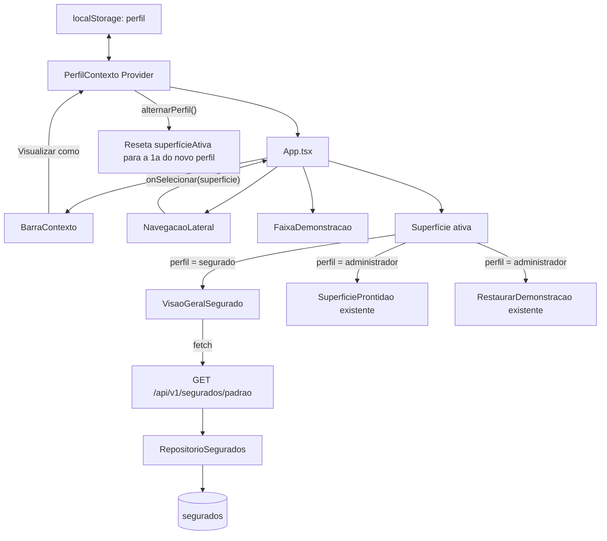

# Alternar o Contexto Demonstrativo Design

**Spec**: `.specs/features/1-4-alternar-o-contexto-demonstrativo/spec.md`
**Context**: `.specs/features/1-4-alternar-o-contexto-demonstrativo/context.md`
**Status**: Draft

---

## Approach Exploration

| Approach | Description | Trade-off |
| --- | --- | --- |
| **A — Estado local de "superfície ativa" (recomendado)** | Um `React Context` guarda `perfil` (`'administrador' \| 'segurado'`) e `superficieAtiva`; a navegação lateral troca `superficieAtiva` via `useState`, sem nova rota de URL. Persistência só do `perfil` em `localStorage`. | Zero dependências novas; casa com as 3 superfícies reais de hoje; nenhum AC desta história pede URL profunda ou botão voltar/avançar do navegador. Custo: quando Épico 2 trouxer muitas superfícies (Monitoramento, Regras...), migrar para rotas de URL será um retrabalho contido — mesmo padrão de custo aceito em AD-003. |
| **B — `react-router-dom` com rotas por perfil/superfície** | Introduz o pacote, define rotas `/administrador/prontidao`, `/administrador/restaurar`, `/segurado`. | Dá URL profunda e histórico do navegador de graça, mas nenhum AC exige isso agora; adiciona uma dependência e a complexidade de rotas aninhadas por perfil para 3 superfícies só para "não precisar migrar depois" — antecipa uma necessidade do Épico 2 que `epic-1-context.md` pede para não antecipar. |

**Recomendação**: Approach A. Nenhum critério de aceitação da História 1.4 menciona URL, deep-link ou navegação do navegador; a complexidade de A é proporcional ao que existe hoje (3 superfícies) e o retrabalho futuro é o mesmo tipo de custo já aceito em AD-003.

---

## Architecture Overview



O `perfil` e a `superficieAtiva` vivem num único `PerfilProvider` no topo de `App.tsx`. Trocar de perfil sempre redefine `superficieAtiva` para a primeira superfície válida do novo perfil — isso, por si só, desmonta `RestaurarDemonstracao` (e seu modal, se aberto) e `SuperficieProntidao` quando se sai do perfil Administrador, satisfazendo CTX-04 sem lógica especial de "fechar modal": o React desmonta o componente e seu estado interno desaparece.

---

## Code Reuse Analysis

### Existing Components to Leverage

| Component | Location | How to Use |
| --- | --- | --- |
| `SuperficieProntidao` | `src/frontend/src/funcionalidades/prontidao/SuperficieProntidao.tsx` | Passa a ser renderizada como a superfície "Prontidão" do perfil Administrador; nenhuma mudança interna. |
| `RestaurarDemonstracao` | `src/frontend/src/funcionalidades/dados-sinteticos/RestaurarDemonstracao.tsx` | Passa a ser renderizada como a superfície "Restaurar dados sintéticos" do perfil Administrador; nenhuma mudança interna. |
| Padrão de cliente HTTP (`ErroX`, `lerProblema`, `FALHA_DE_REDE`) | `src/frontend/src/api/prontidao.ts`, `src/frontend/src/api/dadosSinteticos.ts` | Replicado no novo `src/frontend/src/api/contexto.ts` para o `GET /segurados/padrao` — mesmo formato de erro tipado e mesma tradução `snake_case` → `camelCase`. |
| Padrão de roteador REST (`criar_roteador`, `problema()`, `ProblemaX`) | `src/backend/central_preventiva/adaptadores/http/prontidao.py`, `dados_sinteticos.py` | Replicado no novo `adaptadores/http/contexto.py`. |
| `identificador_demonstracao` | `src/backend/central_preventiva/adaptadores/persistencia/semeador.py:17-20` | Extraído para `dominio/identificadores_demonstracao.py` (função pura de hash determinístico) e reusado tanto pelo semeador quanto pelo novo repositório de leitura — elimina duplicar a lógica de UUID determinístico. |
| Faixa fixa "Ambiente educacional..." | `src/frontend/src/App.tsx:110-113` (`<footer className="faixa-simulacao">`) | Extraída para `componentes/FaixaDemonstracao.tsx` e renderizada uma vez no shell, fora do conteúdo trocável. |
| Aviso de resolução não suportada | `src/frontend/src/App.tsx:27-33,73-77` | Lógica de `viewportNaoSuportado` movida para o `PerfilProvider`/`App.tsx` sem mudança de comportamento (CTX-16/17 já cobertos hoje). |

### Integration Points

| System | Integration Method |
| --- | --- |
| DuckDB `segurados` | Novo `RepositorioSegurados.buscar_por_id(id)` (padrão de `RepositorioExecucoes`), consulta somente leitura. |
| FastAPI `/api/v1` | Novo roteador `contexto.py` registrado em `composicao/api.py` junto aos existentes. |
| `localStorage` | Chave única `central-preventiva.perfil`, valor `"administrador" \| "segurado"`; leitura/escrita centralizada em `contexto/PerfilContexto.tsx`, nunca acessada fora dele. |

---

## Components

### `dominio/identificadores_demonstracao.py` (backend)

- **Purpose**: Única fonte da função determinística de UUID sintético e da constante do segurado padrão.
- **Location**: `src/backend/central_preventiva/dominio/identificadores_demonstracao.py`
- **Interfaces**:
  - `identificador_demonstracao(nome: str) -> UUID` — hash `uuid5` determinístico (movido de `semeador.py`).
  - `SEGURADO_PADRAO: UUID` — `identificador_demonstracao("segurado/chuva-elegivel")`.
- **Dependencies**: nenhuma (função pura, só `uuid5`).
- **Reuses**: lógica hoje duplicada implicitamente em `semeador.py`; `semeador.py` passa a importar daqui.

### `adaptadores/persistencia/repositorio_segurados.py` (backend)

- **Purpose**: Consulta somente leitura de um segurado sintético por id.
- **Location**: `src/backend/central_preventiva/adaptadores/persistencia/repositorio_segurados.py`
- **Interfaces**:
  - `buscar_por_id(self, id: UUID) -> Segurado | None` — `SELECT id, nome FROM segurados WHERE id = ?`.
- **Dependencies**: `abrir_conexao` (reuso de `conexao.py`).
- **Reuses**: mesmo padrão de `RepositorioExecucoes`.

### `dominio/segurado.py` (backend)

- **Purpose**: Modelo de domínio mínimo (id + nome) para o segurado sintético.
- **Location**: `src/backend/central_preventiva/dominio/segurado.py`
- **Interfaces**: `@dataclass(frozen=True) class Segurado: id: UUID; nome: str`
- **Dependencies**: nenhuma.
- **Reuses**: segue o estilo dos demais módulos de `dominio/` (puro, sem FastAPI/DuckDB).

### `aplicacao/contexto.py` (backend)

- **Purpose**: Caso de uso "consultar o segurado sintético padrão".
- **Location**: `src/backend/central_preventiva/aplicacao/contexto.py`
- **Interfaces**:
  - `class PortasContexto: segurados: <protocolo com buscar_por_id>`
  - `class SeguradoPadraoAusente(Exception)` — levantada quando `buscar_por_id(SEGURADO_PADRAO)` devolve `None` (dados sintéticos ainda não restaurados/inicializados).
  - `def consultar_segurado_padrao(portas: PortasContexto) -> Segurado`
- **Dependencies**: `dominio.identificadores_demonstracao.SEGURADO_PADRAO`, `dominio.segurado.Segurado`.
- **Reuses**: mesmo formato de porta com `Protocol` já usado em `aplicacao/portas_prontidao.py`/`portas_persistencia.py`.

### `adaptadores/http/contexto.py` (backend)

- **Purpose**: Expõe `GET /api/v1/segurados/padrao`.
- **Location**: `src/backend/central_preventiva/adaptadores/http/contexto.py`
- **Interfaces**: `criar_roteador(configuracao: Configuracao) -> APIRouter`
- **Dependencies**: `RepositorioSegurados`, `aplicacao.contexto`.
- **Reuses**: `problema()` / `ProblemaX` / `TIPO_PROBLEMA` no mesmo formato de `prontidao.py`/`dados_sinteticos.py`.
- Resposta de sucesso (200): `{"id": "<uuid>", "nome": "Pessoa Segurada Sintética DEMO-001"}`.
- Resposta de falha (503, `problem+json`): dados sintéticos ainda não restaurados — `codigo="segurado_padrao_ausente"`, `proxima_acao="Execute a inicialização/restauração dos dados sintéticos e tente novamente."`.

### `src/frontend/src/api/contexto.ts`

- **Purpose**: Cliente HTTP tipado do novo endpoint.
- **Location**: `src/frontend/src/api/contexto.ts`
- **Interfaces**:
  - `type SeguradoPadrao = { id: string; nome: string }`
  - `class ErroContexto extends Error { codigo; correlacaoId; ocorrencia; impacto; proximaAcao; status }`
  - `async function getSeguradoPadrao(): Promise<SeguradoPadrao>`
- **Dependencies**: `fetch` nativo.
- **Reuses**: estrutura idêntica a `api/prontidao.ts` (`lerProblema`, `FALHA_DE_REDE`, `FALHA_INESPERADA`).

### `src/frontend/src/contexto/PerfilContexto.tsx`

- **Purpose**: Fonte única de verdade do perfil ativo e da superfície ativa; persiste só o perfil.
- **Location**: `src/frontend/src/contexto/PerfilContexto.tsx`
- **Interfaces**:
  - `type Perfil = 'administrador' | 'segurado'`
  - `type Superficie = 'prontidao' | 'restaurar-dados-sinteticos' | 'visao-geral'`
  - `SUPERFICIES_POR_PERFIL: Record<Perfil, readonly Superficie[]>` — `administrador: ['prontidao', 'restaurar-dados-sinteticos']`, `segurado: ['visao-geral']`.
  - `function PerfilProvider({ children }): JSX.Element`
  - `function usePerfilContexto(): { perfil, superficieAtiva, alternarPerfil(), selecionarSuperficie(s), superficieValida: boolean }`
- **Dependencies**: `window.localStorage` (chave `central-preventiva.perfil`).
- **Reuses**: nenhum componente existente; é a peça nova central da história.
- **Behavior**:
  - Estado inicial: lê `localStorage.getItem('central-preventiva.perfil')`; se ausente ou não for `'administrador' | 'segurado'`, usa `'administrador'` (CTX-11/CTX-12, edge case de valor corrompido).
  - `alternarPerfil(novoPerfil)`: grava em `localStorage`, define `perfil = novoPerfil` e `superficieAtiva = SUPERFICIES_POR_PERFIL[novoPerfil][0]` — nunca preserva a superfície do perfil anterior.
  - `superficieValida = SUPERFICIES_POR_PERFIL[perfil].includes(superficieAtiva)` — sempre `true` na prática (todo caminho que muda `superficieAtiva` passa por `selecionarSuperficie`, que só aceita valores da lista do perfil ativo), mas exposto explicitamente para o `ContextoInconsistente` (abaixo) cobrir CTX-13/14/15 como uma salvaguarda real, testável isoladamente, e não apenas um estado inalcançável.

### `src/frontend/src/componentes/ContextoInconsistente.tsx`

- **Purpose**: Bloqueia a renderização quando `superficieValida` é falso e oferece a próxima ação válida.
- **Location**: `src/frontend/src/componentes/ContextoInconsistente.tsx`
- **Interfaces**: `function ContextoInconsistente({ perfil, aoVoltar }: { perfil: Perfil; aoVoltar: () => void })`
- **Dependencies**: nenhuma.
- **Reuses**: nenhum.

### `src/frontend/src/componentes/BarraContexto.tsx`

- **Purpose**: Mostra perfil, segurado ativo (quando Segurado) e data/hora de referência; hospeda o seletor "Visualizar como".
- **Location**: `src/frontend/src/componentes/BarraContexto.tsx`
- **Interfaces**: `function BarraContexto(): JSX.Element` (lê `usePerfilContexto()` internamente).
- **Dependencies**: `usePerfilContexto`, `api/contexto.ts` (só quando `perfil === 'segurado'`).
- **Reuses**: markup/CSS de `App.tsx:67-71` (`<header className="barra-contexto">`) como ponto de partida.
- **Behavior**: região `aria-live="polite"` anuncia o texto do perfil após cada troca (CTX-19).

### `src/frontend/src/componentes/NavegacaoLateral.tsx`

- **Purpose**: Lista os itens de navegação do perfil ativo e aciona `selecionarSuperficie`.
- **Location**: `src/frontend/src/componentes/NavegacaoLateral.tsx`
- **Interfaces**: `function NavegacaoLateral(): JSX.Element`
- **Dependencies**: `usePerfilContexto`.
- **Reuses**: markup/CSS de `App.tsx:40-66` (`<nav className="navegacao">`).

### `src/frontend/src/componentes/FaixaDemonstracao.tsx`

- **Purpose**: Faixa fixa "Ambiente educacional · Dados sintéticos · Sem envio real", sem controle de fechamento.
- **Location**: `src/frontend/src/componentes/FaixaDemonstracao.tsx`
- **Interfaces**: `function FaixaDemonstracao(): JSX.Element`
- **Dependencies**: nenhuma.
- **Reuses**: markup/CSS de `App.tsx:110-113` (`<footer className="faixa-simulacao">`).

### `src/frontend/src/funcionalidades/segurado/VisaoGeralSegurado.tsx`

- **Purpose**: Conteúdo estático hoje embutido em `App.tsx` (linhas 78-109), extraído como a superfície "Visão geral" do perfil Segurado.
- **Location**: `src/frontend/src/funcionalidades/segurado/VisaoGeralSegurado.tsx`
- **Interfaces**: `function VisaoGeralSegurado(): JSX.Element`
- **Dependencies**: nenhuma (conteúdo estático desta história; dados reais de alerta/apólice ficam para épicos futuros).
- **Reuses**: markup/CSS de `App.tsx:78-109`, com "Marina Costa" removido (o nome real vem da `BarraContexto` via `getSeguradoPadrao()`).

---

## Data Models

### `Segurado` (backend, `dominio/segurado.py`)

```python
@dataclass(frozen=True)
class Segurado:
    id: UUID
    nome: str
```

**Relationships**: `id` corresponde a `segurados.id` no DuckDB (tabela já existente, sem mudança de schema).

### `SeguradoPadrao` (frontend, `api/contexto.ts`)

```typescript
type SeguradoPadrao = {
  id: string
  nome: string
}
```

### `Perfil` / `Superficie` (frontend, `contexto/PerfilContexto.tsx`)

```typescript
type Perfil = 'administrador' | 'segurado'
type Superficie = 'prontidao' | 'restaurar-dados-sinteticos' | 'visao-geral'
```

---

## Error Handling Strategy

| Error Scenario | Handling | User Impact |
| --- | --- | --- |
| Dados sintéticos ainda não restaurados (tabela `segurados` vazia) | Backend devolve `503 problem+json` (`segurado_padrao_ausente`); frontend captura em `ErroContexto`. | `BarraContexto` mostra estado de indisponibilidade com causa e um botão "Tentar novamente" (CTX-09 AC3). |
| Falha de rede ao buscar o segurado padrão | `ErroContexto` com `FALHA_DE_REDE`, igual ao padrão de `prontidao.ts`. | Mesmo estado de indisponibilidade acima. |
| Valor inválido/corrompido em `localStorage` | `PerfilProvider` trata como ausência de preferência. | Abre em "Administrador" silenciosamente, sem erro visível (comportamento esperado, não uma falha). |
| `superficieValida === false` (salvaguarda; não alcançável pelos fluxos normais de UI) | `ContextoInconsistente` substitui o conteúdo principal. | Mensagem explicando a inconsistência + botão que chama `selecionarSuperficie` com a 1ª superfície do perfil ativo. |
| Largura da janela < 1024 px | Mantido o comportamento atual de `viewportNaoSuportado` (`App.tsx:27-33`). | Aviso consultivo, nenhuma função removida. |

---

## Risks & Concerns

| Concern | Location (file:line) | Impact | Mitigation |
| --- | --- | --- | --- |
| `identificador_demonstracao` hoje só existe dentro de `semeador.py`, fora do domínio puro | `src/backend/central_preventiva/adaptadores/persistencia/semeador.py:17-20` | Duplicar a função no novo repositório criaria duas fontes de verdade para o mesmo UUID determinístico | Extraída para `dominio/identificadores_demonstracao.py` nesta história; `semeador.py` passa a importar de lá (ver Code Reuse Analysis). |
| `App.tsx` hoje mistura shell, navegação estática e conteúdo do Segurado num único arquivo de ~120 linhas | `src/frontend/src/App.tsx` (arquivo inteiro) | Sem separação, cada nova superfície cresceria o mesmo arquivo indefinidamente | Esta história já extrai `BarraContexto`, `NavegacaoLateral`, `FaixaDemonstracao` e `VisaoGeralSegurado`; `App.tsx` fica só como composição do shell. |
| Nenhum teste de frontend cobre hoje troca de perfil, `localStorage` ou o endpoint novo | N/A (funcionalidade inexistente antes desta história) | Sem tarefa dedicada, a alternância poderia ficar sem cobertura | Tasks desta história incluem testes para as duas direções de alternância, `localStorage`, contexto inconsistente e larguras suportadas (ver Success Criteria do spec). |

> Nenhum outro risco de segurança, performance ou dívida técnica identificado na área tocada por esta história.

---

## Tech Decisions

| Decision | Choice | Rationale |
| --- | --- | --- |
| Mecanismo de navegação entre superfícies | Estado local em `PerfilContexto` (Approach A), sem `react-router-dom` | Ver Approach Exploration; proporcional ao escopo atual, sem nova dependência. |
| Rota do segurado padrão | `GET /api/v1/segurados/padrao` | Segue "recursos plurais" (`segurados`); `padrao` é um alias conhecido e estável, não um id opaco, mas evita inventar um recurso `/contexto` novo quando o recurso real já é `segurados`. |
| Código de falha quando dados sintéticos não existem | `503` com `problem+json`, não `404` | `404` sugeriria "id inexistente"; `503` comunica corretamente "dependência de dados ainda não preparada", coerente com o vocabulário de indisponibilidade já usado em Prontidão. |
| Persistência do perfil | Só a chave `central-preventiva.perfil` em `localStorage`; nenhuma outra parte da UI usa `localStorage` diretamente | Único ponto de leitura/escrita facilita auditar CTX-10 ("nenhuma decisão de backend depende do valor") — o valor nunca sai do navegador. |

> **Project-level decision candidate**: a extração de `identificador_demonstracao` para `dominio/identificadores_demonstracao.py` é reutilizável por qualquer história futura que precise referenciar um id sintético determinístico (ex. apólice padrão). Registrado como Tech Decision local aqui; não é elevado a `AD-NNN` porque não impõe uma restrição a decisões futuras, só disponibiliza uma função utilitária.

---

## Tips (not part of the design; process note)

Nenhuma nota adicional — Approach A confirmado no Architecture Overview acima é a base do restante do design.
