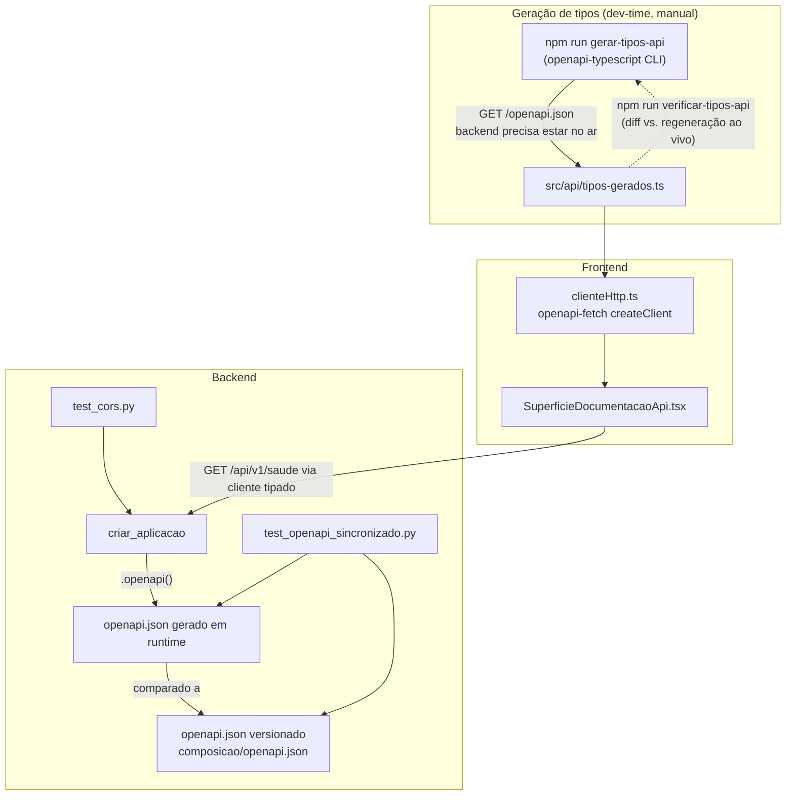

# História 1.5: Consumir e inspecionar a API real — Design

**Spec**: `.specs/features/1-5-consumir-e-inspecionar-a-api-real/spec.md`
**Context**: `.specs/features/1-5-consumir-e-inspecionar-a-api-real/context.md`
**Status**: Draft

---

## Architecture Overview

Two independent, loosely-coupled tracks share one artifact — the OpenAPI document FastAPI already generates from the real routers:

1. **Backend track**: freeze that document as a versioned snapshot and add a test that fails the moment the live app's `openapi()` output drifts from it (title/description/status codes/schemas), plus a CORS-boundary test.
2. **Frontend track**: a small typed HTTP client (`openapi-fetch` + `openapi-typescript`-generated `paths`), consumed by exactly one new surface — "Documentação da API" — which proves the API/docs are reachable using a real typed call, not a fixture.



**Key correction from the spec's revisable assumption** (see Tech Decisions below): the new surface does **not** fetch `/openapi.json` directly through the typed client, because FastAPI's own `/openapi.json` and `/docs` routes are not registered as `APIRoute`s and therefore never appear as `paths` in the schema they describe — `openapi-typescript` cannot generate a typed path for them. The surface instead calls the already-typed `GET /api/v1/saude` to prove the backend (and therefore the same-process `/docs`/`/openapi.json`) is reachable, and renders the two well-known local addresses as static text/links. This keeps "usa exclusivamente o cliente HTTP central tipado" literally true.

---

## Code Reuse Analysis

### Existing Components to Leverage

| Component | Location | How to Use |
| --- | --- | --- |
| `criar_aplicacao` | `src/backend/central_preventiva/composicao/api.py` | Source of truth for the OpenAPI document (`aplicacao.openapi()`); no change needed to routers |
| `configuracao_para` / `cliente_para` test helpers pattern | `src/backend/testes/test_contexto_api.py:17-35` | Same pattern reused in `test_openapi_sincronizado.py` and `test_cors.py` |
| `ErroContexto` / `lerProblema` pattern | `src/frontend/src/api/contexto.ts:27-77` | Reused as the shape (codigo/causa/impacto/proxima_acao) for the new surface's error type, adapted since `/api/v1/saude` never returns `problem+json` (it has no documented error responses) |
| `SuperficieProntidao.tsx` loading/state pattern | `src/frontend/src/funcionalidades/prontidao/SuperficieProntidao.tsx` | Same `useEffect` + `useState` fetch-on-mount shape for `SuperficieDocumentacaoApi.tsx` |
| `Superficie` union + `SUPERFICIES_POR_PERFIL` + `NavegacaoLateral` | `src/frontend/src/contexto/PerfilContexto.tsx`, `src/frontend/src/componentes/NavegacaoLateral.tsx` | Extended, not replaced — add `'documentacao-api'` |
| `RespostaSaude` contract | `src/backend/central_preventiva/adaptadores/http/saude.py` | Becomes the typed call the new surface makes |

### Integration Points

| System | Integration Method |
| --- | --- |
| FastAPI `app.openapi()` | Called both by the backend snapshot test (in-process, via `TestClient`'s underlying app) and, live, by `npm run gerar-tipos-api` hitting the running server |
| `/api/v1/saude` | Consumed by the new frontend surface through the generated `paths` type — the first (and, per this story's scope, only) typed caller |

---

## Components

### `central_preventiva/composicao/openapi_export.py` (backend, new)

- **Purpose**: single source for producing the canonical OpenAPI document, used by both the CLI export and the drift test.
- **Location**: `src/backend/central_preventiva/composicao/openapi_export.py`
- **Interfaces**:
  - `gerar_documento_openapi(configuracao: Configuracao) -> dict` — builds the app via `criar_aplicacao` and returns `aplicacao.openapi()`.
  - `escrever_documento_openapi(caminho: Path, documento: dict) -> None` — writes it `json.dumps(..., ensure_ascii=False, indent=2, sort_keys=True)` for stable diffs.
  - `if __name__ == "__main__":` CLI entry writing to the default snapshot path.
- **Dependencies**: `criar_aplicacao`, `obter_configuracao`.
- **Reuses**: existing app factory; no router changes.

### `composicao/openapi.json` (backend, new, versioned)

- **Purpose**: committed snapshot the drift test compares against.
- **Location**: `src/backend/central_preventiva/composicao/openapi.json`
- **Generated by**: `uv run --directory src/backend python -m central_preventiva.composicao.openapi_export`

### `testes/test_openapi_sincronizado.py` (backend, new)

- **Purpose**: fails if the live app's OpenAPI document (title, per-operation summary/description, status codes, error schema fields) diverges from the committed snapshot, and asserts every `/api/v1` operation has a non-empty PT-BR `summary`/`description`.
- **Location**: `src/backend/testes/test_openapi_sincronizado.py`
- **Reuses**: `configuracao_para`/`cliente_para` pattern from `test_contexto_api.py`; loads the snapshot with `json.loads(Path(...).read_text())`.

### `testes/test_cors.py` (backend, new)

- **Purpose**: asserts the app responds with `Access-Control-Allow-Origin: http://127.0.0.1:5151` when that `Origin` header is sent, and omits it (or FastAPI/Starlette rejects) for a different origin (e.g. `http://evil.example`).
- **Location**: `src/backend/testes/test_cors.py`
- **Reuses**: `TestClient(criar_aplicacao(...))`, same helper pattern.

### `api/tipos-gerados.ts` (frontend, generated, versioned)

- **Purpose**: `paths`/`components` types generated by `openapi-typescript` from the live `/openapi.json`.
- **Location**: `src/frontend/src/api/tipos-gerados.ts`
- **Generated by**: `npm run gerar-tipos-api --prefix src/frontend` → `openapi-typescript http://127.0.0.1:8000/openapi.json -o src/api/tipos-gerados.ts` (requires the backend running; the script SHALL exit non-zero with a clear message if the fetch fails, per Edge Cases in the spec).

### `api/clienteHttp.ts` (frontend, new)

- **Purpose**: the one central, typed HTTP client for this story's new resource.
- **Location**: `src/frontend/src/api/clienteHttp.ts`
- **Interfaces**:
  - `export const clienteApi = createClient<paths>({ baseUrl: 'http://127.0.0.1:8000' })` (from `openapi-fetch`).
- **Dependencies**: `openapi-fetch`, `./tipos-gerados`.
- **Reuses**: none — first module of its kind; deliberately does not touch `contexto.ts`/`prontidao.ts`/`dadosSinteticos.ts` (Out of Scope, per context.md decision 2).

### `api/documentacaoApi.ts` (frontend, new)

- **Purpose**: wraps `clienteApi.GET('/api/v1/saude')` into the availability check the surface needs, with a typed error carrying causa/impacto/proxima ação.
- **Location**: `src/frontend/src/api/documentacaoApi.ts`
- **Interfaces**:
  - `export type EstadoDocumentacaoApi = 'carregando' | 'disponivel' | 'indisponivel'`
  - `export async function verificarDocumentacaoApi(): Promise<ResultadoDocumentacaoApi>` — returns `{ estado: 'disponivel', enderecoSwaggerUi, enderecoOpenApi }` or throws `ErroDocumentacaoApi` (causa/impacto/proximaAcao) on network failure or non-2xx.
- **Reuses**: the causa/impacto/proximaAcao error shape from `contexto.ts`, adapted (no `problem+json` body parsing, since `/api/v1/saude` has no documented error response).

### `funcionalidades/documentacao-api/SuperficieDocumentacaoApi.tsx` (frontend, new)

- **Purpose**: renders carregando/disponível/indisponível, the two local addresses, and a `target="_blank" rel="noopener noreferrer"` link to `/docs`.
- **Location**: `src/frontend/src/funcionalidades/documentacao-api/SuperficieDocumentacaoApi.tsx`
- **Reuses**: fetch-on-mount + state pattern from `SuperficieProntidao.tsx`.

### Extended: `PerfilContexto.tsx`, `NavegacaoLateral.tsx`, `App.tsx`

- Add `'documentacao-api'` to `Superficie` and to `SUPERFICIES_POR_PERFIL.administrador`.
- Add a nav icon/label (`Documentação da API`) and a `case 'documentacao-api':` branch in `SuperficieAtiva`.

---

## Data Models

```typescript
// src/frontend/src/api/documentacaoApi.ts
export type EstadoDocumentacaoApi = 'carregando' | 'disponivel' | 'indisponivel'

export type ResultadoDocumentacaoApi = {
  estado: 'disponivel'
  enderecoSwaggerUi: string   // 'http://127.0.0.1:8000/docs'
  enderecoOpenApi: string     // 'http://127.0.0.1:8000/openapi.json'
}

export class ErroDocumentacaoApi extends Error {
  readonly causa: string
  readonly impacto: string
  readonly proximaAcao: string
  readonly enderecoEsperado: string
}
```

**Relationships**: `ResultadoDocumentacaoApi` / `ErroDocumentacaoApi` are frontend-only view models derived from the typed `paths['/api/v1/saude']['get']['responses']['200']` response — no new backend model.

---

## Error Handling Strategy

| Error Scenario | Handling | User Impact |
| --- | --- | --- |
| Backend unreachable (network failure) when opening "Documentação da API" | `verificarDocumentacaoApi` catches the `fetch` rejection, throws `ErroDocumentacaoApi` with a network-failure causa | Surface shows "Indisponível", causa, and the expected local address — no fixture data |
| `/api/v1/saude` responds non-2xx | Treated the same as network failure (documentation is only as available as the API process) | Same as above |
| `openapi.json` drifted from the app's live schema | `test_openapi_sincronizado.py` fails in `pytest` | Caught before merge, not a runtime user-facing state |
| `tipos-gerados.ts` stale vs. live backend | `npm run verificar-tipos-api` fails (documented manual/CI step, requires backend running — kept out of the default `npm test` which must run without a live backend) | Caught before merge |
| Cross-origin request from a non-configured origin | Starlette's `CORSMiddleware` omits `Access-Control-Allow-Origin`; browser blocks the response client-side | No CORS-approved response reaches unauthorized origins |

---

## Risks & Concerns

| Concern | Location (file:line) | Impact | Mitigation |
| --- | --- | --- | --- |
| `/openapi.json` and `/docs` are not `APIRoute`s and never appear in the OpenAPI document's own `paths` | `src/backend/central_preventiva/composicao/api.py` (FastAPI default routes, not explicitly registered) | A typed client generated from that document cannot call them — the naive design (fetch `/openapi.json` via the typed client) is technically impossible | Surface calls the already-typed `GET /api/v1/saude` instead, as the reachability proxy; addresses shown as static text (see Architecture Overview) |
| `tipos-gerados.ts` sync check needs a live backend, so it cannot run inside the existing `npm test` (which must stay backend-independent per the current test suite's design) | `src/frontend/package.json` scripts | If undocumented, "verificação automatizada" for type sync could silently never run | Ships as its own documented `npm run verificar-tipos-api` script, called out in the README's verification command list (not folded into `npm test`) |
| `openapi.json` snapshot is a generated, potentially large file checked into git | `src/backend/central_preventiva/composicao/openapi.json` (new) | Diff noise on every route change | Accepted: it is the explicit mechanism the story asks for ("incompatibilidades... deverão falhar na verificação automatizada"); kept small since the API surface is intentionally minimal |
| None found beyond the above | — | — | — |

---

## Tech Decisions (only non-obvious ones)

| Decision | Choice | Rationale |
| --- | --- | --- |
| How the new surface proves API/docs availability | Typed `GET /api/v1/saude` call, not a direct fetch of `/openapi.json` | `/openapi.json`/`/docs` are not typed paths in the generated schema (see Risks & Concerns) — this resolves the spec's assumption row 3, marked revisable in Design |
| OpenAPI snapshot format and location | `central_preventiva/composicao/openapi.json`, `json.dumps(..., sort_keys=True, indent=2)` | Deterministic diffs; colocated with `api.py` (the thing it documents) |
| `openapi-fetch` vs. hand-rolled fetch wrapper for the central client | `openapi-fetch` (`createClient<paths>`) | Standard companion library to `openapi-typescript`; avoids reinventing typed request/response plumbing (Knowledge Verification Chain step 4 — confirmed via web search, not fabricated) |
| Type-sync verification cadence | Separate `npm run verificar-tipos-api` script, not part of default `npm test` | `npm test` must stay runnable without a live backend (existing suite convention); folding a live-backend dependency into it would break that invariant for every future contributor |
| No migration of `contexto.ts`/`prontidao.ts`/`dadosSinteticos.ts` | Confirmed by user in context.md decision 2 | Out of scope for this story; tracked debt already logged as AD-003 |

> No new project-level `AD-NNN` needed: these are feature-local implementation choices, not standing conventions other future stories must follow. (AD-003 already anticipated and covers the non-migration decision.)

---

## Tips

N/A — implementation proceeds to Tasks.
