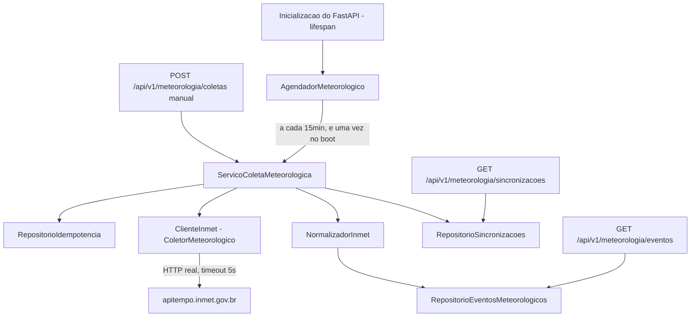

# História 2.1: Coletar e normalizar dados do INMET — Design

**Spec**: `.specs/features/2-1-coletar-e-normalizar-dados-do-inmet/spec.md`
**Status**: Approved

---

## Research (Knowledge Verification Chain)

**Codebase**: já existe uma sonda de prontidão real (`SondaInmet`) fazendo `GET` de saúde em `CENTRAL_PREVENTIVA_URL_BASE_INMET`, sem retry nem normalização (`adaptadores/prontidao/sonda_inmet.py`). O schema (`adaptadores/persistencia/README.md`) já reserva `eventos_meteorologicos` com `proveniencia CHECK IN ('real_inmet', 'sintetico')`. `dominio/estados_execucao.py` já define `EstadoExecucao` (AD-4). Nenhum dependency de agendamento (APScheduler etc.) existe em `pyproject.toml` — só `duckdb`, `fastapi`, `httpx`, `pydantic(-settings)`, `uvicorn`.

**Project docs**: AD-8 (ARCHITECTURE-SPINE.md) exige que adaptadores normalizem para modelo interno com timeout e no máximo três tentativas, e que falha nunca produza dado silenciosamente novo. AD-7 exige um "runner único no processo" para trabalho assíncrono. ADR-0013 autoriza a saída real de rede para o INMET como a única integração pública desta natureza. AD-10 proíbe log de corpo externo íntegro.

**Web search (INMET real)**: confirmado por sondagem direta que `https://apitempo.inmet.gov.br` é um serviço público, sem autenticação, que responde em JSON. `GET /estacoes/T` retorna o catálogo de estações automáticas com campos confirmados: `CD_ESTACAO`, `DC_NOME`, `VL_LATITUDE`, `VL_LONGITUDE`, `VL_ALTITUDE`, `SG_ESTADO`, `TP_ESTACAO` (`"Automatica"`), `CD_SITUACAO` (`"Operante"`/`"Pane"`), `DT_INICIO_OPERACAO`, `DT_FIM_OPERACAO`. **Não foi possível confirmar, via sondagem ao vivo nesta sessão, os nomes exatos dos campos de leitura horária (chuva, temperatura, vento) do endpoint de dados por estação** — as tentativas de sondagem devolveram 404 ou corpo vazio para as combinações testadas. Isso é registrado explicitamente como incerteza, não presumido. A "prova limitada contra a fonte oficial" exigida pelo AC `INMET-01`/`INMET-02` é o primeiro item de implementação desta história, e fixa esses nomes de campo a partir de uma chamada real, antes de qualquer normalizador ser escrito. **Um fato, porém, já é conhecido do contrato de estações automáticas: as leituras horárias expõem precipitação, temperatura, vento, pressão, umidade e radiação — não existe campo de granizo.** Por isso o AD-013 fixa que `tipo = granizo` entra no MVP exclusivamente pelo cenário sintético de contingência (2.2), com `proveniencia = 'sintetico'`; a proveniência `real_inmet` fica reservada a `chuva_intensa`, derivada da medida de precipitação.

**Decisões confirmadas com o usuário nesta sessão** (aplicam-se a este Design e ficam registradas para a História 2.2 reaproveitar):

- Agendamento: task assíncrona única in-process (sem biblioteca nova), iniciada no ciclo de vida do FastAPI.
- Timeout HTTP da coleta de produção: 5 segundos por tentativa.
- Intervalo de coleta automática: 15 minutos.
- Tentativas/backoff (3 tentativas, 1s/2s/4s): confirmados como valor-alvo, mas a *orquestração* de retry, backoff e o terminal `falhou_coleta` são escopo da História 2.2 — esta história implementa a chamada HTTP única com timeout de 5s, pronta para ser envolvida pelo laço de retry de 2.2 sem mudança de interface.

---

## Approach

**Escolhida**: task `asyncio` in-process, iniciada no `lifespan` do FastAPI, chamando o mesmo caso de uso usado pela coleta manual — nenhuma dependência nova, e é literalmente o "runner único no processo" que o AD-7 já define para todo trabalho assíncrono do backend. Alternativas descartadas: APScheduler (dependência nova para um único agendamento fixo) e cron externo do SO (contraria "sem etapas manuais ocultas" do README e foge do processo único da PoC).



---

## Code Reuse Analysis

### Existing Components to Leverage

| Component | Location | How to Use |
| --- | --- | --- |
| `Configuracao.url_base_inmet` | `composicao/configuracao.py` | Já existe; reusada como URL base do cliente HTTP real (mesma variável `CENTRAL_PREVENTIVA_URL_BASE_INMET` da sonda) |
| Padrão de repositório por conexão explícita | `adaptadores/persistencia/repositorio_execucoes.py`, `repositorio_segurados.py` | Mesmo padrão (`abrir_conexao`, uma classe por tabela/agregação) para os novos repositórios desta história |
| `ExecutorMigracoes` / convenção de migração numerada | `adaptadores/persistencia/migracoes.py` | Nova migração `0002_meteorologia.sql` segue a mesma convenção (transação própria, registrada em `schema_migracoes`) |
| Padrão de roteador HTTP por recurso | `adaptadores/http/prontidao.py`, `contexto.py` | Mesmo padrão `criar_roteador(configuracao) -> APIRouter` para `adaptadores/http/meteorologia.py` |
| Mecanismo genérico de `Idempotency-Key` (AD-002) | tabela `chaves_idempotencia` (schema existente) | Reusado tal como está para a coleta manual (`POST /api/v1/meteorologia/coletas`) — nenhuma tabela de idempotência nova |
| `identificador_demonstracao` / padrão de dataset sintético | `dominio/identificadores_demonstracao.py`, `adaptadores/persistencia/semeador.py` | Reusado para gerar os IDs determinísticos das amostras congeladas de teste |
| `httpx.AsyncClient` com timeout explícito | `adaptadores/prontidao/sonda_inmet.py` | Mesmo padrão de cliente HTTP assíncrono, timeout próprio (5s, distinto dos 3s da sonda) |

### Integration Points

| System | Integration Method |
| --- | --- |
| INMET (`apitempo.inmet.gov.br`) | `ClienteInmet` faz `httpx.AsyncClient.get` com timeout de 5s; única saída de rede nova, já autorizada pelo ADR-0013 |
| DuckDB | Duas tabelas novas (`sincronizacoes_meteorologicas`, `areas_monitoradas_inmet`) via migração `0002`; `eventos_meteorologicos` (já existente) recebe as linhas normalizadas |
| Restauração (Épico 1) | `restaurar_dados_sinteticos`/semeador estendidos para repor o estado inicial completo (AD-014): wipe orientado pelo catálogo do DuckDB, exceto `schema_migracoes` e configuração versionada (`areas_monitoradas_inmet`) — cobre automaticamente toda tabela futura de execução |
| Frontend | Consumido pela API existente `/api/v1`; endpoints novos entram no mesmo `openapi.json` gerado (História 1.5) |

---

## Components

### `ClienteInmet` (adaptador de coleta)

- **Purpose**: Executa uma única chamada HTTP real ao INMET e devolve a resposta bruta, sem normalizar nem decidir sucesso/falha de negócio.
- **Location**: `adaptadores/meteorologia/cliente_inmet.py`
- **Interfaces**:
  - `async def coletar(self, area_monitorada: AreaMonitorada) -> RespostaColetaInmet` — faz o `GET` real (endpoint e parâmetros fixados pela prova limitada do primeiro item de implementação), timeout de 5s; propaga `httpx.TimeoutException`/`httpx.TransportError`/status HTTP sem tratá-los (a História 2.2 decide o que fazer com eles).
- **Dependencies**: `httpx.AsyncClient`, `Configuracao.url_base_inmet`.
- **Reuses**: mesmo padrão de cliente assíncrono com transporte injetável da `SondaInmet`, para permitir dublê de transporte nos testes.

### `AdaptadorInmetFalso` (dublê de teste)

- **Purpose**: Implementa a mesma porta que `ClienteInmet` devolvendo amostras congeladas (válidas e inválidas) sem rede, para os testes determinísticos exigidos pelos ACs.
- **Location**: `testes/dubles/adaptador_inmet_falso.py`
- **Interfaces**: mesma assinatura de `ColetorMeteorologico` (porta).
- **Dependencies**: nenhuma (dados embutidos, obtidos da prova limitada real).
- **Reuses**: convenção de dublê já usada por `SondaInmet` (`transport=` injetável) e pelos testes existentes de prontidão.

### `NormalizadorInmet`

- **Purpose**: Converte a resposta bruta do INMET no `EventoMeteorologico` interno, aplicando a área monitorada correspondente e validando campos obrigatórios/faixas plausíveis.
- **Location**: `adaptadores/meteorologia/normalizador_inmet.py`
- **Interfaces**:
  - `def normalizar(self, bruta: RespostaColetaInmet, area: AreaMonitorada) -> ResultadoNormalizacao` — retorna `EventoMeteorologico` em caso de sucesso, ou um motivo de rejeição tipado (campo ausente / medida inválida / geografia não reconhecida) em caso de falha; nunca lança exceção para entrada malformada.
- **Dependencies**: nenhuma dependência externa (função pura sobre dados já coletados).
- **Reuses**: nada existente — é o primeiro normalizador do domínio meteorológico.

### `ServicoColetaMeteorologica` (caso de uso)

- **Purpose**: Orquestra uma tentativa de coleta (manual ou automática): persiste a sincronização antes de responder, chama o `ColetorMeteorologico`, normaliza, persiste evento ou motivo de falha, e fecha o registro de sincronização.
- **Location**: `aplicacao/coleta_meteorologica.py`
- **Interfaces**:
  - `async def solicitar_coleta_manual(self, area_id: UUID, chave_idempotencia: str) -> SincronizacaoAceita` — usado pelo endpoint `POST`; reserva idempotência antes de qualquer efeito, igual ao padrão de AD-002/AD-7.
  - `async def executar_coleta(self, area: AreaMonitorada, requisicao_id: UUID) -> ResultadoSincronizacao` — usado tanto pelo agendador automático quanto pelo caminho manual após a reserva de idempotência.
- **Dependencies**: `ColetorMeteorologico` (porta implementada por `ClienteInmet`/dublê), `NormalizadorInmet`, `RepositorioEventosMeteorologicos`, `RepositorioSincronizacoes`, `RepositorioIdempotencia` (já existente).
- **Reuses**: mesmo desenho de "persistir antes de responder" já usado pela restauração de dados sintéticos (`aplicacao/restauracao.py`).

### `AgendadorMeteorologico`

- **Purpose**: Task assíncrona única que dispara `executar_coleta` uma vez no boot e depois a cada 15 minutos, para cada área monitorada ativa, sem depender de ação humana.
- **Location**: `composicao/agendador_meteorologico.py`
- **Interfaces**:
  - `async def executar_em_segundo_plano(self) -> None` — laço `while True: coletar(); await asyncio.sleep(INTERVALO_SEGUNDOS)`, cancelável no `shutdown` do lifespan.
- **Dependencies**: `ServicoColetaMeteorologica`, `RepositorioAreasMonitoradas`.
- **Reuses**: nenhum agendador existente (é o primeiro); usa infraestrutura assíncrona já presente no FastAPI/uvicorn do projeto.

### Extensão da restauração — estado inicial completo (AD-014)

- **Purpose**: Faz a restauração do conjunto sintético repor o estado inicial completo do banco: dentro da mesma transação já existente, apaga — enumerando as tabelas pelo catálogo do DuckDB — todas as tabelas fora da lista explícita de exceções (`schema_migracoes` e tabelas de configuração versionada, hoje só `areas_monitoradas_inmet`) e então resemeia as tabelas semeadas como antes. Sem isso, as tabelas de coleta/execução criadas a partir desta história sobreviveriam ao restore, deixando referências órfãs (sem FK, por AD-005) e quebrando o determinismo dos E2E da 5.8.
- **Location**: `adaptadores/persistencia/semeador.py` (método de restauração) + `aplicacao/restauracao.py` (contrato inalterado — a guarda DW-002 de execução não terminal permanece)
- **Interfaces**: nenhuma assinatura pública nova — o comportamento de `portas.dados.restaurar()` é ampliado; a lista de exceções vive como constante nomeada ao lado do semeador.
- **Dependencies**: catálogo do DuckDB (`information_schema`/`duckdb_tables()`), `abrir_conexao`.
- **Reuses**: transação única e idempotência da restauração do Épico 1; enumeração pelo catálogo elimina a necessidade de cada história futura registrar suas tabelas — apenas tabelas de configuração versionada novas precisam entrar na lista de exceções (regra do AD-014).

### Roteador HTTP `meteorologia`

- **Purpose**: Expõe `POST /api/v1/meteorologia/coletas` (manual, com `Idempotency-Key`), `GET /api/v1/meteorologia/eventos` (consulta de eventos normalizados) e `GET /api/v1/meteorologia/sincronizacoes` (histórico).
- **Location**: `adaptadores/http/meteorologia.py`
- **Interfaces**: `def criar_roteador(configuracao: Configuracao) -> APIRouter`, seguindo a assinatura já usada pelos demais roteadores.
- **Dependencies**: `ServicoColetaMeteorologica`, repositórios de consulta.
- **Reuses**: mesmo padrão de fábrica de roteador dos módulos existentes em `adaptadores/http/`.

---

## Data Models

### Migração `0002_meteorologia.sql`

#### `areas_monitoradas_inmet` (nova)

Mapeia uma estação/área real do INMET para o `codigo_ibge_area` sintético usado pelo conjunto demonstrativo — necessário porque os segurados/apólices sintéticos usam códigos de área fictícios (`9990001`, `9990002`, ver `semeador.py`), não códigos IBGE reais; sem esse mapeamento explícito, um evento real do INMET nunca encontraria um segurado sintético elegível.

| Coluna | Tipo | Restrições |
| --- | --- | --- |
| `id` | `UUID` | chave primária |
| `codigo_estacao_inmet` | `VARCHAR` | `NOT NULL`, código real da estação (`CD_ESTACAO`) |
| `nome_estacao` | `VARCHAR` | `NOT NULL` |
| `codigo_ibge_area` | `VARCHAR` | `NOT NULL`, chave estrangeira lógica para a área usada por `segurados`/`apolices` |
| `ativa` | `BOOLEAN` | `NOT NULL`, padrão `true` |
| `criado_em` | `TIMESTAMP` | `NOT NULL`, padrão `now()` |

#### `sincronizacoes_meteorologicas` (nova)

Histórico de cada tentativa de coleta (manual ou automática), correlacionada e consultável sem novo cálculo.

| Coluna | Tipo | Restrições |
| --- | --- | --- |
| `id` | `UUID` | chave primária |
| `requisicao_id` | `UUID` | `NOT NULL`, correlação (AD-10) |
| `area_monitorada_id` | `UUID` | `NOT NULL`, chave estrangeira lógica para `areas_monitoradas_inmet(id)` |
| `origem` | `VARCHAR` | `NOT NULL`, `CHECK` em `automatica`, `manual` |
| `estado` | `VARCHAR` | `NOT NULL`, `CHECK` em `coletando`, `normalizando`, `concluido`, `falha` |
| `registros_validos` | `INTEGER` | `NOT NULL`, padrão `0` |
| `motivo_falha` | `VARCHAR` | nulo se `estado != 'falha'` |
| `iniciado_em` | `TIMESTAMP` | `NOT NULL`, padrão `now()` |
| `finalizado_em` | `TIMESTAMP` | nulo enquanto em andamento |

### `EventoMeteorologico` (domínio, novo)

```python
@dataclass(frozen=True, slots=True)
class EventoMeteorologico:
    id: UUID
    tipo: TipoEventoMeteorologico  # "chuva_intensa" | "granizo"
    area: str  # codigo_ibge_area
    periodo_inicio: datetime
    periodo_fim: datetime
    intensidade: float
    proveniencia: ProvenienciaEvento  # "real_inmet" | "sintetico"
    instante_observado: datetime
```

**Relationships**: persistido em `eventos_meteorologicos` (schema já existente, Épico 1); referenciado por `area_monitorada_id` → `areas_monitoradas_inmet` apenas na tabela de sincronização, não no próprio evento (o evento guarda o `codigo_ibge_area` final, já mapeado, mantendo o domínio livre do vocabulário do INMET — AD-1).

---

## Error Handling Strategy

| Error Scenario | Handling | User Impact |
| --- | --- | --- |
| Resposta HTTP sem campos obrigatórios, medida fora de faixa plausível ou geografia não reconhecida | `NormalizadorInmet` retorna motivo de rejeição tipado; nenhum `EventoMeteorologico` é criado; sincronização termina `falha` com `motivo_falha` | Marina vê `Falha` no histórico com o motivo, sem alerta gerado |
| Timeout ou erro de transporte na chamada HTTP única desta história | Propagado sem tratamento especial (2.2 decide retry/estado); nesta história, encerra a sincronização corrente como `falha` | Tratamento de resiliência completo chega com a História 2.2 |
| `codigo_estacao_inmet` sem mapeamento em `areas_monitoradas_inmet` | Normalização rejeita com motivo `geografia não reconhecida` | Evento não avança; motivo consultável no histórico |
| `Idempotency-Key` repetida na coleta manual | `RepositorioIdempotencia` devolve a resposta já registrada, sem nova chamada ao INMET | Resposta idêntica devolvida, sem duplicar coleta |

---

## Risks & Concerns

| Concern | Location (file:line) | Impact | Mitigation |
| --- | --- | --- | --- |
| Nomes exatos dos campos de leitura horária do INMET (chuva, temperatura etc.) não foram confirmados por sondagem ao vivo nesta sessão de Design | `adaptadores/meteorologia/normalizador_inmet.py` (a criar) | Se assumidos incorretamente, o normalizador rejeitaria toda resposta real ou mapearia campos errados | Primeiro item de implementação é uma prova limitada e registrada contra o endpoint real (exigida pelo próprio AC `INMET-01`/`INMET-02`), antes de fixar o normalizador; testes de parsing usam a amostra congelada dessa prova |
| Segurados/apólices sintéticos usam `codigo_ibge_area` fictício (`9990001`/`9990002`), não geografia real | `adaptadores/persistencia/semeador.py:44` (`area_chuva = "9990001"`) | Sem mapeamento explícito, nenhum evento real do INMET jamais encontraria um segurado sintético elegível — o "caminho feliz" da demonstração com dado real nunca dispararia elegibilidade | Nova tabela `areas_monitoradas_inmet` mapeia deliberadamente uma estação real monitorada para o `codigo_ibge_area` sintético da demonstração, documentado como decisão de PoC (weather real, público sintético) |
| Task `asyncio` in-process não sobrevive a reinício do processo nem a múltiplos workers | `composicao/agendador_meteorologico.py` (a criar) | Coerente com o MVP de processo único (AD-2, AD-7); não escala para múltiplos workers, mas isso está fora do escopo da PoC | Documentar explicitamente como limitação aceita de PoC; nenhuma mitigação adicional necessária neste escopo |

---

## Tech Decisions

| Decision | Choice | Rationale |
| --- | --- | --- |
| Agendamento da coleta automática | Task `asyncio` única no lifespan do FastAPI, sem biblioteca nova | Confirmado com o usuário; alinhado ao "runner único no processo" do AD-7; zero dependência nova |
| Timeout HTTP da coleta de produção | 5 segundos por chamada | Confirmado com o usuário; maior que o timeout de 3s da sonda de prontidão (que só faz ping), pois a coleta real processa payload maior |
| Intervalo de coleta automática | 15 minutos | Confirmado com o usuário; compatível com a atualização horária real do INMET sem sobrecarregar a fonte pública |
| Escopo de retry/backoff nesta história | Não implementado aqui; `ClienteInmet.coletar` faz uma única tentativa com timeout de 5s, pronta para ser envolvida pelo laço de retry da História 2.2 | Mantém 2.1 focada em coleta+normalização do caminho feliz, conforme o próprio `spec.md` desta história já delimita em "Out of Scope" |
| Mapeamento estação real → área sintética | Nova tabela `areas_monitoradas_inmet`, versionada por migração, com poucas linhas cobrindo só as áreas do conjunto demonstrativo | Necessário para o evento real do INMET poder, em algum cenário de demonstração, casar com um segurado sintético elegível; consistente com ADR-0013 (weather real, dados securitários sintéticos) |
| Proveniência de granizo | `tipo = granizo` é exclusivamente sintético (**AD-013**): leituras reais de estação só produzem `chuva_intensa`; o normalizador atribui `granizo` apenas a respostas do cenário sintético (2.2) e as fixtures de granizo derivam do conjunto demonstrativo, nunca de resposta real | As leituras horárias de estações automáticas do INMET não têm campo de granizo — uma "amostra real de granizo" é inobtenível no endpoint escolhido, e construir o normalizador sobre contrato fabricado violaria a cadeia de verificação (achado A2 da revisão independente) |

> **Project-level decision candidate**: o padrão "task `asyncio` única no lifespan do FastAPI é o runner assíncrono padrão do backend" e "mapeamento estação real → área sintética via tabela de configuração dedicada" valem para toda futura integração de agendamento/geografia do projeto. Proponho registrar como **AD-006** e **AD-007** em `.specs/STATE.md` ao aprovar este Design.

---

## Approval

Aprovado pelo usuário em 2026-08-30. **AD-006** e **AD-007** registrados em `.specs/STATE.md` `## Decisions`.
