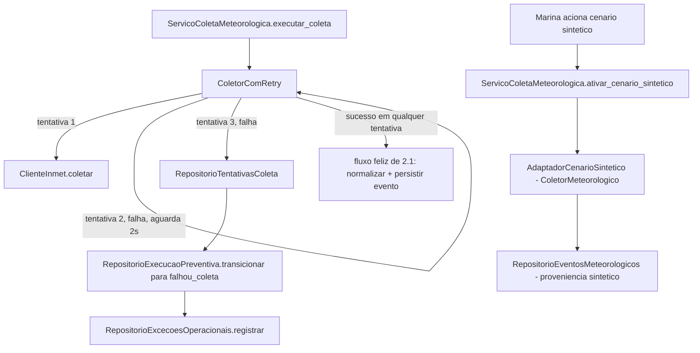

# História 2.2: Operar com segurança durante indisponibilidades meteorológicas — Design

**Spec**: `.specs/features/2-2-operar-com-seguranca-durante-indisponibilidades-meteorologicas/spec.md`
**Status**: Approved

---

## Research (Knowledge Verification Chain)

**Codebase**: a História 2.1 (Design aprovado) já define `ClienteInmet.coletar()` como uma **única tentativa** HTTP com timeout de 5s, deliberadamente sem retry — o próprio `design.md` de 2.1 registra: "Escopo de retry/backoff nesta história: não implementado aqui... pronta para ser envolvida pelo laço de retry da História 2.2". Esta história implementa exatamente esse laço. `dominio/estados_execucao.py` (AD-004) já define `EstadoExecucao.COLETANDO`/`FALHOU_COLETA` e `ESTADOS_TERMINAIS`; a tabela `execucao_preventiva` (schema do Épico 1) já existe como "casca mínima". Nenhuma tabela de execução ainda é escrita por código de produção — esta é a primeira história a fazê-lo.

**Project docs**: AD-8 exige timeout + no máximo três tentativas e que falha do INMET preserve o último snapshot só para consulta. AD-7 exige que estados terminais sejam monotônicos e que nova tentativa após `falhou_coleta` crie execução correlacionada nova, com `execucao_id`/chave idempotente próprios. AD-006 (registrado nesta sessão) já fixa o runner assíncrono padrão como task `asyncio` in-process — reaproveitado aqui para nada novo (o retry desta história é síncrono dentro da própria chamada, não um agendamento).

**Decisões já confirmadas na sessão de Design da História 2.1** (reaproveitadas aqui, não reabertas): timeout de 5s por tentativa, 3 tentativas totais, backoff exponencial 1s/2s/4s.

---

## Approach

**Escolhida**: um decorator/wrapper síncrono de retry (`ColetorComRetry`) que envolve `ClienteInmet` (porta `ColetorMeteorologico` de 2.1) sem alterar sua interface — cada chamada a `.coletar()` já é uma tentativa única; o wrapper repete até 3 vezes com espera 1s/2s/4s entre elas, registrando cada tentativa individual. Isso preserva a composição de portas do AD-1 (aplicação depende só de portas) e evita duplicar a lógica de timeout dentro do cliente HTTP.

Alternativa descartada: colocar o laço de retry dentro do próprio `ClienteInmet`. Rejeitada porque misturaria a responsabilidade de "falar HTTP" com "decidir quantas vezes tentar", tornando `ClienteInmet` não testável isoladamente para o caso de uma única tentativa (que a História 2.1 já testa) sem dublês adicionais.

---

## Code Reuse Analysis

### Existing Components to Leverage

| Component | Location | How to Use |
| --- | --- | --- |
| `ColetorMeteorologico` (porta) | `aplicacao/portas_meteorologia.py` (T3 da 2.1) | `ColetorComRetry` implementa a mesma porta, delegando cada tentativa a um `ColetorMeteorologico` interno (`ClienteInmet` real ou dublê) |
| `ClienteInmet` / `AdaptadorInmetFalso` | `adaptadores/meteorologia/cliente_inmet.py` (T6 da 2.1) | Reusados sem alteração como a implementação de "uma tentativa" envolvida pelo retry |
| `RepositorioSincronizacoes` | `adaptadores/persistencia/repositorio_meteorologia.py` (T7 da 2.1) | Estendido (não recriado) para também aceitar o estado `falha` já previsto no `CHECK` da tabela |
| `ServicoColetaMeteorologica` | `aplicacao/coleta_meteorologica.py` (T8 da 2.1) | Passa a injetar `ColetorComRetry` em vez de `ClienteInmet` diretamente; ganha `ativar_cenario_sintetico` |
| `EstadoExecucao`, `ESTADOS_TERMINAIS`, `eh_terminal` | `dominio/estados_execucao.py` (AD-004) | Usados tal como estão para validar a transição a `falhou_coleta` |
| Padrão de repositório por conexão explícita | `adaptadores/persistencia/repositorio_execucoes.py` | Mesmo padrão para os três repositórios novos desta história |
| AD-002 (`Idempotency-Key` genérico) | tabela `chaves_idempotencia` | Reusado para a "nova tentativa explícita" e a "ativação de cenário sintético" (ambas mutações `POST`) |

### Integration Points

| System | Integration Method |
| --- | --- |
| DuckDB | Três tabelas novas via migração `0003` (`tentativas_coleta_meteorologica`, `excecoes_operacionais`, `cenarios_sinteticos_ativados`); `execucao_preventiva` (schema do Épico 1) passa a ser escrita pela primeira vez |
| INMET | Nenhuma integração nova — reusa `ClienteInmet` de 2.1 |

---

## Components

### `ColetorComRetry`

- **Purpose**: Envolve um `ColetorMeteorologico` de tentativa única com retry limitado, backoff e registro por tentativa.
- **Location**: `aplicacao/coleta_meteorologica.py` (mesmo módulo do caso de uso; classe interna de aplicação, não adaptador — decide política de negócio, não transporte)
- **Interfaces**:
  - `async def coletar(self, area: AreaMonitorada) -> RespostaColetaInmet` — mesma assinatura da porta `ColetorMeteorologico`; internamente chama o coletor delegado até 3 vezes, aguardando 1s/2s/4s entre falhas, publicando cada tentativa via `RepositorioTentativasColeta` antes de decidir a próxima ação.
- **Dependencies**: `ColetorMeteorologico` (delegado), `RepositorioTentativasColeta`, um `esperar: Callable[[float], Awaitable[None]]` injetável (para dublê de tempo nos testes, mesmo padrão de `medir_tempo` de `SondaInmet`).
- **Reuses**: interface idêntica ao `ColetorMeteorologico` de 2.1 — nenhuma mudança no chamador além de qual implementação é injetada.

### `RepositorioExecucaoPreventiva`

- **Purpose**: Primeira implementação real de leitura/escrita da tabela `execucao_preventiva` — cria uma execução, lê seu estado/versão, e transiciona atomicamente com checagem otimista de versão (mesmo padrão que a História 2.4 vai reusar para regras, e que a História 2.6 vai estender para o restante da máquina de estados).
- **Location**: `adaptadores/persistencia/repositorio_execucao_preventiva.py`
- **Interfaces**:
  - `def criar(self, estado_inicial: EstadoExecucao) -> UUID`
  - `def obter(self, execucao_id: UUID) -> SnapshotExecucao` (estado, versão)
  - `def transicionar(self, execucao_id: UUID, versao_esperada: int, novo_estado: EstadoExecucao) -> None` — levanta `ConflitoVersao` se `versao_esperada` não bater, ou `TransicaoInvalida` se `eh_terminal(estado_atual)` for verdadeiro (estados terminais nunca reabrem, AD-7).
- **Dependencies**: `abrir_conexao`, `dominio/estados_execucao.py`.
- **Reuses**: padrão de conexão explícita e transação por agregado (AD-2) de `repositorio_execucoes.py`.

### `RepositorioTentativasColeta`

- **Purpose**: Persiste cada tentativa individual de coleta (número, início, término, código do resultado, correlação), consultável pela interface durante o retry em andamento.
- **Location**: `adaptadores/persistencia/repositorio_meteorologia.py` (adicionado ao mesmo arquivo de T7, por ser a mesma família de portas de meteorologia)
- **Interfaces**:
  - `def registrar_tentativa(self, sincronizacao_id: UUID, numero: int, resultado: ResultadoTentativa) -> None`
  - `def listar_tentativas(self, sincronizacao_id: UUID) -> list[TentativaColeta]`
- **Dependencies**: `abrir_conexao`.
- **Reuses**: mesmo padrão dos demais repositórios de meteorologia de 2.1.

### `RepositorioExcecoesOperacionais`

- **Purpose**: Registra a `Exceção` (causa, tentativas, impacto operacional) quando uma execução alcança `falhou_coleta`.
- **Location**: `adaptadores/persistencia/repositorio_execucao_preventiva.py` (mesmo módulo — mesma transação da transição de estado)
- **Interfaces**:
  - `def registrar(self, execucao_id: UUID, causa: str, tentativas: int, impacto: str) -> None`
- **Dependencies**: `abrir_conexao`.
- **Reuses**: nada existente — primeira tabela de exceções do projeto.

### `AdaptadorCenarioSintetico`

- **Purpose**: Implementa `ColetorMeteorologico` devolvendo um cenário sintético pré-definido do conjunto demonstrativo do Épico 1, rotulado como tal.
- **Location**: `adaptadores/meteorologia/adaptador_cenario_sintetico.py`
- **Interfaces**:
  - `async def coletar(self, area: AreaMonitorada) -> RespostaColetaInmet` — devolve dados fixos do cenário sintético selecionado (o `NormalizadorInmet` de 2.1 normaliza com `proveniencia = sintetico`, pois a proveniência é decidida pelo chamador, não pelo adaptador — ver Tech Decisions).
- **Dependencies**: dataset sintético do Épico 1 (`adaptadores/persistencia/semeador.py` como referência dos cenários disponíveis, não como dependência de runtime).
- **Reuses**: mesma porta `ColetorMeteorologico` de `ClienteInmet`/`AdaptadorInmetFalso` — o caso de uso não precisa saber qual coletor está ativo.

### Extensão de `ServicoColetaMeteorologica`

- **Purpose**: Adiciona `ativar_cenario_sintetico(chave_idempotencia)`, `solicitar_nova_tentativa(chave_idempotencia)` (após `falhou_coleta`, cria execução correlacionada nova) e a lógica de decisão pós-retry (sucesso → fluxo de 2.1; falha esgotada → transição a `falhou_coleta` + `Exceção`).
- **Location**: `aplicacao/coleta_meteorologica.py` (extensão do caso de uso de 2.1, mesmo arquivo)
- **Dependencies**: `ColetorComRetry`, `RepositorioExecucaoPreventiva`, `RepositorioExcecoesOperacionais`, `AdaptadorCenarioSintetico`.
- **Reuses**: idempotência genérica (AD-002), snapshot de sincronização de 2.1.

---

## Data Models

### Migração `0003_resiliencia_meteorologica.sql`

#### `tentativas_coleta_meteorologica` (nova)

| Coluna | Tipo | Restrições |
| --- | --- | --- |
| `id` | `UUID` | chave primária |
| `sincronizacao_id` | `UUID` | `NOT NULL`, chave estrangeira lógica para `sincronizacoes_meteorologicas(id)` |
| `numero_tentativa` | `INTEGER` | `NOT NULL`, `CHECK` entre 1 e 3 |
| `codigo_resultado` | `VARCHAR` | `NOT NULL` (`sucesso`, `timeout`, `erro_transporte`, `status_erro`) |
| `iniciado_em` | `TIMESTAMP` | `NOT NULL` |
| `finalizado_em` | `TIMESTAMP` | `NOT NULL` |

#### `excecoes_operacionais` (nova)

| Coluna | Tipo | Restrições |
| --- | --- | --- |
| `id` | `UUID` | chave primária |
| `execucao_id` | `UUID` | `NOT NULL`, chave estrangeira lógica para `execucao_preventiva(id)` |
| `causa` | `VARCHAR` | `NOT NULL` |
| `tentativas` | `INTEGER` | `NOT NULL` |
| `impacto` | `VARCHAR` | `NOT NULL` |
| `criado_em` | `TIMESTAMP` | `NOT NULL`, padrão `now()` |

#### `cenarios_sinteticos_ativados` (nova)

Rastreia quando/qual cenário sintético de contingência foi ativado, para a interface explicar a origem sintética.

| Coluna | Tipo | Restrições |
| --- | --- | --- |
| `id` | `UUID` | chave primária |
| `sincronizacao_id` | `UUID` | `NOT NULL`, chave estrangeira lógica para `sincronizacoes_meteorologicas(id)` |
| `identificador_cenario` | `VARCHAR` | `NOT NULL` (id determinístico do dataset sintético do Épico 1) |
| `ativado_em` | `TIMESTAMP` | `NOT NULL`, padrão `now()` |

---

## Error Handling Strategy

| Error Scenario | Handling | User Impact |
| --- | --- | --- |
| Tentativa 1 ou 2 falha, tentativas restantes | `ColetorComRetry` registra a tentativa e aguarda o backoff antes da próxima | Fonte meteorológica mostra "Em tentativa" com contador (`tentativa atual / 3`) |
| 3ª tentativa falha | `ServicoColetaMeteorologica` transiciona a execução para `falhou_coleta` e registra `Exceção`; snapshot anterior (se existir) permanece só-leitura | Interface mostra "Indisponível", snapshot antigo marcado como desatualizado |
| Nova tentativa explícita após `falhou_coleta` | Cria nova `ExecucaoPreventiva` (`criar` com estado `coletando`), nova `Idempotency-Key`; a execução terminal anterior nunca é reaberta | Nova barra de progresso independente da execução anterior |
| Ativação de cenário sintético | `AdaptadorCenarioSintetico` injetado no lugar do coletor real para essa execução; evento resultante tem `proveniencia = sintetico` e nunca é confundido com `real_inmet` na consulta | Indicador textual "Cenário sintético" visível em toda superfície derivada |
| Recuperação real após falha/sintético | Coleta real bem-sucedida grava evento com chave determinística de conteúdo (mesmos campos-chave: tipo, área, período); `RepositorioEventosMeteorologicos` rejeita duplicata pela mesma chave | Nenhum evento duplicado aparece na lista |

---

## Risks & Concerns

| Concern | Location (file:line) | Impact | Mitigation |
| --- | --- | --- | --- |
| Esta é a primeira história a escrever de fato na tabela `execucao_preventiva`, que a História 2.6 também vai orquestrar de ponta a ponta | `adaptadores/persistencia/repositorio_execucao_preventiva.py` (a criar) | Risco de a História 2.6 precisar de uma interface diferente da que 2.2 define, gerando retrabalho | `RepositorioExecucaoPreventiva` expõe só `criar`/`obter`/`transicionar` genéricos sobre `EstadoExecucao`, sem nenhuma lógica específica de meteorologia — desenhado deliberadamente para ser a mesma porta que 2.3, 2.5 e 2.6 vão reusar sem alteração de assinatura |
| "Chave determinística de conteúdo" para deduplicar evento real após uma janela sintética não tem um algoritmo definido ainda | `adaptadores/persistencia/repositorio_meteorologia.py` (`RepositorioEventosMeteorologicos`, estendido nesta história) | Sem definição, a dedução de duplicata poderia ser implementada de forma inconsistente | Definido em Tech Decisions abaixo: chave = `(tipo, area, periodo_inicio, periodo_fim)` com `UNIQUE` na tabela `eventos_meteorologicos`, adicionada por esta migração |

---

## Tech Decisions

| Decision | Choice | Rationale |
| --- | --- | --- |
| Onde decidir a `proveniencia` do evento (`real_inmet` vs `sintetico`) | O caso de uso (`ServicoColetaMeteorologica`) passa a proveniência esperada ao `NormalizadorInmet` explicitamente, em vez de o normalizador inferi-la da resposta bruta | O mesmo normalizador de 2.1 serve tanto a coleta real quanto o cenário sintético; a proveniência é uma decisão de "qual coletor foi chamado", não do conteúdo da resposta |
| Chave de deduplicação de evento | `UNIQUE(tipo, area, periodo_inicio, periodo_fim)` em `eventos_meteorologicos`, adicionada nesta migração | Cumpre literalmente "não deverá duplicar eventos já persistidos com a mesma identidade externa ou chave determinística de conteúdo"; simples e suficiente para o conjunto de dados da PoC |
| Onde vive o retry (wrapper vs dentro do cliente) | Wrapper `ColetorComRetry` na camada de aplicação, envolvendo a porta `ColetorMeteorologico` | Mantém `ClienteInmet` testável como chamada única (já coberto por 2.1) e centraliza política de retry num único lugar reusável por qualquer coletor futuro |
| Escopo de `RepositorioExecucaoPreventiva` nesta história | Só `criar`/`obter`/`transicionar` genéricos; nenhuma lógica de marcos (`publico_elegivel_formado` etc.) — isso é da História 2.6 | Evita que 2.2 antecipe decisões de design que pertencem à orquestração completa (2.6), mantendo esta história focada em coleta+resiliência |

---

## Approval

Design técnico direto, sem bifurcação de produto nova (todos os defaults de resiliência já foram confirmados com o usuário na sessão de Design da História 2.1). Aprovado por extensão dessa decisão; usuário pediu explicitamente para eu seguir só até Tasks de todo o Épico 2 nesta rodada, sem executar.
