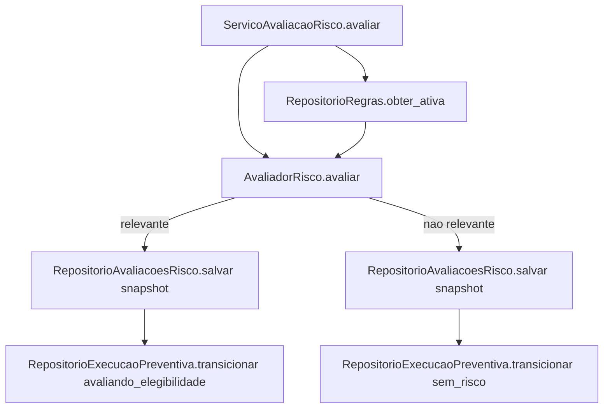

# História 2.3: Identificar eventos meteorológicos relevantes — Design

**Spec**: `.specs/features/2-3-identificar-eventos-meteorologicos-relevantes/spec.md`
**Status**: Approved

---

## Research (Knowledge Verification Chain)

**Codebase**: a tabela `regras` já existe no schema do Épico 1 (`evento_tipo`, `limiar_meteorologico`, `area_aplicavel`, `apolice_tipo`, `cobertura_exigida`, `antecedencia_horas`, `canal`, `versao`, `estado`) — esta história só **consome** a regra ativa, não a gerencia (isso é a História 2.4). `EventoMeteorologico` (História 2.1) já carrega `tipo`, `area`, `periodo_inicio/fim`, `intensidade`. `RepositorioExecucaoPreventiva` (História 2.2) já expõe `transicionar(execucao_id, versao_esperada, novo_estado)` com checagem de `eh_terminal` — reusado tal como está, sem mudança de assinatura, confirmando a previsão de "Risks & Concerns" do Design de 2.2.

**Project docs**: AD-5 proíbe qualquer LLM na decisão de risco. AD-11 exige que a mudança futura de uma regra não recalcule execuções já concluídas — cumprido preservando um snapshot imutável da regra aplicada, não uma referência viva a `regras`.

**Valores de limiar**: a Spec já registra como assunção revisável no Design; fixados abaixo em Tech Decisions com justificativa meteorológica plausível para a demonstração — não são um dado real de produção, são o valor padrão do conjunto sintético (mesma natureza dos limiares já assumidos implicitamente pelo dataset de `regras` semeado no Épico 1).

---

## Approach

Motor de avaliação puro (`AvaliadorRisco`), sem estado, que recebe `EventoMeteorologico` + regra ativa e devolve um `ResultadoAvaliacaoRisco` determinístico. O caso de uso (`ServicoAvaliacaoRisco`) persiste o snapshot e transiciona a execução via `RepositorioExecucaoPreventiva` (2.2). Nenhuma alternativa de arquitetura foi considerada — é uma função determinística direta, sem ambiguidade estrutural.

---

## Code Reuse Analysis

### Existing Components to Leverage

| Component | Location | How to Use |
| --- | --- | --- |
| `EventoMeteorologico` | `dominio/evento_meteorologico.py` (2.1) | Entrada do avaliador |
| `RepositorioExecucaoPreventiva` | `adaptadores/persistencia/repositorio_execucao_preventiva.py` (2.2) | Transição para `sem_risco`/`avaliando_elegibilidade`, sem mudança de interface |
| `EstadoExecucao` | `dominio/estados_execucao.py` (AD-004) | Estados-alvo da transição |
| Tabela `regras` (schema Épico 1) | `adaptadores/persistencia/` | Fonte da regra ativa por `evento_tipo` |
| Padrão de repositório por conexão explícita | `repositorio_execucoes.py` | Mesmo padrão para os componentes novos |

### Integration Points

| System | Integration Method |
| --- | --- |
| DuckDB | Nova tabela `avaliacoes_risco` (migração `0004`) para o snapshot imutável evento+regra+critérios+resultado |

---

## Components

### `AvaliadorRisco` (domínio, função pura)

- **Purpose**: Compara um `EventoMeteorologico` contra uma regra ativa e devolve relevância determinística com os critérios avaliados.
- **Location**: `dominio/avaliador_risco.py`
- **Interfaces**:
  - `def avaliar(evento: EventoMeteorologico, regra: RegraSnapshot) -> ResultadoAvaliacaoRisco` — sem I/O, sem estado; mesma entrada sempre produz a mesma saída (cumpre `RISCO-06`).
- **Dependencies**: nenhuma (função pura).
- **Reuses**: nada — primeiro motor de decisão do domínio.

### `RepositorioRegras` (consulta, somente leitura nesta história)

- **Purpose**: Obtém a regra ativa por `evento_tipo`. A escrita/versionamento pertence à História 2.4; esta história só lê.
- **Location**: `adaptadores/persistencia/repositorio_regras.py`
- **Interfaces**:
  - `def obter_ativa(self, evento_tipo: TipoEventoMeteorologico) -> RegraSnapshot | None`
- **Dependencies**: `abrir_conexao`.
- **Reuses**: padrão de repositório de conexão explícita.

### `RepositorioAvaliacoesRisco`

- **Purpose**: Persiste o snapshot imutável da avaliação (evento, regra e versão, critérios, resultado).
- **Location**: `adaptadores/persistencia/repositorio_avaliacoes_risco.py`
- **Interfaces**:
  - `def salvar(self, execucao_id: UUID, evento_id: UUID, regra_id: UUID, resultado: ResultadoAvaliacaoRisco) -> UUID`
  - `def obter_por_execucao(self, execucao_id: UUID) -> AvaliacaoRisco | None`
- **Dependencies**: `abrir_conexao`.
- **Reuses**: padrão de repositório existente.

### `ServicoAvaliacaoRisco` (caso de uso)

- **Purpose**: Orquestra obtenção da regra ativa, avaliação, persistência do snapshot e transição de estado.
- **Location**: `aplicacao/avaliacao_risco.py`
- **Interfaces**:
  - `def avaliar_evento(self, execucao_id: UUID, versao_esperada: int, evento: EventoMeteorologico) -> ResultadoAvaliacaoRisco`
- **Dependencies**: `AvaliadorRisco`, `RepositorioRegras`, `RepositorioAvaliacoesRisco`, `RepositorioExecucaoPreventiva`.
- **Reuses**: `RepositorioExecucaoPreventiva.transicionar` (2.2) sem alteração.

---

## Data Models

### Migração `0004_avaliacao_risco.sql`

#### `avaliacoes_risco` (nova)

| Coluna | Tipo | Restrições |
| --- | --- | --- |
| `id` | `UUID` | chave primária |
| `execucao_id` | `UUID` | `NOT NULL`, chave estrangeira lógica para `execucao_preventiva(id)` |
| `evento_id` | `UUID` | `NOT NULL`, chave estrangeira lógica para `eventos_meteorologicos(id)` |
| `regra_id` | `UUID` | `NOT NULL`, chave estrangeira lógica para `regras(id)` |
| `regra_versao` | `INTEGER` | `NOT NULL` — snapshot da versão, não referência viva |
| `relevante` | `BOOLEAN` | `NOT NULL` |
| `criterios` | `VARCHAR` | `NOT NULL` — JSON serializado com operando/valor observado/resultado por critério |
| `motivo` | `VARCHAR` | `NOT NULL` |
| `criado_em` | `TIMESTAMP` | `NOT NULL`, padrão `now()` |

---

## Error Handling Strategy

| Error Scenario | Handling | User Impact |
| --- | --- | --- |
| Evento de tipo não suportado (nem chuva intensa nem granizo) | `AvaliadorRisco` retorna resultado "não suportado"; execução não avança | Motivo consultável, sem alerta gerado |
| Nenhuma regra ativa para o tipo do evento | `ServicoAvaliacaoRisco` trata como "sem regra aplicável" — mesmo efeito de `sem_risco`, motivo específico | Interface mostra "sem risco" com motivo "nenhuma regra ativa para este tipo de evento" |
| Evento no valor-limite exato do limiar | `AvaliadorRisco` aplica a fronteira documentada (inclusiva/exclusiva) sem ambiguidade | Resultado determinístico e reproduzível |

---

## Risks & Concerns

> None found — motor puro sem dependência externa, sobre componentes já existentes de 2.1/2.2.

---

## Tech Decisions

| Decision | Choice | Rationale |
| --- | --- | --- |
| Limiar de chuva intensa (demonstração) | `intensidade >= 50.0` (mm acumulados no período do evento) — fronteira **inclusiva** | Valor de referência usado por classificações meteorológicas públicas para "chuva forte/muito forte" em 24h; adequado como default de demonstração, documentado como tal (não é um valor operacional real) |
| Limiar de granizo (demonstração) | Qualquer evento com `tipo = granizo` já é considerado relevante por ocorrência (não há limiar de intensidade adicional na demonstração) — a severidade em si é o gatilho | Simplifica o cenário sintético do MVP; granizo é binário (ocorreu/não ocorreu) na fonte pública, diferente de chuva que é uma medida contínua |
| Onde vive o limiar | Reaproveita `regras.limiar_meteorologico` (schema já existente) — não introduz configuração paralela | A tabela já foi desenhada no Épico 1 exatamente para isso |
| Serialização de `criterios` | JSON em coluna `VARCHAR` (DuckDB não tem tipo JSON nativo neste schema) | Consistente com `apolices.coberturas` sendo `VARCHAR[]`; aqui a estrutura é heterogênea por critério, então JSON serializado é mais simples que normalizar em tabela filha para o volume da PoC |

---

## Approval

Aprovado por extensão da mesma sessão — sem bifurcação de produto nova; limiares documentados como default de demonstração, revisáveis.
