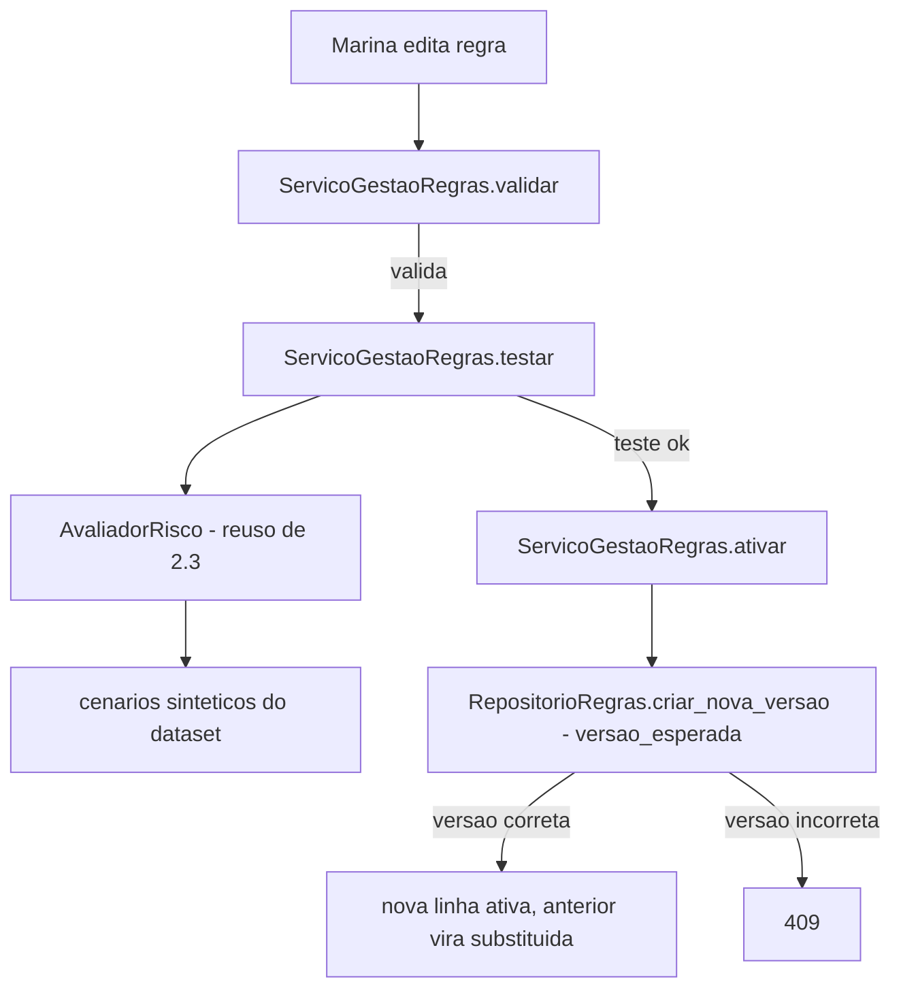

# História 2.4: Configurar, testar e versionar regras preventivas — Design

**Spec**: `.specs/features/2-4-configurar-testar-e-versionar-regras-preventivas/spec.md`
**Status**: Approved

---

## Research (Knowledge Verification Chain)

**Codebase**: a tabela `regras` (schema Épico 1) já tem `versao INTEGER NOT NULL DEFAULT 1` e `estado CHECK IN ('ativa', 'substituida')` — exatamente o modelo de "nova versão imutável substitui a ativa" que o AC pede. `RepositorioExecucaoPreventiva.transicionar` (2.2) já é o exemplo de concorrência otimista por `versao_esperada` no projeto — este design replica o mesmo padrão para `regras`. `AvaliadorRisco` (2.3) consome `RegraSnapshot` — esta história não muda essa interface, só adiciona o caminho de escrita/teste/ativação por trás dela.

**Project docs**: AD-11 exige preservar histórico e nunca reescrever justificativa passada — cumprido porque a História 2.3 já snapshota `regra_versao` em `avaliacoes_risco`, não uma referência viva.

---

## Approach

CRUD versionado clássico sobre `regras`, com um passo de teste determinístico obrigatório antes da ativação (reusa `AvaliadorRisco` de 2.3 como motor do teste — não duplica lógica de avaliação). Concorrência otimista via `versao_esperada`, idempotência via o mecanismo genérico AD-002. Nenhuma alternativa de arquitetura considerada — é o mesmo padrão de concorrência já estabelecido em `RepositorioExecucaoPreventiva`.

---

## Code Reuse Analysis

### Existing Components to Leverage

| Component | Location | How to Use |
| --- | --- | --- |
| `AvaliadorRisco` | `dominio/avaliador_risco.py` (2.3) | Reusado sem alteração como motor do "teste determinístico" desta história — nenhuma segunda implementação de avaliação |
| `RepositorioRegras.obter_ativa` | `adaptadores/persistencia/repositorio_regras.py` (2.3, leitura) | Estendido (mesmo arquivo) com as operações de escrita desta história |
| Tabela `regras` (schema Épico 1) | — | Nenhuma migração nova necessária — schema já suporta versionamento por substituição |
| AD-002 (`Idempotency-Key`) | `chaves_idempotencia` | Reusado para `ativar` |
| Cenários sintéticos do dataset | `adaptadores/persistencia/semeador.py` | Fonte dos "cenários sintéticos selecionados" para o teste determinístico |

### Integration Points

| System | Integration Method |
| --- | --- |
| DuckDB | Extensão de `repositorio_regras.py`; nenhuma tabela nova |

---

## Components

### Extensão de `RepositorioRegras` — escrita versionada

- **Purpose**: `criar_nova_versao` com concorrência otimista (mesmo padrão de `RepositorioExecucaoPreventiva.transicionar`).
- **Location**: `adaptadores/persistencia/repositorio_regras.py` (extensão de 2.3)
- **Interfaces**:
  - `def listar(self, evento_tipo: TipoEventoMeteorologico | None = None) -> list[RegraSnapshot]`
  - `def obter_por_id(self, regra_id: UUID) -> RegraSnapshot | None`
  - `def criar_nova_versao(self, regra_anterior_id: UUID, versao_esperada: int, dados: DadosRegra) -> RegraSnapshot` — levanta `ConflitoVersao` (`409`) se `versao_esperada` não bater; marca a anterior `substituida` e insere a nova `ativa`, na mesma transação.
- **Dependencies**: `abrir_conexao`.
- **Reuses**: mesmo padrão de conflito otimista de `RepositorioExecucaoPreventiva` (2.2).

### `ValidadorRegra`

- **Purpose**: Valida tipos, faixas, combinações obrigatórias e coerência evento↔produto antes de permitir teste/ativação.
- **Location**: `dominio/validador_regra.py`
- **Interfaces**:
  - `def validar(dados: DadosRegra) -> ResultadoValidacao` — lista de erros por campo, em português brasileiro.
- **Dependencies**: nenhuma (função pura).
- **Reuses**: nada — primeira validação de regra do domínio.

### `ServicoGestaoRegras` (caso de uso)

- **Purpose**: Orquestra validar → testar (via `AvaliadorRisco` contra cenários sintéticos) → ativar (versão nova, idempotente).
- **Location**: `aplicacao/gestao_regras.py`
- **Interfaces**:
  - `def testar(self, dados: DadosRegra) -> list[ResultadoAvaliacaoRisco]` — aplica `AvaliadorRisco` a cada cenário sintético selecionado; bloqueia se `ValidadorRegra` reprovar.
  - `def ativar(self, regra_anterior_id: UUID, versao_esperada: int, dados: DadosRegra, chave_idempotencia: str) -> RegraSnapshot`
- **Dependencies**: `ValidadorRegra`, `AvaliadorRisco` (2.3), `RepositorioRegras`, `RepositorioIdempotencia`.
- **Reuses**: `AvaliadorRisco` sem modificação; idempotência genérica AD-002.

---

## Data Models

Nenhuma migração nova — `regras` (schema Épico 1) já suporta o modelo. Nenhuma alteração de `EventoMeteorologico`/`ResultadoAvaliacaoRisco` (2.1/2.3).

---

## Error Handling Strategy

| Error Scenario | Handling | User Impact |
| --- | --- | --- |
| Configuração inválida (tipo/faixa/combinação) | `ValidadorRegra` bloqueia antes de testar/ativar, com motivo por campo em PT-BR | Erro junto ao campo, valores preservados no formulário |
| `versao_esperada` desatualizada na ativação | `RepositorioRegras.criar_nova_versao` levanta `ConflitoVersao` → `409` | Nenhuma versão nova criada; Marina recarrega e tenta de novo |
| `Idempotency-Key` repetida com conteúdo idêntico | `RepositorioIdempotencia` devolve resposta registrada | Nenhuma versão duplicada |
| `Idempotency-Key` repetida com conteúdo diferente | `409` | Erro claro, nenhuma mutação |
| Execução já iniciada quando a regra ativa muda | Nada a fazer aqui — a execução já preserva `regra_versao` (snapshot de 2.3), não uma referência viva | Resultado histórico nunca recalculado |

---

## Risks & Concerns

> None found — reusa integralmente o motor de avaliação de 2.3 e o padrão de concorrência de 2.2, sem componente novo de alto risco.

---

## Tech Decisions

| Decision | Choice | Rationale |
| --- | --- | --- |
| Motor do "teste determinístico" | Reusa `AvaliadorRisco` (2.3) diretamente — a regra em edição (ainda não ativa) é passada como `RegraSnapshot` candidato | Evita duplicar a lógica de comparação de critérios; a mesma função que decide risco em produção decide o teste |
| Cenários sintéticos do teste | Reusa os cenários já semeados por `semeador.py` (Épico 1), filtrados pelo `evento_tipo` da regra em edição | Consistente com a decisão já tomada em 2.2 para o cenário sintético de contingência — uma única fonte de cenários sintéticos no projeto |
| Escopo de gestão de histórico | Só consulta das versões necessárias à auditoria (via `listar`/`obter_por_id`); sem duplicação de regra nem reversão — conforme o próprio AC do MVP | Delimitado explicitamente pela spec como fora de escopo |

---

## Approval

Aprovado por extensão da mesma sessão — reuso direto de componentes já aprovados em 2.2/2.3, sem decisão de produto nova.
