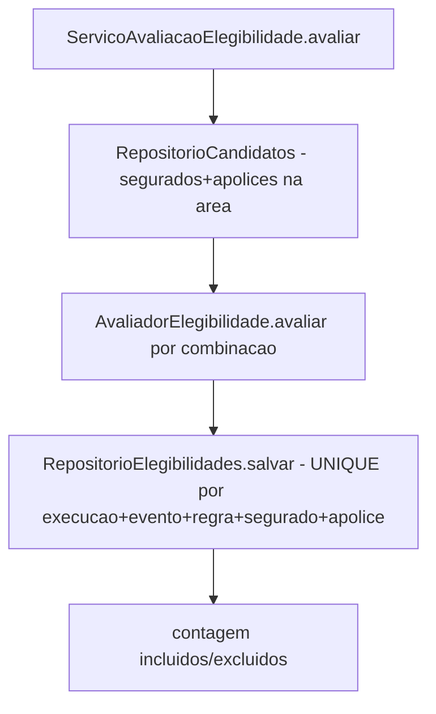

# História 2.5: Selecionar e explicar o público elegível — Design

**Spec**: `.specs/features/2-5-selecionar-e-explicar-o-publico-elegivel/spec.md`
**Status**: Approved

---

## Research (Knowledge Verification Chain)

**Codebase**: `elegibilidades_historicas` já existe no schema do Épico 1 (`evento_id`, `regra_id`, `segurado_id`, `apolice_id`, `elegivel`, `justificativa`) — mesma forma que os ACs desta história pedem para os resultados `incluido`/`excluido`. `segurados`/`apolices` (schema Épico 1) já têm todos os campos que os critérios de elegibilidade avaliam (`codigo_ibge_area`, `canal_preferido`, `participa_de_alertas`, `tipo`, `situacao`, `coberturas`). `RepositorioExecucaoPreventiva.transicionar` (2.2) é reusado para levar a execução a `avaliando_elegibilidade`→ próximo estado (a transição final para `aguardando_geracao`/`sem_elegiveis` é orquestrada pela História 2.6, que decide entre os dois; esta história só produz os resultados de elegibilidade e informa a contagem).

**Project docs**: AD-5 proíbe LLM na seleção do público. AD-11 exige snapshot imutável (segurado, apólice, evento, regra) que não é recalculado por mudança posterior nos dados originais.

---

## Approach

Motor de elegibilidade puro (`AvaliadorElegibilidade`), análogo ao `AvaliadorRisco` de 2.3, avaliando cada combinação segurado+apólice candidata contra os critérios objetivos. O caso de uso persiste um resultado por combinação com `UNIQUE` garantindo "no máximo um resultado" (mesmo padrão de dedução usado em 2.2 para eventos). Nenhuma alternativa de arquitetura considerada — extensão direta do padrão já estabelecido por 2.3.

---

## Code Reuse Analysis

### Existing Components to Leverage

| Component | Location | How to Use |
| --- | --- | --- |
| `elegibilidades_historicas` (schema Épico 1) | — | Reusada como a tabela de resultados desta história (antes só populada por dado pré-calculado de demonstração; agora também escrita pela execução real) |
| `segurados`, `apolices` (schema Épico 1) | — | Fonte dos candidatos; nenhuma tabela nova |
| Padrão de `AvaliadorRisco` (função pura + snapshot) | `dominio/avaliador_risco.py` (2.3) | Mesmo padrão estrutural aplicado a `AvaliadorElegibilidade` |
| `RepositorioExecucaoPreventiva` | `adaptadores/persistencia/repositorio_execucao_preventiva.py` (2.2) | Reusado sem alteração |

### Integration Points

| System | Integration Method |
| --- | --- |
| DuckDB | Migração `0006` recria `elegibilidades_historicas` por recreate-and-copy (AD-015) com as colunas novas, backfill das linhas semeadas e `UNIQUE(execucao_id, evento_id, regra_id, segurado_id, apolice_id)` declarada no `CREATE` |

---

## Components

### `AvaliadorElegibilidade` (domínio, função pura)

- **Purpose**: Avalia uma combinação segurado+apólice contra os critérios de elegibilidade (área, tipo/situação da apólice, coberturas, participação em alertas), devolvendo `incluido`/`excluido` com critério a critério.
- **Location**: `dominio/avaliador_elegibilidade.py`
- **Interfaces**:
  - `def avaliar(segurado: Segurado, apolice: ApoliceSnapshot, evento: EventoMeteorologico, regra: RegraSnapshot) -> ResultadoElegibilidade`
- **Dependencies**: nenhuma (função pura).
- **Reuses**: mesmo formato estrutural de `AvaliadorRisco` (2.3) — não a mesma função, mas o mesmo padrão "entrada imutável → saída determinística com critérios".

### `RepositorioCandidatosElegibilidade`

- **Purpose**: Lista segurados+apólices candidatos por área afetada (mesma área do evento).
- **Location**: `adaptadores/persistencia/repositorio_elegibilidade.py`
- **Interfaces**:
  - `def listar_candidatos(self, area: str) -> list[CandidatoElegibilidade]`
- **Dependencies**: `abrir_conexao`.
- **Reuses**: padrão de repositório existente.

### `RepositorioElegibilidades`

- **Purpose**: Persiste um resultado por combinação (dedução por `UNIQUE`), consulta quantidades e detalhe por execução.
- **Location**: `adaptadores/persistencia/repositorio_elegibilidade.py` (mesmo arquivo)
- **Interfaces**:
  - `def salvar(self, execucao_id: UUID, evento_id: UUID, regra_id: UUID, resultado: ResultadoElegibilidade) -> UUID | None` (`None` se já existir a combinação — idempotente por natureza do `UNIQUE`, não por `Idempotency-Key`)
  - `def contar_por_execucao(self, execucao_id: UUID) -> ContagemElegibilidade`
  - `def listar_por_execucao(self, execucao_id: UUID) -> list[ResultadoElegibilidade]`
- **Dependencies**: `abrir_conexao`.
- **Reuses**: padrão de repositório existente.

### `ServicoAvaliacaoElegibilidade` (caso de uso)

- **Purpose**: Orquestra candidatos → avaliação → persistência → contagem, para todos os candidatos de um evento relevante.
- **Location**: `aplicacao/avaliacao_elegibilidade.py`
- **Interfaces**:
  - `def avaliar_publico(self, execucao_id: UUID, evento: EventoMeteorologico, regra: RegraSnapshot) -> ContagemElegibilidade`
- **Dependencies**: `AvaliadorElegibilidade`, `RepositorioCandidatosElegibilidade`, `RepositorioElegibilidades`.
- **Reuses**: nada de I/O novo além dos repositórios acima.

---

## Data Models

### Migração `0006_elegibilidade.sql`

Recria `elegibilidades_historicas` por recreate-and-copy na transação da própria migração (**AD-015** — o DuckDB não suporta `ALTER ADD CONSTRAINT`, e a tabela já contém linhas semeadas do Épico 1 que precisam de backfill): `CREATE TABLE elegibilidades_historicas_nova (...)` com todas as colunas e constraints, `INSERT INTO ... SELECT` com os backfills abaixo, `DROP`, `RENAME`.

| Coluna adicionada | Tipo | Restrições e backfill das linhas semeadas |
| --- | --- | --- |
| `execucao_id` | `UUID` | **nulo permitido** — `NULL` identifica linha semeada de demonstração, anterior ao motor de execuções (não há execução a referenciar); toda linha produzida por execução recebe valor obrigatório, garantido por `RepositorioElegibilidades.salvar` (sempre grava o `execucao_id`), não pelo schema |
| `criterios` | `VARCHAR` | `NOT NULL` — JSON serializado com critério a critério, mesmo formato de `avaliacoes_risco.criterios`; backfill das linhas semeadas: `'{"origem": "seed_demonstrativo"}'` |
| `canal` | `VARCHAR` | `NOT NULL` — canal preferencial preservado no momento da avaliação (snapshot, não referência viva a `segurados.canal_preferido`); backfill das linhas semeadas: `segurados.canal_preferido` via join no `INSERT ... SELECT` (determinístico no conjunto semeado) |

Constraint declarada no `CREATE`: `UNIQUE(execucao_id, evento_id, regra_id, segurado_id, apolice_id)`. Linhas semeadas (`execucao_id IS NULL`) nunca colidem entre si — `NULL`s são distintos para `UNIQUE` — e a dedução por execução (linhas com `execucao_id` preenchido) permanece integral.

---

## Error Handling Strategy

| Error Scenario | Handling | User Impact |
| --- | --- | --- |
| Nenhum candidato satisfaz a regra | Conjunto vazio válido; contagem `incluidos = 0`; nenhuma chamada de IA | Interface mostra "nenhum elegível" sem erro |
| Reprocessamento da mesma execução (retomada) | `UNIQUE` impede segunda linha para a mesma combinação; `salvar` detecta e não duplica | Nenhum resultado duplicado |
| Segurado com múltiplas apólices na área, elegibilidade mista | Cada combinação segurado+apólice avaliada e persistida separadamente | Tabela mostra uma linha por combinação |

---

## Risks & Concerns

> None found — reusa diretamente o padrão de motor puro + snapshot já validado em 2.3, sobre tabelas já existentes no schema do Épico 1.

---

## Tech Decisions

| Decision | Choice | Rationale |
| --- | --- | --- |
| Mecanismo de "no máximo um resultado" | `UNIQUE(execucao_id, evento_id, regra_id, segurado_id, apolice_id)`, não uma checagem em código | Consistente com a dedução de eventos por `UNIQUE` em 2.2 (mesma família de decisão já tomada no projeto); a constraint do banco é a garantia mais forte disponível |
| Estratégia da migração `0006` | Recreate-and-copy com backfill das linhas semeadas (`execucao_id` nulo, `criterios` fixo, `canal` via join) — **AD-015** | O DuckDB não suporta `ALTER ADD CONSTRAINT`, e `NOT NULL` sem backfill falharia sobre as linhas semeadas do Épico 1; a constraint no `CREATE` preserva a semântica de `ON CONFLICT` do insert-or-noop (AD-010) |
| Onde o canal preferencial é lido | Lido de `segurados.canal_preferido` no momento da avaliação e gravado como snapshot em `elegibilidades_historicas.canal` | Cumpre "canal deverá ser preservado... sem alterar o resultado dos demais critérios" — o snapshot desacopla o valor congelado do valor atual, que a História 5.6 (fora do Épico 2) poderá mudar sem afetar o histórico |

---

## Approval

Aprovado por extensão da mesma sessão — reuso direto do padrão de motor puro de 2.3 e do schema já existente do Épico 1.
