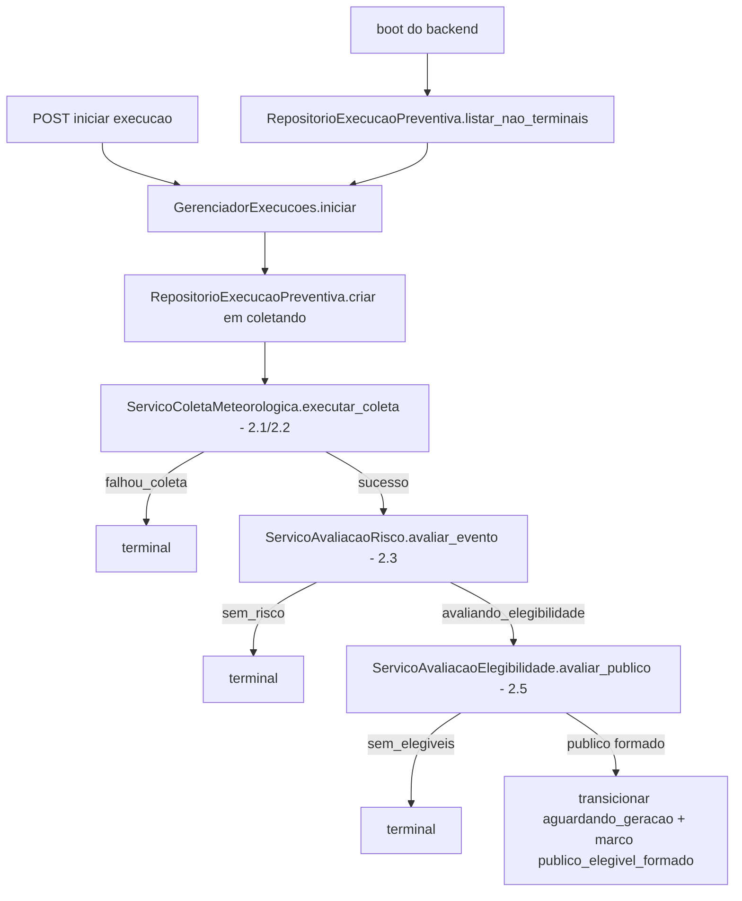

# História 2.6: Encerrar ou encaminhar a execução preventiva — Design

**Spec**: `.specs/features/2-6-encerrar-ou-encaminhar-a-execucao-preventiva/spec.md`
**Status**: Approved

---

## Research (Knowledge Verification Chain)

**Codebase**: por design, todas as peças que esta história encadeia já existem ao final de 2.1–2.5: `ServicoColetaMeteorologica` (2.1/2.2), `ServicoAvaliacaoRisco` (2.3), `ServicoAvaliacaoElegibilidade` (2.5), e `RepositorioExecucaoPreventiva.transicionar` (2.2) já usado por 2.3/2.5 para levar a execução a `sem_risco`/`avaliando_elegibilidade`. Esta história é a que finalmente possui o *runner* que os invoca em sequência automaticamente — hoje cada um só é chamado isoladamente por seu próprio caso de uso. AD-006 (runner assíncrono padrão) já define que trabalho assíncrono in-process do backend é uma task `asyncio` única — reusado aqui para o mesmo papel que o `AgendadorMeteorologico` (2.1) cumpre para a coleta, mas agora para a orquestração completa da execução.

**Project docs**: AD-4 (diagrama de estados) e AD-7 (runner único, idempotência, retomada no boot) são o contrato desta história. AD-7 nomeia o componente `GerenciadorExecucoes` — esta história é a que efetivamente o implementa.

---

## Approach

`GerenciadorExecucoes`: um orquestrador de aplicação (não um adaptador) que, dado um `execucao_id` em `coletando`, chama sequencialmente os casos de uso já existentes (2.1→2.3→2.5), interpretando o estado retornado por `RepositorioExecucaoPreventiva` após cada etapa para decidir se para (terminal) ou continua. Retomada no boot: ao iniciar, lista execuções não terminais (`RepositorioExecucaoPreventiva.listar_nao_terminais` — nova função, mesma tabela) e continua cada uma a partir do seu estado persistido. Alternativa descartada: implementar a orquestração como uma máquina de estados LangGraph já nesta história — rejeitada porque a spec desta história é só a etapa determinística (sem IA); LangGraph entra no Épico 3, quando há geração/crítica/revisão a orquestrar de fato (AD-4 já reserva esse uso para lá).

---

## Code Reuse Analysis

### Existing Components to Leverage

| Component | Location | How to Use |
| --- | --- | --- |
| `ServicoColetaMeteorologica` | `aplicacao/coleta_meteorologica.py` (2.1/2.2) | Chamado diretamente pelo `GerenciadorExecucoes`, sem alteração |
| `ServicoAvaliacaoRisco` | `aplicacao/avaliacao_risco.py` (2.3) | Idem |
| `ServicoAvaliacaoElegibilidade` | `aplicacao/avaliacao_elegibilidade.py` (2.5) | Idem |
| `RepositorioExecucaoPreventiva` | `adaptadores/persistencia/repositorio_execucao_preventiva.py` (2.2) | Estendido com `listar_nao_terminais` e `registrar_marco`; nenhuma mudança nas operações existentes |
| `EstadoExecucao`/`ESTADOS_TERMINAIS`/`eh_terminal` | `dominio/estados_execucao.py` (AD-004) | Decide quando o runner para |
| AD-006 (task `asyncio` in-process) | — | Mesmo padrão do `AgendadorMeteorologico` (2.1), agora para retomada no boot |
| AD-002 (`Idempotency-Key`) | `chaves_idempotencia` | Reusado para o comando de início de execução |

### Integration Points

| System | Integration Method |
| --- | --- |
| DuckDB | Migração `0008` adiciona `marcos_execucao` (histórico de transições correlacionadas) |
| Backend lifespan | `GerenciadorExecucoes.retomar_pendentes()` chamado uma vez no `lifespan`, antes do `AgendadorMeteorologico` iniciar |

---

## Components

### `GerenciadorExecucoes` (orquestrador de aplicação)

- **Purpose**: Encadeia coleta → risco → elegibilidade automaticamente para uma execução, persistindo cada transição como marco; retoma execuções não terminais no boot.
- **Location**: `aplicacao/gerenciador_execucoes.py`
- **Interfaces**:
  - `async def iniciar(self, chave_idempotencia: str) -> UUID` — cria a execução em `coletando` e dispara `continuar` (sem bloquear a resposta HTTP além da criação — mesmo padrão "persistir antes de responder" de 2.1).
  - `async def continuar(self, execucao_id: UUID) -> None` — lê o estado atual, chama o próximo caso de uso aplicável, registra o marco, repete até um terminal ou `aguardando_geracao`.
  - `async def retomar_pendentes(self) -> None` — chamado no boot; lista não terminais e chama `continuar` para cada uma.
- **Dependencies**: `ServicoColetaMeteorologica`, `ServicoAvaliacaoRisco`, `ServicoAvaliacaoElegibilidade`, `RepositorioExecucaoPreventiva`.
- **Reuses**: todos os casos de uso de 2.1–2.5, sem modificação de suas assinaturas.

### Extensão de `RepositorioExecucaoPreventiva`

- **Purpose**: `listar_nao_terminais` (para retomada no boot) e `registrar_marco` (histórico de transições).
- **Location**: `adaptadores/persistencia/repositorio_execucao_preventiva.py` (extensão de 2.2)
- **Interfaces**:
  - `def listar_nao_terminais(self) -> list[UUID]`
  - `def registrar_marco(self, execucao_id: UUID, marco: str, causa: str | None = None) -> None`
- **Dependencies**: `abrir_conexao`.
- **Reuses**: mesma tabela `execucao_preventiva`/nova `marcos_execucao`.

---

## Data Models

### Migração `0008_marcos_execucao.sql`

#### `marcos_execucao` (nova)

| Coluna | Tipo | Restrições |
| --- | --- | --- |
| `id` | `UUID` | chave primária |
| `execucao_id` | `UUID` | `NOT NULL`, chave estrangeira lógica para `execucao_preventiva(id)` |
| `marco` | `VARCHAR` | `NOT NULL` (ex.: `coleta_concluida`, `avaliacao_risco_concluida`, `publico_elegivel_formado`, ou o próprio nome do estado terminal alcançado) |
| `causa` | `VARCHAR` | nulo quando não aplicável |
| `criado_em` | `TIMESTAMP` | `NOT NULL`, padrão `now()` |

---

## Error Handling Strategy

| Error Scenario | Handling | User Impact |
| --- | --- | --- |
| Falha interna não recuperável em qualquer etapa | `GerenciadorExecucoes` captura, registra marco de exceção técnica e transiciona a execução a um terminal técnico explícito (distinto dos terminais de negócio) | Execução nunca fica presa em `Coletando`/`Avaliando`/`Processando` |
| Reinício do backend no meio da orquestração | `retomar_pendentes` no boot retoma cada execução não terminal do seu último marco durável, sem recalcular etapas já concluídas | Execução continua de onde parou, sem duplicar evento/elegibilidade |
| Comando de início repetido com a mesma `Idempotency-Key` | `RepositorioIdempotencia` devolve o `execucao_id` já criado, sem criar segunda execução | Resposta idêntica, nenhuma duplicação |

---

## Risks & Concerns

| Concern | Location (file:line) | Impact | Mitigation |
| --- | --- | --- | --- |
| `continuar` é uma corrotina potencialmente longa (coleta HTTP real + 2 avaliações); se chamada de forma síncrona pela requisição HTTP de início, poderia violar "persistir antes de responder" e criar timeout HTTP | `aplicacao/gerenciador_execucoes.py` (a criar) | Requisição de início ficaria bloqueada até o fim de toda a etapa determinística | `iniciar` cria a execução e devolve `202` imediatamente; `continuar` roda como uma task `asyncio` desacoplada (`asyncio.create_task`), mesmo padrão de "efeito assíncrono após resposta" já usado pelo `AgendadorMeteorologico` (2.1) — consistente com AD-7 |

---

## Tech Decisions

| Decision | Choice | Rationale |
| --- | --- | --- |
| Onde mora a orquestração (LangGraph vs função simples) | Função de aplicação simples (`GerenciadorExecucoes.continuar`), sem LangGraph | Esta história é só a etapa determinística (sem IA); AD-4 reserva LangGraph para orquestrar Fetcher→Risk&Policy Matcher→Copywriter→Critic→Notifier, que só existe a partir do Épico 3 |
| Terminal técnico vs terminais de negócio | Um `EstadoExecucao` técnico adicional não é necessário — reusa o padrão de "estado terminal com causa" já existente; a distinção entre "falha técnica" e "sem risco/sem elegíveis" fica na `causa`/`marco` registrado, não em um novo valor de enum | Evita inflar `EstadoExecucao` (AD-004, já fixado e usado por múltiplas histórias) com um estado que a spec não nomeia explicitamente |

---

## Approval

Aprovado por extensão da mesma sessão — orquestra exclusivamente componentes já aprovados em 2.1–2.5, sem decisão de produto nova.
