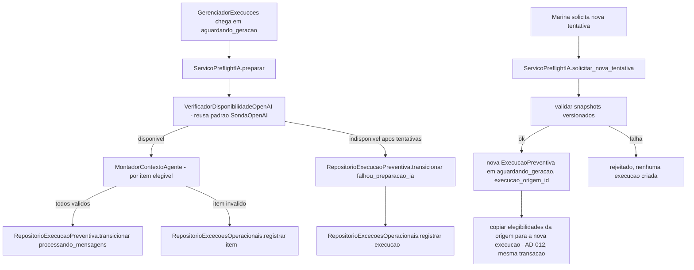

# História 3.1: Preparar a produção agêntica com dados mínimos — Design

**Spec**: `.specs/features/3-1-preparar-a-producao-agentica-com-dados-minimos/spec.md`
**Status**: Approved

---

## Research (Knowledge Verification Chain)

**Codebase**: `SondaOpenAI` (Épico 1, `adaptadores/prontidao/sonda_openai.py`) já verifica disponibilidade real (`GET /v1/models`) sem retries e sem nunca expor a chave — mesmo padrão reusado aqui, mas dentro do fluxo de produção. `RepositorioExecucaoPreventiva` (2.2) e `EstadoExecucao.PROCESSANDO_MENSAGENS`/`FALHOU_PREPARACAO_IA` (AD-004) já existem. `GerenciadorExecucoes` (2.6) já para em `aguardando_geracao` — esta história é o próximo passo que ele vai encadear quando o Épico 3 estiver completo (fora do escopo de 2.6, que só cobre a etapa determinística). `pyproject.toml` do backend ainda **não** declara `langchain`, `langchain-openai` nem `langgraph` como dependências — esta história é a primeira a adicioná-las.

**Project docs**: ADR-0012 decide LangChain para integração com o modelo e LangGraph para o grafo de agentes; AD-9 exige minimização de dados e trata ausência/invalidez de chave ou indisponibilidade do serviço como caso de preflight (`falhou_preparacao_ia`), não falha estrutural. AD-8 exige timeout e tratamento explícito de falha externa.

**Web search (LangChain/LangGraph)**: confirmado que `langchain_openai.ChatOpenAI` é o wrapper atual do modelo, e que o preflight desta história (uma única chamada de disponibilidade, sem estado nem transição condicional) não precisa de LangGraph — LangGraph é justificado a partir de 3.2, quando existe de fato um grafo (gerando→criticando→...). Versões exatas de pacote não são fixadas aqui (não confirmadas por fonte oficial nesta sessão); a task de implementação que adiciona a dependência deve fixar a versão estável mais recente compatível no momento, documentada no `pyproject.toml`.

---

## Approach

Preflight como uma função de aplicação simples (`ServicoPreflightIA`), reusando o padrão de `SondaOpenAI` para a chamada real, mas persistindo o resultado como parte da execução (não como sonda isolada). Contexto mínimo como um assembler determinístico (`MontadorContextoAgente`), puro, sem chamar a OpenAI. Nenhuma alternativa de arquitetura considerada — ambos são extensões diretas de padrões já aprovados (2.2's retry/terminal pattern; 2.3/2.5's snapshot pattern).

---

## Code Reuse Analysis

### Existing Components to Leverage

| Component | Location | How to Use |
| --- | --- | --- |
| `SondaOpenAI` (padrão, não a classe em si) | `adaptadores/prontidao/sonda_openai.py` (Épico 1) | O padrão de chamada real sem expor a chave é replicado em `VerificadorDisponibilidadeOpenAI`; a sonda de prontidão continua existindo separadamente para a superfície de Prontidão (Épico 1), esta é uma verificação de produção |
| `RepositorioExecucaoPreventiva` | `adaptadores/persistencia/repositorio_execucao_preventiva.py` (2.2) | `transicionar` para `processando_mensagens`/`falhou_preparacao_ia`, sem alteração |
| `RepositorioExcecoesOperacionais` | mesmo módulo (2.2) | Reusado para a exceção sanitizada de preflight |
| `Configuracao`/`obter_configuracao` | `composicao/configuracao.py` | Estendida com os parâmetros de modelo/prompt (ver Tech Decisions), mesma validação estrita de inicialização |
| Padrão "execução correlacionada de origem" | `ServicoColetaMeteorologica.solicitar_nova_tentativa` (2.2) | Mesmo padrão aplicado a `falhou_preparacao_ia`: novo `execucao_id`, `execucao_origem_id`, chave idempotente própria, origem permanece terminal |
| `RepositorioElegibilidades` | `adaptadores/persistencia/repositorio_elegibilidade.py` (2.5) | Estendido com `copiar_para_execucao` (AD-012): a nova execução correlacionada recebe cópias das linhas de elegibilidade da origem, nunca referências às linhas originais |
| AD-002 (`Idempotency-Key`) | `chaves_idempotencia` | Reusado para o comando de nova tentativa |

### Integration Points

| System | Integration Method |
| --- | --- |
| OpenAI | `langchain_openai.ChatOpenAI` para a chamada real de disponibilidade (reaproveitando o mesmo endpoint/abordagem de baixo custo de `SondaOpenAI`, mas via o cliente que os agentes de 3.2+ também vão usar — uma única integração, não duas) |
| DuckDB | Migração `0007` adiciona `execucao_origem_id` a `execucao_preventiva` e nova tabela `contextos_agente` |

---

## Components

### `VerificadorDisponibilidadeOpenAI`

- **Purpose**: Confirma disponibilidade real da OpenAI (chave válida + serviço respondendo) sem expor a credencial.
- **Location**: `adaptadores/ia/verificador_disponibilidade_openai.py`
- **Interfaces**:
  - `async def verificar(self) -> ResultadoDisponibilidade` — usa `langchain_openai.ChatOpenAI` (ou chamada HTTP equivalente de baixo custo) com timeout; nunca inclui a chave no resultado.
- **Dependencies**: `Configuracao.chave_openai`.
- **Reuses**: mesmo padrão de classificação (`disponível`/`indisponível`/causa sanitizada) de `SondaOpenAI`.

### `MontadorContextoAgente`

- **Purpose**: Monta o contexto mínimo (evento, localização aproximada, contexto/coberturas relevantes, canal, orientações de segurança) para um item elegível, validando campos obrigatórios.
- **Location**: `dominio/montador_contexto_agente.py`
- **Interfaces**:
  - `def montar(self, elegibilidade: ResultadoElegibilidade, evento: EventoMeteorologico) -> ContextoAgente | ErroContexto` — função pura; nunca inclui documentos, dados financeiros, pagamento ou credenciais.
- **Dependencies**: nenhuma (função pura).
- **Reuses**: `ResultadoElegibilidade`/`EventoMeteorologico` (2.5/2.1) como entrada, sem I/O novo.

### `ServicoPreflightIA` (caso de uso)

- **Purpose**: Orquestra verificação de disponibilidade → montagem de contexto por item → transição de estado; e `solicitar_nova_tentativa` após `falhou_preparacao_ia`.
- **Location**: `aplicacao/preflight_ia.py`
- **Interfaces**:
  - `async def preparar(self, execucao_id: UUID, versao_esperada: int) -> ResultadoPreflight`
  - `async def solicitar_nova_tentativa(self, execucao_origem_id: UUID, chave_idempotencia: str) -> UUID` — após validar os snapshots, cria a nova execução em `aguardando_geracao` **e copia todas as linhas de elegibilidade da origem (incluídas e excluídas) para a nova execução, na mesma transação** (`RepositorioElegibilidades.copiar_para_execucao`, AD-012). A nova execução nunca referencia as linhas de elegibilidade da origem — sem a cópia, as `UNIQUE`s de `contextos_agente.elegibilidade_id` (abaixo) e `mensagens(elegibilidade_id, canal)` (3.2) inviabilizariam refazer preflight/geração quando a origem já os possui.
- **Dependencies**: `VerificadorDisponibilidadeOpenAI`, `MontadorContextoAgente`, `RepositorioExecucaoPreventiva`, `RepositorioExcecoesOperacionais`, `RepositorioContextosAgente`, `RepositorioElegibilidades` (2.5, estendido).
- **Reuses**: padrão de execução correlacionada de 2.2.

### Extensão de `RepositorioElegibilidades` — `copiar_para_execucao` (AD-012)

- **Purpose**: Materializa, para uma execução correlacionada, cópias das linhas de elegibilidade da origem: novos `id`s, `execucao_id` da nova execução, conteúdo de snapshot idêntico (evento, regra, segurado, apólice, critérios, canal, justificativa).
- **Location**: `adaptadores/persistencia/repositorio_elegibilidade.py` (extensão do repositório de 2.5)
- **Interfaces**:
  - `def copiar_para_execucao(self, execucao_origem_id: UUID, nova_execucao_id: UUID) -> int` — retorna o número de linhas copiadas; executa dentro da transação aberta pelo chamador. A `UNIQUE(execucao_id, evento_id, regra_id, segurado_id, apolice_id)` de 2.5 permite as cópias por construção (o `execucao_id` difere).
- **Dependencies**: `abrir_conexao`.
- **Reuses**: tabela e padrão de `RepositorioElegibilidades` (2.5), sem mudar as operações existentes.

### `RepositorioContextosAgente`

- **Purpose**: Persiste o contexto minimizado e sua proveniência (categorias usadas/não usadas) por item.
- **Location**: `adaptadores/persistencia/repositorio_contextos_agente.py`
- **Interfaces**:
  - `def salvar(self, execucao_id: UUID, elegibilidade_id: UUID, contexto: ContextoAgente, categorias_usadas: list[str], categorias_nao_usadas: list[str]) -> UUID`
  - `def obter_por_elegibilidade(self, elegibilidade_id: UUID) -> ContextoAgente | None`
- **Dependencies**: `abrir_conexao`.
- **Reuses**: padrão de repositório existente.

---

## Data Models

### Migração `0007_preflight_ia.sql`

#### Extensão de `execucao_preventiva`

| Coluna adicionada | Tipo | Restrições |
| --- | --- | --- |
| `execucao_origem_id` | `UUID` | nulo — presente só em execuções correlacionadas, aponta para a execução terminal que originou a nova tentativa |

#### `contextos_agente` (nova)

| Coluna | Tipo | Restrições |
| --- | --- | --- |
| `id` | `UUID` | chave primária |
| `execucao_id` | `UUID` | `NOT NULL`, chave estrangeira lógica para `execucao_preventiva(id)` |
| `elegibilidade_id` | `UUID` | `NOT NULL`, chave estrangeira lógica para `elegibilidades_historicas(id)`, `UNIQUE` |
| `conteudo` | `VARCHAR` | `NOT NULL` — JSON serializado do `ContextoAgente` (evento, localização aproximada, coberturas, canal, orientações) |
| `categorias_usadas` | `VARCHAR[]` | `NOT NULL` |
| `categorias_nao_usadas` | `VARCHAR[]` | `NOT NULL` |
| `criado_em` | `TIMESTAMP` | `NOT NULL`, padrão `now()` |

---

## Error Handling Strategy

| Error Scenario | Handling | User Impact |
| --- | --- | --- |
| `OPENAI_API_KEY` ausente/inválida | `VerificadorDisponibilidadeOpenAI` classifica como indisponível sem tentar chamada real de geração; após esgotar tentativas de preflight (reusa a mesma política de 3 tentativas/backoff do AD-8, via o `ColetorComRetry`-like wrapper de 2.2 aplicado aqui) → `falhou_preparacao_ia` | Interface explica bloqueio, sem revelar detalhe da chave |
| Configuração estrutural inválida (ex.: nome de modelo mal formatado no `.env`) | Bloqueia a inicialização do backend, mesmo padrão de `ConfiguracaoInvalida` já existente | Backend não sobe; erro sanitizado no log de inicialização |
| Contexto de um item com campo obrigatório ausente | Só esse item alcança terminal de exceção; os demais continuam normalmente | Marina vê 1 item em exceção, resto segue |
| Nova tentativa com snapshot corrompido/versão não suportada | `solicitar_nova_tentativa` rejeita sem criar execução | Erro claro, nenhuma execução nova criada |

---

## Risks & Concerns

| Concern | Location (file:line) | Impact | Mitigation |
| --- | --- | --- | --- |
| Esta é a primeira história a declarar dependência real de `langchain`/`langchain-openai`/`langgraph` no `pyproject.toml`, sem versões fixadas por pesquisa nesta sessão | `src/backend/pyproject.toml` (a editar) | Uma versão incompatível poderia quebrar a integração já na primeira história | A task de implementação que adiciona a dependência deve consultar a documentação oficial/PyPI no momento da implementação (Knowledge Verification Chain, Passo 3/4) antes de fixar a versão — não fixar aqui um número não verificado |
| Retry do preflight de disponibilidade precisa da mesma política de 2.2 (3 tentativas/backoff) sem duplicar `ColetorComRetry` | `aplicacao/preflight_ia.py` (a criar) | Duplicar a lógica de retry criaria dois lugares para manter a mesma política | Tech Decisions abaixo generaliza `ColetorComRetry` (2.2) para um wrapper reusável, não específico de meteorologia |

---

## Tech Decisions

| Decision | Choice | Rationale |
| --- | --- | --- |
| Generalização do wrapper de retry de 2.2 | Extrair `ColetorComRetry` (2.2) para um `RetryComBackoff[T]` genérico em `aplicacao/_retry.py`, parametrizado pela operação; `ColetorComRetry` (2.2) e `VerificadorDisponibilidadeOpenAI` (3.1) passam a usá-lo | Evita duplicar a política de 3 tentativas/backoff 1s-2s-4s em dois lugares; pequeno refactor de 2.2, sem mudar seu comportamento observável |
| Onde configurar modelo/temperatura/prompt/limites | Novos campos em `Configuracao` (`composicao/configuracao.py`): `modelo_openai`, `temperatura_openai`, `versao_prompt`, com validação e defaults documentados no `.env.example` | Mesma fonte única de configuração já usada por todo o projeto; nenhuma configuração paralela |
| Formato de `ContextoAgente` | `dataclass` imutável espelhando exatamente os 5 campos permitidos pelo AC (evento, localização aproximada, coberturas relevantes, canal, orientações de segurança) — nenhum campo opcional "extra" | Torna a violação de minimização de dados um erro de tipo, não uma disciplina de código |
| Elegibilidades da execução correlacionada | Cópia integral das linhas da origem para a nova execução (`copiar_para_execucao`), na mesma transação da criação — nunca referência às linhas originais (**AD-012**) | As `UNIQUE`s de `contextos_agente.elegibilidade_id` e `mensagens(elegibilidade_id, canal)` tornariam a retentativa pós-`falhou_simulacao` inimplementável sobre as linhas da origem; a `UNIQUE` de `elegibilidades_historicas` inclui `execucao_id` (2.5), o que legitima cópias por execução e mantém cada execução auditável de forma autocontida |

---

## Approval

Aprovado por extensão da mesma sessão — reuso direto dos padrões de 2.2 e da `SondaOpenAI` do Épico 1; única decisão nova de peso (adoção de LangChain/LangGraph) já está fixada pelo ADR-0012.
