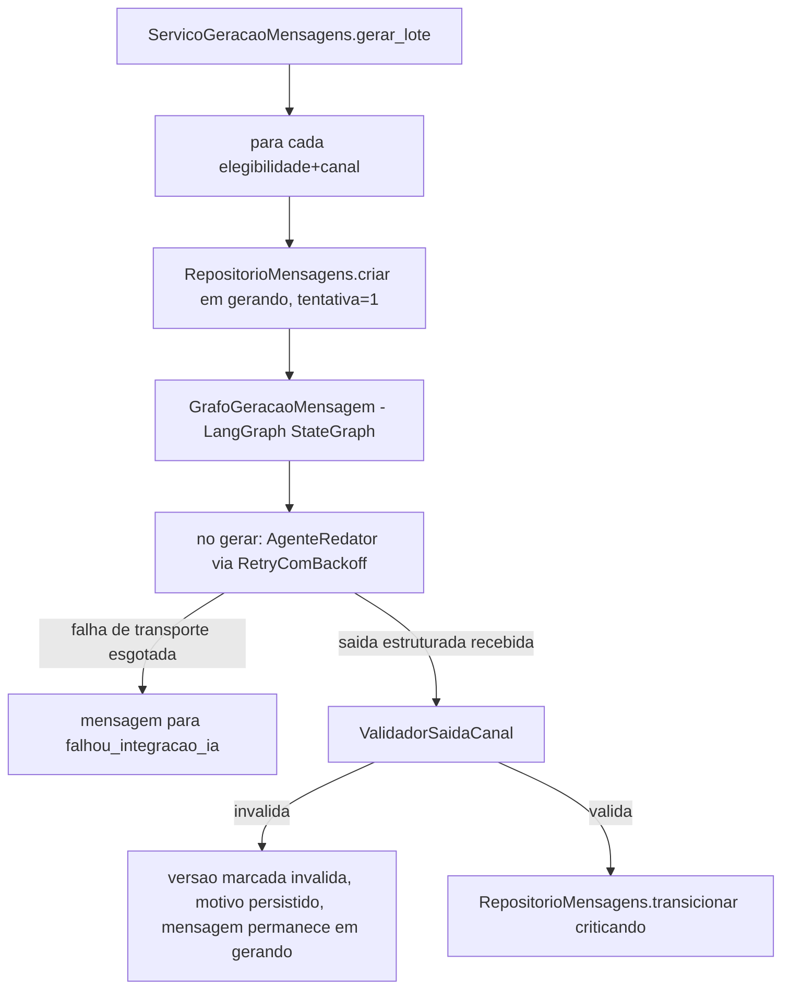

# História 3.2: Gerar mensagens automaticamente para cada canal — Design

**Spec**: `.specs/features/3-2-gerar-mensagens-automaticamente-para-cada-canal/spec.md`
**Status**: Approved

---

## Research (Knowledge Verification Chain)

**Codebase**: `MontadorContextoAgente`/`RepositorioContextosAgente` (3.1) já produzem o contexto mínimo por item elegível. `RetryComBackoff[T]` (3.1) já generaliza retry+backoff — reusado aqui para as chamadas de transporte à OpenAI (distintas das "tentativas de conteúdo" que a História 3.4 vai orquestrar). `langchain-openai`/`langgraph` já são dependências a partir de 3.1 (T1). Nenhuma tabela de mensagem existe ainda — esta é a primeira história a criá-la.

**Project docs**: AD-4 (segundo diagrama mermaid, mensagem) já define o estado exato que este design implementa: `gerando`→`criticando`, com `falhou_conteudo` e `falhou_integracao_ia` como terminais possíveis a partir de `gerando`. AD-4 também define que "toda entrada em `gerando`... reserva e incrementa atomicamente o próximo número de tentativa, começando em 1". AD-5 proíbe o LLM de decidir campos obrigatórios/tamanho — só gera e é validado deterministicamente por fora. AD-9 proíbe dado desnecessário no prompt (contexto já minimizado por 3.1).

**Web search (LangGraph/LangChain)**: confirmado nesta sessão (Design de 3.1) que `ChatOpenAI.with_structured_output(SchemaPydantic)` é o padrão atual para saída estruturada validável, e que `langgraph.graph.StateGraph` com um `TypedDict` de estado é o padrão atual para nós/transições. Este design usa exatamente esses dois padrões.

---

## Approach

Um `StateGraph` do LangGraph por mensagem (não um grafo único para o lote inteiro) — cada mensagem tem seu próprio estado de conteúdo (AD-4), então cada execução do grafo é isolada por mensagem, com o nó `gerar` chamando o modelo e um passo de validação determinística fora do LLM decidindo a transição. O caso de uso (`ServicoGeracaoMensagens`) invoca um grafo por combinação elegibilidade+canal, sequencialmente, dentro da task assíncrona já iniciada por `GerenciadorExecucoes` (2.6) ao entrar em `processando_mensagens`. Alternativa descartada: um único grafo do LangGraph orquestrando todas as mensagens do lote como um mapa de estados. Rejeitada porque AD-4 já declara "cada mensagem possui seu próprio estado de geração, crítica, revisão e simulação" — um grafo por mensagem espelha isso diretamente e mantém cada execução de grafo pequena e testável isoladamente.

---

## Code Reuse Analysis

### Existing Components to Leverage

| Component | Location | How to Use |
| --- | --- | --- |
| `MontadorContextoAgente`/`RepositorioContextosAgente` | `dominio/montador_contexto_agente.py`, `adaptadores/persistencia/repositorio_contextos_agente.py` (3.1) | Contexto minimizado já pronto é a entrada do nó `gerar`, sem remontagem |
| `RetryComBackoff[T]` | `aplicacao/_retry.py` (3.1) | Envolve a chamada real ao modelo — mesma política de 3 tentativas de transporte/backoff, terminal `falhou_integracao_ia` quando esgota |
| `Configuracao` (modelo/temperatura/versão de prompt) | `composicao/configuracao.py` (3.1) | Parâmetros do `ChatOpenAI` vêm daqui, não hardcoded |
| Padrão de repositório por conexão explícita | `repositorio_execucao_preventiva.py` | Mesmo padrão para `RepositorioMensagens` |
| AD-002 (unicidade/dedução) | — | `UNIQUE(elegibilidade_id, canal)` em `mensagens`, mesmo padrão de dedução de 2.2/2.5 |

### Integration Points

| System | Integration Method |
| --- | --- |
| OpenAI | `langchain_openai.ChatOpenAI.with_structured_output(SaidaCanal)` dentro do nó `gerar` do LangGraph |
| DuckDB | Migração `0008` cria `mensagens` e `versoes_mensagem` |

---

## Components

### `dominio/estados_mensagem.py` (novo, análogo a `estados_execucao.py`)

- **Purpose**: `EstadoMensagem` (StrEnum) espelhando exatamente o segundo diagrama do AD-4: `gerando`, `criticando`, `aguardando_revisao`, `aprovada`, `rejeitada`, `excluida`, `simulada_entregue`, `falhou_conteudo`, `falhou_integracao_ia`; `ESTADOS_TERMINAIS_MENSAGEM` e `eh_terminal_mensagem`.
- **Location**: `dominio/estados_mensagem.py`
- **Dependencies**: nenhuma.
- **Reuses**: mesmo padrão de `dominio/estados_execucao.py` (AD-004).

### `ValidadorSaidaCanal`

- **Purpose**: Valida deterministicamente a saída estruturada do redator contra os limites e campos obrigatórios do canal.
- **Location**: `dominio/validador_saida_canal.py`
- **Interfaces**:
  - `def validar(self, canal: Canal, saida: SaidaCanal) -> ResultadoValidacaoSaida` — checa campo obrigatório presente/não vazio e contagem de caracteres Unicode dentro do limite configurado por canal.
- **Dependencies**: limites de canal (via `Configuracao`, ver Tech Decisions).
- **Reuses**: nenhuma — primeiro validador de saída de canal.

### `AgenteRedator`

- **Purpose**: Chama o modelo com `with_structured_output` para produzir `SaidaWhatsApp`/`SaidaSMS`/`SaidaEmail` a partir do contexto mínimo.
- **Location**: `adaptadores/ia/agente_redator.py`
- **Interfaces**:
  - `async def gerar(self, contexto: ContextoAgente, canal: Canal) -> SaidaCanal` — usa `ChatOpenAI(model=..., temperature=...).with_structured_output(schema_do_canal)`; propaga exceção de transporte sem tratá-la (o wrapper de retry decide).
- **Dependencies**: `Configuracao` (modelo/temperatura/versão de prompt).
- **Reuses**: nenhuma implementação anterior — primeiro agente do projeto.

### `GrafoGeracaoMensagem` (LangGraph)

- **Purpose**: `StateGraph` de um único nó `gerar` (mais nós chegam em 3.3+) que encadeia `AgenteRedator` (via `RetryComBackoff`) → `ValidadorSaidaCanal` → decide a transição de estado.
- **Location**: `aplicacao/grafos/geracao_mensagem.py`
- **Interfaces**:
  - `def construir_grafo(dependencias: DependenciasGrafo) -> CompiledStateGraph` — nó `gerar` recebe `EstadoGrafoMensagem` (TypedDict: `contexto`, `canal`, `tentativa`, `resultado`).
- **Dependencies**: `AgenteRedator`, `ValidadorSaidaCanal`, `RetryComBackoff[T]`.
- **Reuses**: `RetryComBackoff` (3.1).

### `RepositorioMensagens`

- **Purpose**: Cria mensagem (estado inicial `gerando`, tentativa 1), persiste versão (conteúdo, duração, modelo, prompt, métricas de uso, validade), transiciona estado.
- **Location**: `adaptadores/persistencia/repositorio_mensagens.py`
- **Interfaces**:
  - `def criar(self, execucao_id: UUID, elegibilidade_id: UUID, canal: Canal) -> UUID` — respeita `UNIQUE(elegibilidade_id, canal)`.
  - `def salvar_versao(self, mensagem_id: UUID, numero_tentativa: int, conteudo: SaidaCanal, duracao_ms: float, modelo: str, versao_prompt: str, tokens_entrada: int, tokens_saida: int, valida: bool, motivo_invalidez: str | None) -> UUID`
  - `def transicionar(self, mensagem_id: UUID, versao_esperada: int, novo_estado: EstadoMensagem) -> None` — mesma checagem de concorrência otimista + `eh_terminal_mensagem` de `RepositorioExecucaoPreventiva`.
- **Dependencies**: `abrir_conexao`.
- **Reuses**: padrão de concorrência otimista de `RepositorioExecucaoPreventiva` (2.2).

### `ServicoGeracaoMensagens` (caso de uso)

- **Purpose**: Para cada elegibilidade incluída da execução, cria a mensagem, roda o grafo, persiste o resultado.
- **Location**: `aplicacao/geracao_mensagens.py`
- **Interfaces**:
  - `async def gerar_lote(self, execucao_id: UUID) -> None`
- **Dependencies**: `RepositorioElegibilidades` (2.5), `RepositorioContextosAgente` (3.1), `GrafoGeracaoMensagem`, `RepositorioMensagens`.
- **Reuses**: `RepositorioElegibilidades.listar_por_execucao` (2.5, filtrado a `incluido`).

---

## Data Models

### Migração `0008_mensagens.sql`

#### `mensagens` (nova)

| Coluna | Tipo | Restrições |
| --- | --- | --- |
| `id` | `UUID` | chave primária |
| `execucao_id` | `UUID` | `NOT NULL`, chave estrangeira lógica para `execucao_preventiva(id)` |
| `elegibilidade_id` | `UUID` | `NOT NULL`, chave estrangeira lógica para `elegibilidades_historicas(id)` |
| `canal` | `VARCHAR` | `NOT NULL`, `CHECK` em `whatsapp`, `email`, `sms` |
| `estado` | `VARCHAR` | `NOT NULL`, valores de `dominio.estados_mensagem.EstadoMensagem` |
| `tentativa_atual` | `INTEGER` | `NOT NULL`, padrão `1`, `CHECK` entre 1 e 3 |
| `versao` | `INTEGER` | `NOT NULL`, padrão `1` — concorrência otimista, mesmo padrão de `execucao_preventiva.versao` |
| `criado_em` | `TIMESTAMP` | `NOT NULL`, padrão `now()` |
| `atualizado_em` | `TIMESTAMP` | `NOT NULL`, padrão `now()` |

Constraint: `UNIQUE(elegibilidade_id, canal)`.

#### `versoes_mensagem` (nova)

| Coluna | Tipo | Restrições |
| --- | --- | --- |
| `id` | `UUID` | chave primária |
| `mensagem_id` | `UUID` | `NOT NULL`, chave estrangeira lógica para `mensagens(id)` |
| `numero_tentativa` | `INTEGER` | `NOT NULL` |
| `conteudo` | `VARCHAR` | `NOT NULL` — JSON serializado (`{corpo}` ou `{assunto, corpo}`) |
| `valida` | `BOOLEAN` | `NOT NULL` |
| `motivo_invalidez` | `VARCHAR` | nulo quando `valida = true` |
| `duracao_ms` | `DOUBLE` | `NOT NULL` |
| `modelo` | `VARCHAR` | `NOT NULL` |
| `versao_prompt` | `VARCHAR` | `NOT NULL` |
| `tokens_entrada` | `INTEGER` | nulo se a chamada falhou antes de retornar uso |
| `tokens_saida` | `INTEGER` | nulo se a chamada falhou antes de retornar uso |
| `criado_em` | `TIMESTAMP` | `NOT NULL`, padrão `now()` |

---

## Error Handling Strategy

| Error Scenario | Handling | User Impact |
| --- | --- | --- |
| Falha de transporte à OpenAI esgota `RetryComBackoff` | Mensagem transiciona para `falhou_integracao_ia`; demais mensagens da execução continuam (não é terminal da execução) | Item mostrado como exceção, resto do lote segue |
| Saída ausente/malformada/acima do limite | Versão marcada `valida = false` com motivo; mensagem permanece em `gerando` (aguardando a política de regeneração da História 3.4) | Item mostrado como "aguardando nova tentativa" |
| Saída válida | Versão `valida = true`; mensagem transiciona para `criticando` | Item avança visualmente para "em avaliação" |
| Contexto mínimo ausente para um item (3.1 não produziu) | `gerar_lote` pula esse item, registra exceção isolada, não tenta gerar com contexto incompleto | Item mostrado como exceção, sem chamada à OpenAI |

---

## Risks & Concerns

| Concern | Location (file:line) | Impact | Mitigation |
| --- | --- | --- | --- |
| `gerar_lote` processa mensagens sequencialmente (uma chamada OpenAI por vez); para um lote grande isso pode ser lento numa demonstração ao vivo | `aplicacao/geracao_mensagens.py` (a criar) | Tempo de espera perceptível para lotes com muitos elegíveis | Aceitável para o escopo de demonstração da PoC (conjunto sintético pequeno); paralelização fica como melhoria futura não coberta por nenhum AC desta história — não implementada para não expandir escopo |
| Limites de canal (1024/160/78+2000 caracteres) são valores de referência, não confirmados por fonte oficial nesta sessão | `dominio/validador_saida_canal.py` (a criar) | Se um avaliador esperar limites diferentes, os testes de fronteira mudam | Documentado como default de demonstração explícito na spec e aqui; configurável via `Configuracao`, não hardcoded no validador |

---

## Tech Decisions

| Decision | Choice | Rationale |
| --- | --- | --- |
| Onde os limites de canal vivem | Novos campos em `Configuracao`: `limite_caracteres_whatsapp`, `limite_caracteres_sms`, `limite_caracteres_assunto_email`, `limite_caracteres_corpo_email`, com os defaults documentados no `.env.example` | Consistente com o padrão já usado para timeout/tentativas/intervalo (2.1/2.2) — nenhum limite mágico embutido em código |
| Um grafo LangGraph por mensagem vs. um grafo para o lote | Um grafo por mensagem (ver Approach) | Espelha diretamente o AD-4 ("cada mensagem possui seu próprio estado"); mantém cada execução de grafo pequena, isolada e testável sem mockar o lote inteiro |
| Onde a "tentativa" é incrementada | `RepositorioMensagens.criar` sempre insere com `tentativa_atual = 1`; incrementos futuros (regeneração, 3.4) são responsabilidade de 3.4, não desta história | Delimita exatamente o escopo desta história (primeira geração), consistente com "Out of Scope" do `spec.md` |

---

## Approval

Aprovado por extensão da mesma sessão — arquitetura do grafo por mensagem decorre diretamente do AD-4 já aprovado; limites de canal são defaults de demonstração documentados e configuráveis, revisáveis sem mudança estrutural.
