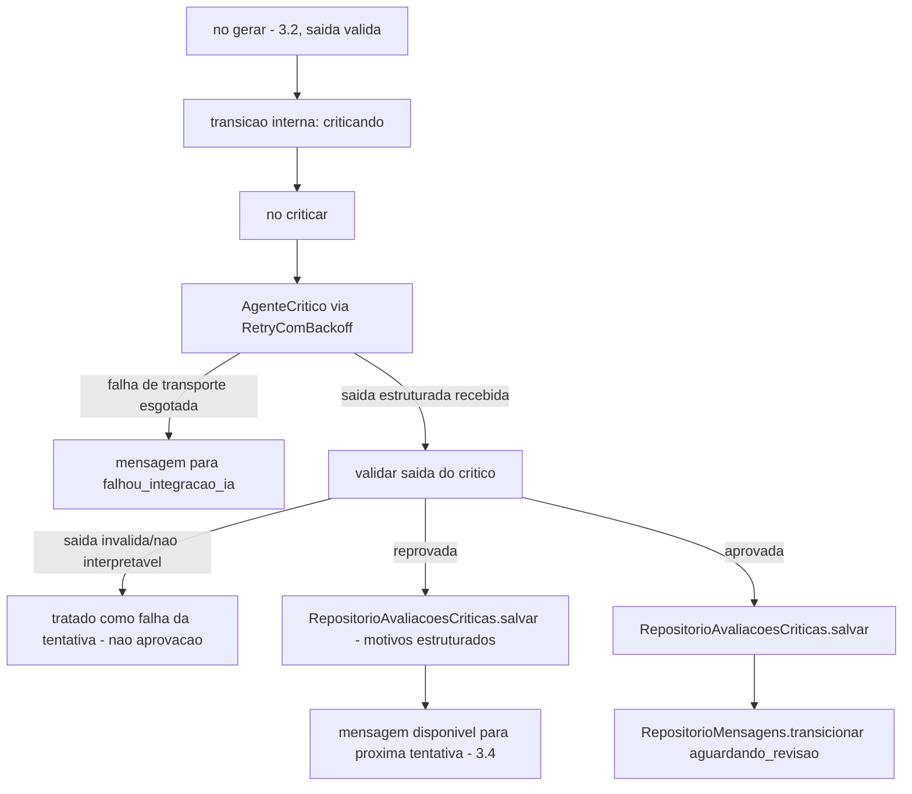

# História 3.3: Avaliar a qualidade e a segurança das mensagens — Design

**Spec**: `.specs/features/3-3-avaliar-a-qualidade-e-a-seguranca-das-mensagens/spec.md`
**Status**: Approved

---

## Research (Knowledge Verification Chain)

**Codebase**: `GrafoGeracaoMensagem` (3.2) já é um `StateGraph` por mensagem com o nó `gerar`; esta história adiciona o nó `criticando` ao mesmo grafo, exatamente como o `spec.md` já decide na tabela de assunções. `RepositorioMensagens.transicionar` (3.2) já implementa concorrência otimista sobre `EstadoMensagem` — reusado sem alteração para `aguardando_revisao`. `RetryComBackoff[T]` (3.1) é reusado para a chamada de transporte ao crítico, mesmo padrão do redator.

**Project docs**: AD-5 proíbe o LLM de decidir risco/elegibilidade/cobertura/limite — o crítico só avalia conteúdo já validado deterministicamente. AD-6 já define que "aprovação do Critic move cada mensagem para `aguardando_revisao`" e que "saída estruturada inválida ou reprovada nunca alcança a simulação" (AD-5).

---

## Approach

Renomear conceitualmente `GrafoGeracaoMensagem` (3.2) para refletir que agora tem dois nós (`gerar`, `criticar`) — sem quebrar a API pública já usada por `ServicoGeracaoMensagens` (3.2), que passa a receber o resultado da crítica como parte do mesmo fluxo. Nenhuma alternativa de arquitetura considerada — é a extensão direta e já decidida (AD-4, spec Assumptions) do grafo existente.

---

## Code Reuse Analysis

### Existing Components to Leverage

| Component | Location | How to Use |
| --- | --- | --- |
| `GrafoGeracaoMensagem` (nó `gerar`) | `aplicacao/grafos/geracao_mensagem.py` (3.2) | Estendido com o nó `criticar`, mesma instância de grafo, mesmo `EstadoGrafoMensagem` |
| `RetryComBackoff[T]` | `aplicacao/_retry.py` (3.1) | Mesma política para a chamada de transporte ao crítico |
| `RepositorioMensagens.transicionar` | `adaptadores/persistencia/repositorio_mensagens.py` (3.2) | Reusado sem alteração para `criticando`→`aguardando_revisao` |
| `ContextoAgente` | `dominio/montador_contexto_agente.py` (3.1) | Mesmo contexto mínimo do redator é passado ao crítico — nenhuma montagem de contexto nova |
| `Configuracao` (modelo/temperatura) | `composicao/configuracao.py` | Reusada; crítico pode usar o mesmo modelo/parâmetros do redator ou um conjunto próprio (ver Tech Decisions) |

### Integration Points

| System | Integration Method |
| --- | --- |
| OpenAI | `langchain_openai.ChatOpenAI.with_structured_output(AvaliacaoCritica)` dentro do nó `criticar` |
| DuckDB | Migração `0009` cria `avaliacoes_criticas` |

---

## Components

### `AgenteCritico`

- **Purpose**: Avalia uma versão de mensagem contra critérios de tom/utilidade/clareza/segurança/promessa/distinção/adequação, devolvendo `AvaliacaoCritica` estruturada.
- **Location**: `adaptadores/ia/agente_critico.py`
- **Interfaces**:
  - `async def avaliar(self, conteudo: SaidaCanal, canal: Canal, contexto: ContextoAgente) -> AvaliacaoCritica` — `with_structured_output(AvaliacaoCritica)`; nunca recebe dado fora do contexto mínimo já montado (3.1) mais o conteúdo da própria mensagem.
- **Dependencies**: `Configuracao`.
- **Reuses**: mesmo padrão estrutural de `AgenteRedator` (3.2), schema Pydantic distinto.

### Extensão de `GrafoGeracaoMensagem` — nó `criticar`

- **Purpose**: Adiciona o nó `criticar` ao grafo por mensagem, encadeado após `gerar` quando a saída é válida.
- **Location**: `aplicacao/grafos/geracao_mensagem.py` (extensão de 3.2)
- **Interfaces**: nó `criticar(estado: EstadoGrafoMensagem) -> EstadoGrafoMensagem` — chama `AgenteCritico` via `RetryComBackoff`; interpreta a saída (aprovada/reprovada/inválida).
- **Dependencies**: `AgenteCritico`, `RetryComBackoff[T]`.
- **Reuses**: mesma infraestrutura de grafo de 3.2 — nenhuma nova instância de `StateGraph`.

### `RepositorioAvaliacoesCriticas`

- **Purpose**: Persiste a avaliação (decisão, motivos estruturados por categoria, agente, modelo, duração) associada à versão de mensagem avaliada.
- **Location**: `adaptadores/persistencia/repositorio_avaliacoes_criticas.py`
- **Interfaces**:
  - `def salvar(self, versao_mensagem_id: UUID, aprovada: bool, motivos: list[MotivoCritica], modelo: str, duracao_ms: float) -> UUID`
  - `def obter_por_versao(self, versao_mensagem_id: UUID) -> AvaliacaoCritica | None`
- **Dependencies**: `abrir_conexao`.
- **Reuses**: padrão de repositório existente.

---

## Data Models

### Migração `0009_avaliacoes_criticas.sql`

#### `avaliacoes_criticas` (nova)

| Coluna | Tipo | Restrições |
| --- | --- | --- |
| `id` | `UUID` | chave primária |
| `versao_mensagem_id` | `UUID` | `NOT NULL`, chave estrangeira lógica para `versoes_mensagem(id)`, `UNIQUE` |
| `aprovada` | `BOOLEAN` | `NOT NULL` |
| `motivos` | `VARCHAR` | `NOT NULL` — JSON serializado (lista de `{categoria, justificativa}`) |
| `agente` | `VARCHAR` | `NOT NULL`, padrão `'critico'` |
| `modelo` | `VARCHAR` | `NOT NULL` |
| `duracao_ms` | `DOUBLE` | `NOT NULL` |
| `criado_em` | `TIMESTAMP` | `NOT NULL`, padrão `now()` |

---

## Error Handling Strategy

| Error Scenario | Handling | User Impact |
| --- | --- | --- |
| Falha de transporte ao crítico, `RetryComBackoff` esgotado | Mensagem transiciona `falhou_integracao_ia`, mesmo tratamento de 3.2 | Item mostrado como exceção |
| Saída do crítico inválida/não interpretável | Tratada como falha da tentativa (não aprovação, não reprovação estruturada); nenhuma avaliação persistida; mensagem permanece disponível para nova tentativa (3.4) | Item mostrado como "aguardando nova tentativa" |
| Crítico reprova | `RepositorioAvaliacoesCriticas.salvar(aprovada=false, motivos=[...])`; mensagem permanece disponível para regeneração (3.4) | Motivos visíveis no detalhe |
| Crítico aprova + validação determinística de 3.2 já era válida | `RepositorioMensagens.transicionar(criticando → aguardando_revisao)` | Item avança para revisão humana |

---

## Risks & Concerns

> None found — extensão direta do grafo e dos repositórios já aprovados em 3.1/3.2, sem componente estrutural novo de alto risco.

---

## Tech Decisions

| Decision | Choice | Rationale |
| --- | --- | --- |
| Modelo/parâmetros do crítico vs. do redator | Reusa os mesmos campos de `Configuracao` (`modelo_openai`, `temperatura_openai`) por padrão nesta história; um modelo/temperatura distintos para o crítico ficam como extensão de configuração não implementada agora (nenhum AC exige parâmetros separados) | Evita introduzir configuração especulativa além do que os ACs desta história pedem; a mesma variável de configuração pode ser reutilizada com valores diferentes no `.env` sem mudança de código, se necessário depois |
| Categorias fechadas de motivo de reprovação | Enum Python (`CategoriaCritica`): `tom`, `utilidade`, `clareza`, `seguranca`, `promessa_indevida`, `distincao_oficial`, `adequacao_canal` | Cumpre literalmente os 7 critérios listados no AC; um enum fechado torna os motivos consultáveis/filtráveis na interface, em vez de texto livre |

---

## Approval

Aprovado por extensão da mesma sessão — extensão direta do grafo por mensagem já aprovado em 3.2, sem decisão de produto nova.
