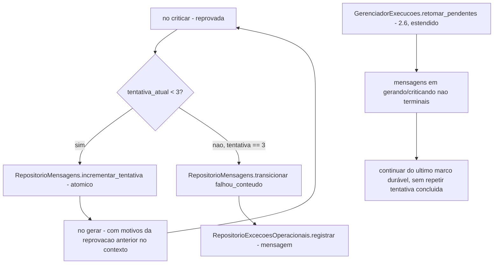

# História 3.4: Regenerar mensagens e registrar a proveniência agêntica — Design

**Spec**: `.specs/features/3-4-regenerar-mensagens-e-registrar-a-proveniencia-agentica/spec.md`
**Status**: Approved

---

## Research (Knowledge Verification Chain)

**Codebase**: `GrafoGeracaoMensagem` (3.2/3.3) já tem os nós `gerar`/`criticar`; esta história adiciona a aresta condicional de volta (`criticar`→`gerar` quando reprovada e `tentativa < 3`) que o `spec.md` já decide usar LangGraph nativamente para isso. `RepositorioMensagens` (3.2) já tem `tentativa_atual` e `transicionar` com concorrência otimista. `GerenciadorExecucoes.retomar_pendentes` (2.6) já é o padrão de retomada no boot — reusado, estendendo sua lista de estados não terminais para cobrir `processando_mensagens`.

**Project docs**: AD-4 (segundo diagrama) já define exatamente as arestas desta história: `criticando --> gerando: reprovada e tentativa menor que 3`, `criticando --> falhou_conteudo: terceira reprovação`, `gerando --> falhou_integracao_ia: tentativas de integração esgotadas`, `criticando --> falhou_integracao_ia: tentativas de integração esgotadas`. O texto de apoio do AD-4 confirma: "Toda entrada em `gerando`... reserva e incrementa atomicamente o próximo número de tentativa... Saída inválida do redator ou do crítico nunca é aprovação e consome a tentativa de geração correspondente." AD-10 exige proveniência sem conteúdo sensível.

---

## Approach

Estender o mesmo `StateGraph` por mensagem (3.2/3.3) com uma aresta condicional `criticar`→`gerar`, guardada por `tentativa_atual < 3`; ao entrar em `gerar` novamente, incrementa `tentativa_atual` atomicamente via `RepositorioMensagens` antes de chamar o redator, passando os motivos da reprovação anterior como parte do contexto de regeneração. Nenhuma alternativa de arquitetura considerada — decorre diretamente do AD-4, já aprovado, e da mesma infraestrutura de grafo já construída em 3.2/3.3.

---

## Code Reuse Analysis

### Existing Components to Leverage

| Component | Location | How to Use |
| --- | --- | --- |
| `GrafoGeracaoMensagem` (nós `gerar`/`criticar`) | `aplicacao/grafos/geracao_mensagem.py` (3.2/3.3) | Estendido com aresta condicional de retorno; mesma instância |
| `RepositorioMensagens.transicionar` | `adaptadores/persistencia/repositorio_mensagens.py` (3.2) | Reusado para `falhou_conteudo`/`falhou_integracao_ia` |
| `RepositorioExcecoesOperacionais` | `adaptadores/persistencia/repositorio_execucao_preventiva.py` (2.2) | Reusado para a `Exceção` de mensagem (correlacionada por `mensagem_id`, não só `execucao_id` — ver Tech Decisions) |
| `GerenciadorExecucoes.retomar_pendentes` | `aplicacao/gerenciador_execucoes.py` (2.6) | Estendido para também retomar mensagens não terminais dentro de execuções em `processando_mensagens` |
| `AgenteRedator`/`AgenteCritico` | `adaptadores/ia/` (3.2/3.3) | Reusados sem alteração de assinatura — só o contexto passado inclui os motivos da reprovação anterior nas regenerações |

### Integration Points

| System | Integration Method |
| --- | --- |
| DuckDB | Nenhuma tabela nova — `versoes_mensagem`/`avaliacoes_criticas` (3.2/3.3) já suportam múltiplas linhas por `mensagem_id`, uma por tentativa |

---

## Components

### Extensão de `RepositorioMensagens` — `incrementar_tentativa`

- **Purpose**: Incrementa `tentativa_atual` atomicamente (dentro da mesma transação que verifica `< 3`), como pré-condição para reentrar em `gerar`.
- **Location**: `adaptadores/persistencia/repositorio_mensagens.py` (extensão de 3.2)
- **Interfaces**:
  - `def incrementar_tentativa(self, mensagem_id: UUID, versao_esperada: int) -> int` — retorna o novo número de tentativa; levanta `LimiteTentativasExcedido` se já estiver em 3.
- **Dependencies**: `abrir_conexao`.
- **Reuses**: mesma tabela `mensagens` de 3.2, mesmo padrão de concorrência otimista.

### Extensão de `GrafoGeracaoMensagem` — aresta condicional e contexto de regeneração

- **Purpose**: Decide, após `criticar` reprovar, se reentra em `gerar` (com motivos) ou transiciona a terminal.
- **Location**: `aplicacao/grafos/geracao_mensagem.py` (extensão de 3.2/3.3)
- **Interfaces**: função de aresta condicional `decidir_apos_critica(estado: EstadoGrafoMensagem) -> Literal["gerar", "falhou_conteudo"]`; `EstadoGrafoMensagem` ganha o campo `motivos_reprovacao_anterior: list[MotivoCritica] | None`.
- **Dependencies**: `RepositorioMensagens.incrementar_tentativa`.
- **Reuses**: mesmos nós de 3.2/3.3, sem reescrevê-los — só a aresta e o campo de estado são novos.

### Extensão de `GerenciadorExecucoes.retomar_pendentes` (2.6)

- **Purpose**: Ao retomar uma execução em `processando_mensagens`, identifica mensagens não terminais e as retoma a partir do seu último marco durável (não reexecuta tentativas já concluídas).
- **Location**: `aplicacao/gerenciador_execucoes.py` (extensão de 2.6)
- **Interfaces**: `retomar_pendentes` (assinatura já existente) passa a também chamar `ServicoGeracaoMensagens.retomar_mensagens_pendentes(execucao_id)` para execuções em `processando_mensagens`.
- **Dependencies**: `RepositorioMensagens` (consulta de mensagens não terminais).
- **Reuses**: `RepositorioExecucaoPreventiva.listar_nao_terminais` (2.6), sem alteração — a extensão está no que acontece *depois* de identificar a execução.

---

## Data Models

Nenhuma migração nova. `versoes_mensagem`/`avaliacoes_criticas` (3.2/3.3) já são tabelas de histórico com uma linha por `numero_tentativa` — a proveniência completa por tentativa já está coberta pelo schema existente; esta história só popula mais linhas ao longo do ciclo.

---

## Error Handling Strategy

| Error Scenario | Handling | User Impact |
| --- | --- | --- |
| Reprovação com `tentativa_atual < 3` | Incrementa tentativa, reentra em `gerar` com motivos da reprovação | Item mostra "tentativa 2 de 3" em progresso |
| Reprovação na tentativa 3 | `falhou_conteudo` + `Exceção`, fora do lote simulável | Item mostrado como exceção terminal, não bloqueia os demais |
| Falha de transporte esgotada em qualquer tentativa (`gerar` ou `criticar`) | `falhou_integracao_ia`, distinto de `falhou_conteudo` | Item mostrado como falha de integração, causa diferenciada de reprovação de conteúdo |
| Reinício do backend com mensagem em `gerando`/`criticando` | `retomar_pendentes` estendido identifica e continua do marco durável | Nenhuma tentativa repetida, nenhum estado terminal reaberto |

---

## Risks & Concerns

| Concern | Location (file:line) | Impact | Mitigação |
| --- | --- | --- | --- |
| A `Exceção` de mensagem (`falhou_conteudo`) precisa de correlação por `mensagem_id`, mas `RepositorioExcecoesOperacionais` (2.2) foi desenhado correlacionado por `execucao_id` | `adaptadores/persistencia/repositorio_execucao_preventiva.py` (2.2, a estender) | Sem `mensagem_id`, a exceção de uma mensagem específica não seria distinguível de uma exceção de execução | `excecoes_operacionais` (2.2) ganha uma coluna opcional `mensagem_id` nesta história (sem migração de dados, coluna nova nula por padrão), mantendo o mesmo repositório único de exceções do projeto em vez de criar uma tabela paralela |

---

## Tech Decisions

| Decision | Choice | Rationale |
| --- | --- | --- |
| Onde persistir a `Exceção` de `falhou_conteudo`/`falhou_integracao_ia` de mensagem | Reusa `excecoes_operacionais` (2.2), com nova coluna opcional `mensagem_id` (migração `0010`) | Um único repositório de exceções para todo o projeto (execução e mensagem), evitando duas tabelas com o mesmo propósito |
| Motivos da reprovação anterior no contexto de regeneração | Passados como um campo adicional do estado do grafo (`motivos_reprovacao_anterior`), nunca persistidos como parte do `ContextoAgente` original de 3.1 (que continua minimizado) | Mantém `ContextoAgente` (3.1) como o contrato de minimização de dados; os motivos de reprovação são um dado efêmero de regeneração, não um dado do segurado |

### Migração `0010_excecoes_mensagem.sql`

| Coluna adicionada a `excecoes_operacionais` | Tipo | Restrições |
| --- | --- | --- |
| `mensagem_id` | `UUID` | nulo — presente só quando a exceção é de uma mensagem específica, chave estrangeira lógica para `mensagens(id)` |

---

## Approval

Aprovado por extensão da mesma sessão — decorre diretamente do AD-4 já aprovado e da infraestrutura de grafo/repositório já construída em 2.2/2.6/3.2/3.3.
