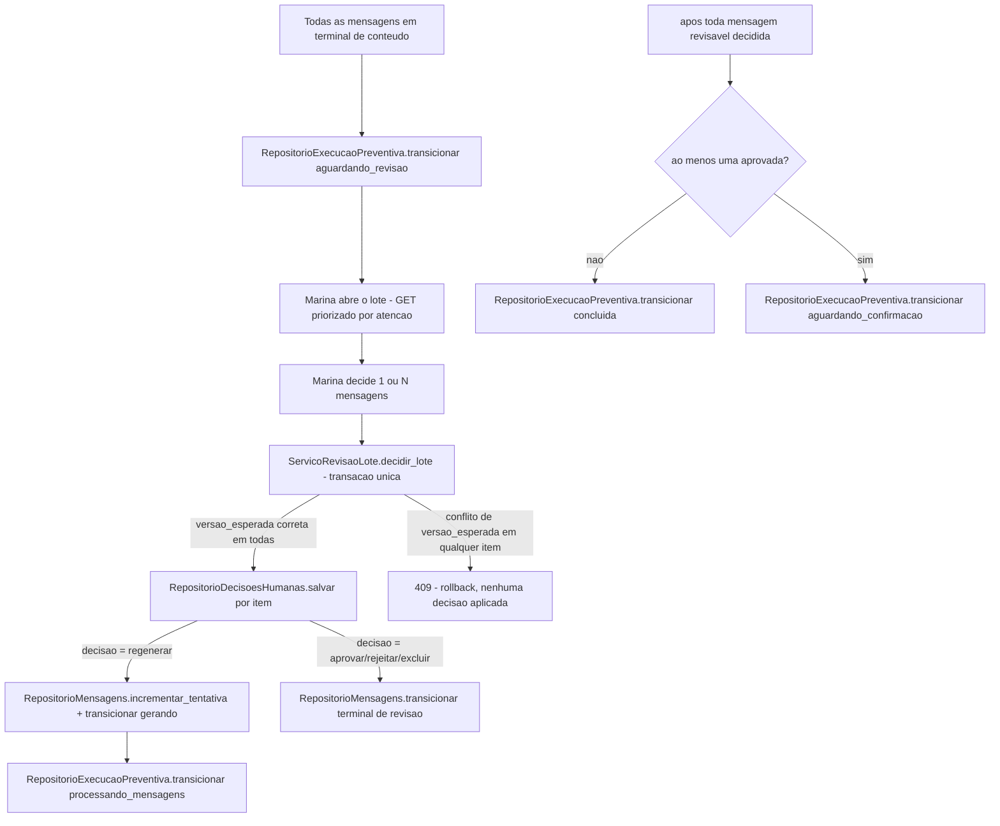

# História 3.5: Revisar e decidir o lote de comunicação — Design

**Spec**: `.specs/features/3-5-revisar-e-decidir-o-lote-de-comunicacao/spec.md`
**Status**: Approved

---

## Research (Knowledge Verification Chain)

**Codebase**: `RepositorioMensagens`/`EstadoMensagem` (3.2) e `RepositorioExecucaoPreventiva` (2.2) já dão a base de concorrência otimista reusada para a decisão em lote atômica. `RepositorioMensagens.incrementar_tentativa` (3.4) já é o mecanismo de contagem compartilhada — reusado tal como está para a regeneração humana. `GrafoGeracaoMensagem` (3.2–3.4) já reentra em `gerar` quando solicitado; esta história só adiciona o gatilho humano (com justificativa) para essa mesma reentrada.

**Project docs**: AD-6 é o contrato integral desta história — decisão individual entre `aprovada`/`rejeitada`/`excluida`, regeneração com `tentativas < 3` incrementando atomicamente e voltando o agregado a `processando_mensagens`, guarda "só retorna a `aguardando_revisao` quando não houver regeneração ativa", "sem aprovadas conclui, uma ou mais aprovadas levam a `aguardando_confirmacao`". AD-11 exige que mutações concorrentes e histórico sejam preservados (decisão em lote atômica, `409` sem parcial).

---

## Approach

`ServicoRevisaoLote`: caso de uso que lê o lote (mensagens + suas versões/avaliações/exceções), aplica decisões humanas em transação única, e decide a transição agregada da execução consultando o estado de todas as mensagens revisáveis após a transação. Regeneração humana reusa a mesma aresta de reentrada em `gerar` que 3.4 já implementa para o ciclo automático — a única diferença é a origem do gatilho (humano vs. crítico) e a exigência de justificativa. Nenhuma alternativa de arquitetura considerada — decorre diretamente do AD-6 e reusa toda a infraestrutura de mensagem/grafo já aprovada.

---

## Code Reuse Analysis

### Existing Components to Leverage

| Component | Location | How to Use |
| --- | --- | --- |
| `RepositorioMensagens` (`transicionar`, `incrementar_tentativa`) | `adaptadores/persistencia/repositorio_mensagens.py` (3.2/3.4) | Reusado sem alteração para as transições de decisão humana e regeneração |
| `RepositorioExecucaoPreventiva` (`transicionar`) | `adaptadores/persistencia/repositorio_execucao_preventiva.py` (2.2) | Reusado para `aguardando_revisao`↔`processando_mensagens`↔`concluida`/`aguardando_confirmacao` |
| `GrafoGeracaoMensagem` (nó `gerar`, contexto de regeneração) | `aplicacao/grafos/geracao_mensagem.py` (3.2–3.4) | Reentrada reusada tal como está — só o gatilho externo muda (humano vs. automático) |
| Padrão de transação única (restauração, Épico 1, AD-005) | `aplicacao/restauracao.py` | Mesmo padrão de "tudo numa transação ou nada" aplicado à decisão em lote |
| `EstadoExecucao.CONCLUIDA`/`AGUARDANDO_CONFIRMACAO` (AD-004) | `dominio/estados_execucao.py` | Já existem no enum — reusados sem alteração |

### Integration Points

| System | Integration Method |
| --- | --- |
| DuckDB | Migração `0011` cria `decisoes_humanas` |

---

## Components

### `RepositorioDecisoesHumanas`

- **Purpose**: Persiste cada decisão humana (perfil sintético, data, resultado, justificativa, versão da mensagem), distinta da aprovação do crítico.
- **Location**: `adaptadores/persistencia/repositorio_decisoes_humanas.py`
- **Interfaces**:
  - `def salvar(self, mensagem_id: UUID, versao_mensagem_id: UUID, perfil: str, resultado: ResultadoDecisaoHumana, justificativa: str | None) -> UUID`
  - `def obter_por_mensagem(self, mensagem_id: UUID) -> list[DecisaoHumana]`
- **Dependencies**: `abrir_conexao`.
- **Reuses**: padrão de repositório existente.

### `ServicoRevisaoLote` (caso de uso)

- **Purpose**: Aplica decisões (individuais ou em lote) numa única transação; após aplicar, verifica se todas as mensagens revisáveis têm decisão terminal e decide a transição agregada.
- **Location**: `aplicacao/revisao_lote.py`
- **Interfaces**:
  - `def obter_lote(self, execucao_id: UUID) -> LoteRevisao` — mensagens ordenadas com itens de atenção primeiro (exceções e reprovações antes de aprovações agênticas limpas).
  - `def decidir_lote(self, execucao_id: UUID, decisoes: list[DecisaoRequisitada], chave_idempotencia: str) -> ResultadoDecisaoLote` — `DecisaoRequisitada` inclui `mensagem_id`, `versao_esperada`, `resultado` (`aprovar`/`rejeitar`/`excluir`/`regenerar`), `justificativa`.
- **Dependencies**: `RepositorioMensagens`, `RepositorioDecisoesHumanas`, `RepositorioExecucaoPreventiva`, `RepositorioIdempotencia`.
- **Reuses**: transação única do DuckDB (mesmo padrão de `aplicacao/restauracao.py`).

---

## Data Models

### Migração `0011_decisoes_humanas.sql`

#### `decisoes_humanas` (nova)

| Coluna | Tipo | Restrições |
| --- | --- | --- |
| `id` | `UUID` | chave primária |
| `mensagem_id` | `UUID` | `NOT NULL`, chave estrangeira lógica para `mensagens(id)` |
| `versao_mensagem_id` | `UUID` | `NOT NULL`, chave estrangeira lógica para `versoes_mensagem(id)` |
| `perfil_responsavel` | `VARCHAR` | `NOT NULL` |
| `resultado` | `VARCHAR` | `NOT NULL`, `CHECK` em `aprovar`, `rejeitar`, `excluir`, `regenerar` |
| `justificativa` | `VARCHAR` | nulo somente quando `resultado = aprovar` |
| `criado_em` | `TIMESTAMP` | `NOT NULL`, padrão `now()` |

---

## Error Handling Strategy

| Error Scenario | Handling | User Impact |
| --- | --- | --- |
| Decisão sem justificativa (rejeitar/excluir/regenerar) | Bloqueada com erro de validação de campo, antes de qualquer mutação | Erro inline junto ao campo de justificativa |
| Conflito de `versao_esperada` em qualquer item do lote | Transação inteira aborta, `409` com os itens conflitantes identificados | Nenhuma decisão aplicada; Marina recarrega e tenta de novo |
| Mensagem já com 3 tentativas, decisão `regenerar` solicitada | Rejeitada com motivo específico, sem consumir a transação das demais decisões válidas do mesmo lote | Ação de regenerar já aparece indisponível na interface antes mesmo do envio |
| Regeneração idempotente reenviada (mesma `Idempotency-Key`) | `RepositorioIdempotencia` devolve a resposta já registrada, sem incrementar tentativa de novo | Nenhuma dupla contagem |

---

## Risks & Concerns

| Concern | Location (file:line) | Impact | Mitigation |
| --- | --- | --- | --- |
| A guarda "agregado só retorna a `aguardando_revisao` quando nenhuma regeneração permanecer ativa" exige saber, a qualquer momento, quantas mensagens estão em `gerando`/`criticando` por regeneração humana ativa vs. já resolvidas | `aplicacao/revisao_lote.py` (a criar) | Cálculo incorreto da guarda poderia liberar `aguardando_confirmacao` prematuramente com mensagem ainda em regeneração | A guarda consulta diretamente `RepositorioMensagens` por estado (não um contador derivado separado): "toda mensagem revisável tem decisão terminal" é recomputado a partir do estado real persistido a cada verificação, nunca cacheado |

---

## Tech Decisions

| Decision | Choice | Rationale |
| --- | --- | --- |
| Ordenação do lote ("itens que exigem atenção primeiro") | Ordem: `falhou_conteudo`/`falhou_integracao_ia` primeiro, depois `aguardando_revisao` com avaliação crítica reprovada em alguma tentativa anterior (mesmo aprovada na final), depois `aguardando_revisao` aprovada limpa | Interpretação objetiva de "exigem atenção": exceções primeiro, depois itens com histórico de reprovação (merecem checagem extra), depois os limpos |
| Transação da decisão em lote | Uma transação DuckDB por chamada de `decidir_lote`, aplicando todas as `DecisaoRequisitada` válidas em sequência dentro dela; qualquer exceção de conflito de versão faz `ROLLBACK` da transação inteira | Cumpre literalmente "mesma transação ou nenhuma"; mesmo padrão já usado pela restauração de dados sintéticos (AD-005) |

---

## Approval

Aprovado por extensão da mesma sessão — decorre diretamente do AD-6 já aprovado, reusando toda a infraestrutura de mensagem/execução construída em 2.2/2.6/3.2–3.4.
