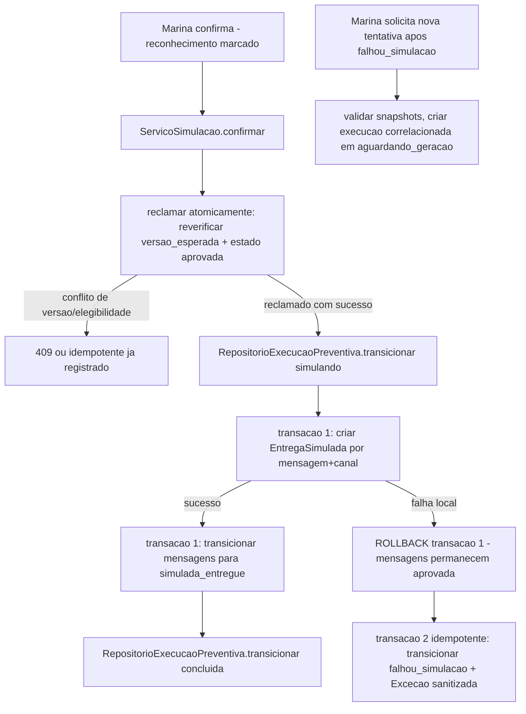

# História 3.6: Confirmar e executar a simulação sem envio real — Design

**Spec**: `.specs/features/3-6-confirmar-e-executar-a-simulacao-sem-envio-real/spec.md`
**Status**: Approved

---

## Research (Knowledge Verification Chain)

**Codebase**: `RepositorioExecucaoPreventiva.transicionar` (2.2) já cobre `aguardando_confirmacao`→`simulando`→`concluida`/`falhou_simulacao` como transições genéricas sobre `EstadoExecucao` (AD-004) — nenhuma mudança de assinatura necessária. O padrão de "nova tentativa correlacionada" já foi implementado duas vezes (2.2 para `falhou_coleta`, 3.1 para `falhou_preparacao_ia`) — esta história é a terceira aplicação do mesmo padrão, agora para `falhou_simulacao`. `RepositorioMensagens.transicionar` (3.2) já suporta `aprovada`→`simulada_entregue` como transição genérica sobre `EstadoMensagem`.

**Project docs**: AD-6 já define exatamente o comportamento: "somente após o reconhecimento explícito o agregado entra em `simulando`, reclama atomicamente as aprovadas e mantém toda entrega rotulada como `simulada`"; "falha local da simulação preserva todas as mensagens como `aprovada`, sem criar entregas parciais". AD-7 já define a idempotência genérica e a "nova tentativa após `falhou_simulacao`" com `execucao_origem_id` novo. AD-9 proíbe qualquer conector real.

---

## Approach

`ServicoSimulacao`: caso de uso que reclama atomicamente as mensagens aprovadas (segunda verificação de versão/elegibilidade no momento da confirmação, não confiando no estado exibido na tela), cria as entregas simuladas numa única transação, e só then transiciona mensagens e execução. Rollback e segunda transação de falha seguem exatamente o texto do AD-6 ("falha local... preserva... sem criar entregas parciais" + "segunda transação idempotente" para `falhou_simulacao`). Nenhuma alternativa de arquitetura considerada — o comportamento já está inteiramente especificado pelo AD-6/AD-7.

---

## Code Reuse Analysis

### Existing Components to Leverage

| Component | Location | How to Use |
| --- | --- | --- |
| `RepositorioExecucaoPreventiva.transicionar` | `adaptadores/persistencia/repositorio_execucao_preventiva.py` (2.2) | Reusado sem alteração para `simulando`/`concluida`/`falhou_simulacao` |
| `RepositorioMensagens.transicionar` | `adaptadores/persistencia/repositorio_mensagens.py` (3.2) | Reusado sem alteração para `aprovada`→`simulada_entregue` |
| Padrão de execução correlacionada (2.2, 3.1) | `ServicoColetaMeteorologica.solicitar_nova_tentativa` (2.2), `ServicoPreflightIA.solicitar_nova_tentativa` (3.1) | Terceira aplicação do mesmo padrão, para `falhou_simulacao` |
| `RepositorioExcecoesOperacionais` | `adaptadores/persistencia/repositorio_execucao_preventiva.py` (2.2) | Reusado para a exceção sanitizada de `falhou_simulacao` |
| AD-002 (`Idempotency-Key`) | `chaves_idempotencia` | Reusado para o comando de confirmação |

### Integration Points

| System | Integration Method |
| --- | --- |
| DuckDB | Migração `0012` cria `entregas_simuladas`; nenhum sistema externo — simulação é inteiramente local |

---

## Components

### `ServicoSimulacao` (caso de uso)

- **Purpose**: Reclama atomicamente as mensagens aprovadas, cria entregas simuladas numa transação, trata rollback + segunda transação de falha, e o fluxo de nova tentativa correlacionada.
- **Location**: `aplicacao/simulacao.py`
- **Interfaces**:
  - `def confirmar(self, execucao_id: UUID, versao_esperada: int, chave_idempotencia: str, injecao_falha_teste: Callable[[], None] | None = None) -> ResultadoSimulacao` — o parâmetro de injeção de falha é usado apenas por teste (ver Tech Decisions), nunca por código de produção.
  - `def solicitar_nova_tentativa(self, execucao_origem_id: UUID, chave_idempotencia: str) -> UUID`
- **Dependencies**: `RepositorioMensagens`, `RepositorioEntregasSimuladas`, `RepositorioExecucaoPreventiva`, `RepositorioExcecoesOperacionais`, `RepositorioIdempotencia`.
- **Reuses**: mesmo padrão de execução correlacionada de 2.2/3.1; mesma transação única de 3.5.

### `RepositorioEntregasSimuladas`

- **Purpose**: Cria uma entrega simulada por mensagem+canal, com a apresentação reaproveitada do conteúdo já aprovado.
- **Location**: `adaptadores/persistencia/repositorio_entregas_simuladas.py`
- **Interfaces**:
  - `def criar_lote(self, execucao_id: UUID, mensagens_aprovadas: list[MensagemAprovada]) -> list[UUID]` — insere todas numa única chamada, dentro da transação já aberta pelo chamador.
  - `def listar_por_execucao(self, execucao_id: UUID) -> list[EntregaSimulada]`
- **Dependencies**: `abrir_conexao`.
- **Reuses**: padrão de repositório existente; `conteudo` da entrega é copiado da última versão aprovada de `versoes_mensagem` (3.2), sem gerar nada novo.

---

## Data Models

### Migração `0012_entregas_simuladas.sql`

#### `entregas_simuladas` (nova)

| Coluna | Tipo | Restrições |
| --- | --- | --- |
| `id` | `UUID` | chave primária |
| `execucao_id` | `UUID` | `NOT NULL`, chave estrangeira lógica para `execucao_preventiva(id)` |
| `mensagem_id` | `UUID` | `NOT NULL`, chave estrangeira lógica para `mensagens(id)`, `UNIQUE` |
| `canal` | `VARCHAR` | `NOT NULL`, `CHECK` em `whatsapp`, `email`, `sms` |
| `apresentacao` | `VARCHAR` | `NOT NULL` — JSON serializado, cópia do `conteudo` da versão aprovada |
| `criado_em` | `TIMESTAMP` | `NOT NULL`, padrão `now()` |

---

## Error Handling Strategy

| Error Scenario | Handling | User Impact |
| --- | --- | --- |
| Reconhecimento não marcado | Ação principal do modal permanece desabilitada no frontend; backend rejeita comando sem o campo de reconhecimento marcado, como defesa em profundidade | Botão desabilitado; erro claro se contornado via API direta |
| `versao_esperada` desatualizada na confirmação | `409`, nenhuma reclamação de mensagem ocorre | Marina recarrega e vê o estado atual |
| Confirmações concorrentes para a mesma versão | Só a primeira transação válida reclama; a segunda recebe idempotente ou `409` | Nenhuma duplicação, mesmo sob duplo clique |
| Falha local durante criação das entregas | Rollback da transação 1 (mensagens permanecem `aprovada`); transação 2 idempotente move agregado a `falhou_simulacao` + `Exceção` sanitizada | Execução mostra "Falha local", nunca "falha de provedor" |
| Repetição da mesma `Idempotency-Key` após sucesso | Devolve a simulação já registrada | Nenhuma segunda entrega criada |

---

## Risks & Concerns

| Concern | Location (file:line) | Impact | Mitigation |
| --- | --- | --- | --- |
| Testar "falha local durante a transação" de forma determinística sem depender de condição real e instável do DuckDB | `testes/test_simulacao.py` (a criar) | Sem um ponto de injeção controlado, o teste de rollback seria não determinístico ou exigiria simular uma falha real de disco | `ServicoSimulacao.confirmar` aceita um parâmetro de injeção de falha exclusivo de teste (nunca chamado em produção — `composicao/` nunca o passa), documentado explicitamente no Design e no código como mecanismo de teste, não uma porta de produção |

---

## Tech Decisions

| Decision | Choice | Rationale |
| --- | --- | --- |
| Mecanismo de teste para falha local | Parâmetro opcional `injecao_falha_teste` em `ServicoSimulacao.confirmar`, `None` por padrão e nunca fornecido pelo código de composição real | Permite um teste determinístico e explícito de rollback sem acoplar o caso de uso a uma biblioteca de fault-injection nem depender de condições de infraestrutura reais |
| Onde a "reclamação atômica" verifica elegibilidade | Reconsulta `RepositorioMensagens` pelo estado real (`aprovada`) no momento da transação, não confia em nenhum estado enviado pelo frontend | Consistente com o mesmo princípio já aplicado em 3.5 (a guarda de decisão terminal é sempre recomputada do estado real, nunca cacheada) |
| Conteúdo da "apresentação simulada" | Cópia exata do `conteudo` da última versão aprovada (`versoes_mensagem`, 3.2), sem transformação | Cumpre "mostrar como o conteúdo seria apresentado" sem introduzir uma segunda fonte de verdade para o texto da mensagem |

---

## Approval

Aprovado por extensão da mesma sessão — comportamento inteiramente especificado pelo AD-6/AD-7 já aprovados; reusa toda a infraestrutura de execução/mensagem construída em 2.2/2.6/3.1–3.5, sem componente estrutural novo de alto risco.
