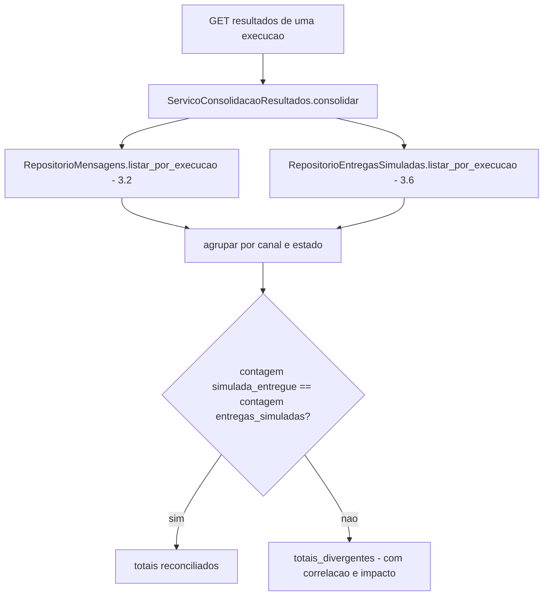

# História 4.1: Consolidar resultados e estados da simulação — Design

**Spec**: `.specs/features/4-1-consolidar-resultados-e-estados-da-simulacao/spec.md`
**Status**: Approved

---

## Research (Knowledge Verification Chain)

**Codebase**: `entregas_simuladas` (3.6) já existe com `UNIQUE(mensagem_id)`, criada atomicamente junto com a transição `aprovada`→`simulada_entregue` (3.6, `ServicoSimulacao.confirmar`). `mensagens.estado` (3.2/`EstadoMensagem`, AD-004-análogo) já distingue `simulada_entregue`, `rejeitada`, `excluida`, `falhou_conteudo`, `falhou_integracao_ia`. `EstadoExecucao.FALHOU_SIMULACAO`/`CONCLUIDA` (AD-004) já existem. Esta história não precisa de nenhuma tabela de estado nova — é inteiramente uma camada de consulta/agregação sobre dado já persistido pelos Épicos 2/3.

**Project docs**: AD-6/AD-7 (já usados pelo design de 3.6) garantem a atomicidade que esta história apenas expõe. Nenhum novo ADR necessário.

---

## Approach

`ServicoConsolidacaoResultados`: um serviço de consulta somente leitura que agrega `mensagens`+`entregas_simuladas` por execução, calcula totais por canal/estado, e detecta divergência comparando a contagem de `entregas_simuladas` com a contagem de `mensagens.estado = simulada_entregue` (que devem sempre ser iguais, dada a atomicidade de 3.6 — uma divergência indicaria corrupção de dado, nunca esperada em operação normal). Nenhuma tabela nova, nenhum novo valor de `EstadoExecucao`. Nenhuma alternativa de arquitetura considerada — é uma consulta de agregação direta sobre schema já existente.

---

## Code Reuse Analysis

### Existing Components to Leverage

| Component | Location | How to Use |
| --- | --- | --- |
| `RepositorioMensagens.listar_por_execucao` | `adaptadores/persistencia/repositorio_mensagens.py` (3.2, método novo se ainda não existir na forma exata) | Fonte de estados e canais por mensagem |
| `RepositorioEntregasSimuladas.listar_por_execucao` | `adaptadores/persistencia/repositorio_entregas_simuladas.py` (3.6) | Fonte das entregas simuladas confirmadas |
| `EstadoExecucao.FALHOU_SIMULACAO`/`CONCLUIDA` (AD-004) | `dominio/estados_execucao.py` | Reusados sem alteração para o estado agregado da execução |
| `EstadoMensagem` (3.2) | `dominio/estados_mensagem.py` | Reusado para classificar cada mensagem em "simulada"/"não simulável" |

### Integration Points

| System | Integration Method |
| --- | --- |
| DuckDB | Nenhuma migração — consultas somente leitura sobre `mensagens` e `entregas_simuladas` |

---

## Components

### `ServicoConsolidacaoResultados` (caso de uso, somente leitura)

- **Purpose**: Agrega totais por canal/estado, mapeia para o vocabulário de exibição, detecta divergência.
- **Location**: `aplicacao/consolidacao_resultados.py`
- **Interfaces**:
  - `def consolidar(self, execucao_id: UUID) -> ResultadoConsolidado` — `ResultadoConsolidado` contém `totais_por_canal`, `totais_por_estado`, `nao_simulaveis` (rejeitadas/excluídas/em exceção, com motivo), e `divergencia: DivergenciaTotais | None`.
- **Dependencies**: `RepositorioMensagens`, `RepositorioEntregasSimuladas`.
- **Reuses**: nenhum I/O novo — só leitura de repositórios já existentes.

### Extensão de `RepositorioMensagens` — `listar_por_execucao`

- **Purpose**: Lista todas as mensagens de uma execução com seu estado atual e canal, para a agregação.
- **Location**: `adaptadores/persistencia/repositorio_mensagens.py` (extensão de 3.2, se o método ainda não existir nessa forma exata)
- **Interfaces**: `def listar_por_execucao(self, execucao_id: UUID) -> list[MensagemResumo]`
- **Dependencies**: `abrir_conexao`.
- **Reuses**: mesma tabela `mensagens`.

---

## Data Models

Nenhuma migração nova. O "vocabulário de exibição" `Preparada`/`Processada`/`Enviada — simulação` é puramente uma tradução de apresentação (frontend/serialização HTTP) da existência de uma linha em `entregas_simuladas` — não um campo de banco novo (ver Tech Decisions).

---

## Error Handling Strategy

| Error Scenario | Handling | User Impact |
| --- | --- | --- |
| Execução ainda em `simulando` (3.6, não concluída) | `ServicoConsolidacaoResultados` retorna o estado de progresso real, sem calcular totais finais | Interface mostra progresso, não resultado consolidado |
| Execução em `falhou_simulacao` | Totais mostram zero entregas simuladas; mensagens listadas como `aprovada` (não `simulada_entregue`); nenhuma menção a falha de canal | Interface mostra claramente "falha local", nunca "falha de WhatsApp/e-mail/SMS" |
| Contagem de `mensagens.simulada_entregue` ≠ contagem de `entregas_simuladas` (nunca esperado sob operação normal) | `ResultadoConsolidado.divergencia` preenchido com a contagem de cada lado e uma correlação (`execucao_id`) | Interface exibe `totais_divergentes`, sem tentar reconciliar visualmente |

---

## Risks & Concerns

| Concern | Location (file:line) | Impact | Mitigation |
| --- | --- | --- | --- |
| `totais_divergentes` é um estado de exibição calculado, não um valor persistido de `EstadoExecucao` — poderia ser confundido com um estado real da máquina de estados do AD-4 | `aplicacao/consolidacao_resultados.py` (a criar) | Um futuro leitor do design/AD-4 poderia esperar `totais_divergentes` em `dominio/estados_execucao.py` e não encontrar | Documentado explicitamente aqui e no `spec.md` (Assumptions) como decisão deliberada de não estender o enum fixado pelo AD-004 para um caso de inconsistência técnica que nunca deveria ocorrer sob operação normal |

---

## Tech Decisions

| Decision | Choice | Rationale |
| --- | --- | --- |
| Onde vive `Preparada`/`Processada`/`Enviada — simulação` | Vocabulário de exibição calculado no momento da resposta HTTP/renderização — não persistido como três estados sequenciais | A criação de `entregas_simuladas` já é atômica (3.6); persistir três sub-estados intermediários introduziria uma segunda máquina de estados sem necessidade, quando o dado real já garante que a sequência sempre "aconteceu inteira" |
| Onde vive `totais_divergentes` | Campo calculado em `ResultadoConsolidado`, não um valor de `EstadoExecucao` | Evita estender o enum fixado pelo AD-004 para um caso que é, por definição, uma inconsistência de dado nunca esperada em operação normal — ver Risks & Concerns |
| Reconciliação de rejeitadas/excluídas/exceção | Contadas separadamente em `nao_simulaveis`, nunca somadas a `totais_por_canal`/`totais_por_estado` das entregas simuladas | Cumpre literalmente o AC — soma de totais só reconcilia com o que foi de fato simulado |

---

## Approval

Aprovado por extensão da mesma sessão — camada de consulta pura sobre schema já existente de 3.2/3.6, sem componente estrutural novo de alto risco.
