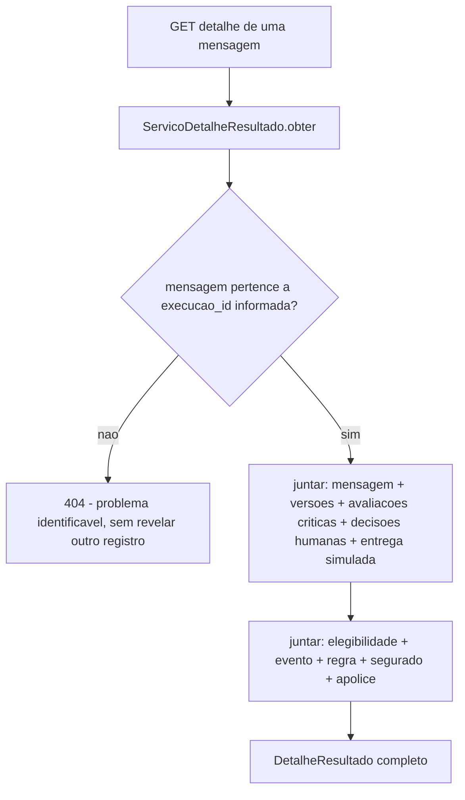

# História 4.2: Inspecionar o resultado individual — Design

**Spec**: `.specs/features/4-2-inspecionar-o-resultado-individual/spec.md`
**Status**: Approved

---

## Research (Knowledge Verification Chain)

**Codebase**: Todo o dado exigido pelo AC já existe: `mensagens`/`versoes_mensagem` (3.2), `avaliacoes_criticas` (3.3), `decisoes_humanas` (3.5), `entregas_simuladas` (3.6), `elegibilidades_historicas`/`avaliacoes_risco` (2.5/2.3) para evento/regra/segurado/apólice. Esta história não precisa de nenhuma tabela nova — é uma junção de leitura sobre schema já existente, análoga a 4.1.

**Project docs**: AD-11 (histórico imutável) já garante que nenhuma versão é reescrita — o detalhe só lê. Nenhum novo ADR necessário.

---

## Approach

`ServicoDetalheResultado`: um serviço de consulta que junta todas as tabelas relevantes por `mensagem_id`, verificando que a mensagem pertence à `execucao_id` informada antes de devolver qualquer dado (para o isolamento exigido pelo AC). Nenhuma alternativa de arquitetura considerada — é uma junção de leitura direta.

---

## Code Reuse Analysis

### Existing Components to Leverage

| Component | Location | How to Use |
| --- | --- | --- |
| `RepositorioMensagens` | `adaptadores/persistencia/repositorio_mensagens.py` (3.2) | Fonte de mensagem, versões |
| `RepositorioAvaliacoesCriticas` | `adaptadores/persistencia/repositorio_avaliacoes_criticas.py` (3.3) | Fonte de avaliações críticas por versão |
| `RepositorioDecisoesHumanas` | `adaptadores/persistencia/repositorio_decisoes_humanas.py` (3.5) | Fonte de decisões humanas por versão |
| `RepositorioEntregasSimuladas` | `adaptadores/persistencia/repositorio_entregas_simuladas.py` (3.6) | Fonte da apresentação simulada final |
| `RepositorioElegibilidades` | `adaptadores/persistencia/repositorio_elegibilidade.py` (2.5) | Fonte de segurado, apólice, localização |
| `RepositorioAvaliacoesRisco` | `adaptadores/persistencia/repositorio_avaliacoes_risco.py` (2.3) | Fonte de evento e versão da regra |

### Integration Points

| System | Integration Method |
| --- | --- |
| DuckDB | Nenhuma migração — consultas somente leitura sobre tabelas já existentes |

---

## Components

### `ServicoDetalheResultado` (caso de uso, somente leitura)

- **Purpose**: Junta todo o dado de origem de uma mensagem, validando que ela pertence à execução informada.
- **Location**: `aplicacao/detalhe_resultado.py`
- **Interfaces**:
  - `def obter(self, execucao_id: UUID, mensagem_id: UUID) -> DetalheResultado | None` — `None` (mapeado a `404` pelo roteador) se a mensagem não existir ou não pertencer à `execucao_id` informada.
- **Dependencies**: `RepositorioMensagens`, `RepositorioAvaliacoesCriticas`, `RepositorioDecisoesHumanas`, `RepositorioEntregasSimuladas`, `RepositorioElegibilidades`, `RepositorioAvaliacoesRisco`.
- **Reuses**: nenhum I/O novo.

---

## Data Models

Nenhuma migração nova — `DetalheResultado` é um DTO de agregação em memória, não uma tabela.

---

## Error Handling Strategy

| Error Scenario | Handling | User Impact |
| --- | --- | --- |
| `mensagem_id` inexistente | `obter` retorna `None` → roteador responde `404` `application/problem+json` genérico | Interface mostra `Não encontrado` com ação de retorno |
| `mensagem_id` existe mas pertence a outra `execucao_id` | Mesma resposta `404` genérica do caso acima — nenhuma distinção de mensagem que revele a existência do registro em outro contexto | Idêntico ao caso "inexistente", por design |
| Mensagem sem decisão humana ainda (não chegou a `aguardando_revisao`) | `DetalheResultado.decisao_humana = None`, sem erro | Interface mostra "aguardando decisão" ou similar, não erro |

---

## Risks & Concerns

> None found — camada de consulta pura sobre schema já existente de 2.3/2.5/3.2/3.3/3.5/3.6, sem componente estrutural novo.

---

## Tech Decisions

| Decision | Choice | Rationale |
| --- | --- | --- |
| Resposta para "existe mas é de outra execução" | Idêntica à resposta de "não existe" (mesmo código, mesma mensagem genérica) | Cumpre literalmente "sem revelar outro registro" — qualquer diferença de resposta entre os dois casos permitiria a um cliente malicioso ou por engano inferir a existência cruzada de um ID |
| Foco/`Esc`/empilhamento de camadas | Implementado como responsabilidade exclusiva do componente de drawer/painel do frontend (sem estado no backend) | Comportamento é inteiramente de interface; nenhum dado de sessão de UI precisa ser persistido |

---

## Approval

Aprovado por extensão da mesma sessão — camada de consulta pura sobre schema já existente, sem componente estrutural novo de alto risco.
