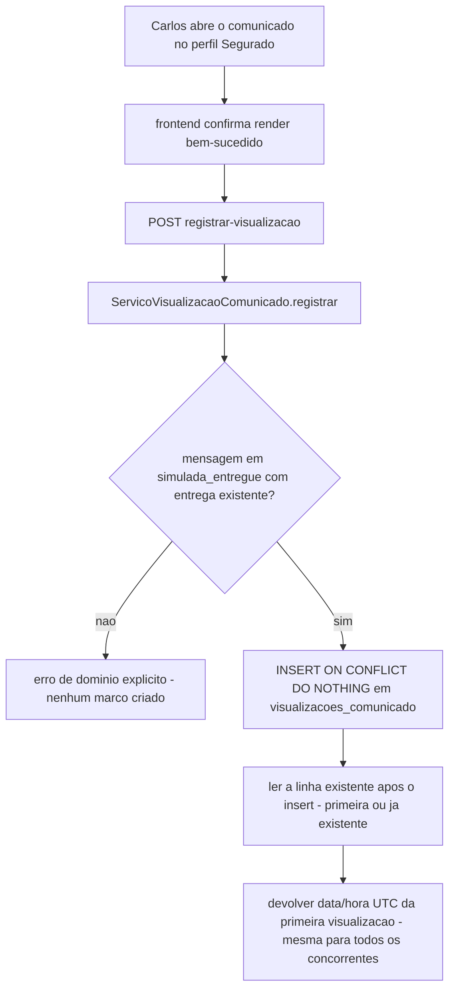

# História 4.3: Registrar a primeira visualização do comunicado — Design

**Spec**: `.specs/features/4-3-registrar-a-primeira-visualizacao-do-comunicado/spec.md`
**Status**: Approved

---

## Research (Knowledge Verification Chain)

**Codebase**: `consultar_segurado_padrao`/`SEGURADO_PADRAO` (`aplicacao/contexto.py`, `dominio/identificadores_demonstracao.py`, Épico 1) já resolve "qual segurado sintético está ativo" no contexto demonstrativo — reusado aqui como a identidade de "Carlos"; a História 5.7 (fora deste épico) estende esse mecanismo para alternância explícita entre segurados, mas o mecanismo básico já existe. `entregas_simuladas` (3.6) e `mensagens.estado = simulada_entregue` (3.2) já identificam o que é elegível para virar "comunicado". Nenhuma tabela de visualização existe ainda.

**Project docs**: AD-9 (envelope local, sem autenticação real) já autoriza consumir o segurado ativo do contexto demonstrativo sem sistema de login. AD-10 (correlação sem conteúdo sensível) aplica-se ao registro de visualização — a exceção sanitizada de falha local nunca deve conter conteúdo do comunicado.

---

## Approach

`ServicoVisualizacaoComunicado`: caso de uso que valida elegibilidade (mensagem em `simulada_entregue`, com `entregas_simuladas` existente) e registra a primeira visualização via `INSERT ... ON CONFLICT DO NOTHING` numa tabela dedicada com `UNIQUE(entrega_simulada_id)`, dentro de uma transação — a chamada que grava e a(s) que concorrem leem de volta a mesma linha já persistida, garantindo convergência sem lock explícito adicional. Nenhuma alternativa de arquitetura considerada — é o padrão de dedução mais simples e correto disponível no DuckDB para esse caso.

---

## Code Reuse Analysis

### Existing Components to Leverage

| Component | Location | How to Use |
| --- | --- | --- |
| `consultar_segurado_padrao`/`SEGURADO_PADRAO` | `aplicacao/contexto.py`, `dominio/identificadores_demonstracao.py` (Épico 1) | Identidade de "Carlos" no ambiente local, sem sistema de login novo |
| `RepositorioMensagens` | `adaptadores/persistencia/repositorio_mensagens.py` (3.2) | Verifica `estado = simulada_entregue` antes de aceitar a visualização |
| `RepositorioEntregasSimuladas` | `adaptadores/persistencia/repositorio_entregas_simuladas.py` (3.6) | Fonte do conteúdo/canal exibido no comunicado |
| Padrão de erro de domínio explícito | mesmo padrão de `application/problem+json` já usado em toda a API | Reusado para "mensagem não elegível" |

### Integration Points

| System | Integration Method |
| --- | --- |
| DuckDB | Migração `0013` cria `visualizacoes_comunicado` |

---

## Components

### `RepositorioVisualizacoesComunicado`

- **Purpose**: Registra a primeira visualização de forma idempotente/concorrente-segura, e consulta o estado atual.
- **Location**: `adaptadores/persistencia/repositorio_visualizacoes_comunicado.py`
- **Interfaces**:
  - `def registrar_primeira_visualizacao(self, entrega_simulada_id: UUID) -> VisualizacaoComunicado` — `INSERT ... ON CONFLICT (entrega_simulada_id) DO NOTHING`, seguido de `SELECT` da linha (própria ou já existente) na mesma transação; sempre devolve a visualização persistida, nunca lança em caso de conflito.
  - `def obter_por_entrega(self, entrega_simulada_id: UUID) -> VisualizacaoComunicado | None`
- **Dependencies**: `abrir_conexao`.
- **Reuses**: padrão de repositório existente.

### `ServicoVisualizacaoComunicado` (caso de uso)

- **Purpose**: Valida elegibilidade da mensagem, monta o comunicado (conteúdo/canal/natureza simulada), e registra a visualização.
- **Location**: `aplicacao/visualizacao_comunicado.py`
- **Interfaces**:
  - `def obter_comunicado(self, entrega_simulada_id: UUID, segurado_id: UUID) -> Comunicado | None` — `None` se a mensagem associada não pertencer ao `segurado_id` informado ou não existir (mesmo padrão de não-enumeração de 4.2).
  - `def registrar_visualizacao(self, entrega_simulada_id: UUID) -> VisualizacaoComunicado` — levanta `MensagemNaoElegivelParaComunicado` se `mensagens.estado != simulada_entregue`.
- **Dependencies**: `RepositorioMensagens`, `RepositorioEntregasSimuladas`, `RepositorioVisualizacoesComunicado`.
- **Reuses**: nenhum I/O novo além dos repositórios acima.

---

## Data Models

### Migração `0013_visualizacoes_comunicado.sql`

#### `visualizacoes_comunicado` (nova)

| Coluna | Tipo | Restrições |
| --- | --- | --- |
| `id` | `UUID` | chave primária |
| `entrega_simulada_id` | `UUID` | `NOT NULL`, `UNIQUE`, chave estrangeira lógica para `entregas_simuladas(id)` |
| `segurado_id` | `UUID` | `NOT NULL`, chave estrangeira lógica para `segurados(id)` — snapshot, não recalculado |
| `visualizada_em` | `TIMESTAMP` | `NOT NULL`, timestamp UTC, padrão `now()` |

---

## Error Handling Strategy

| Error Scenario | Handling | User Impact |
| --- | --- | --- |
| Mensagem não elegível (`falhou_conteudo`, `rejeitada`, `excluida`, ainda não simulada) | `registrar_visualizacao` levanta `MensagemNaoElegivelParaComunicado`; roteador responde erro de domínio explícito | Interface mostra erro específico, sem registrar marco |
| Duas aberturas concorrentes | `ON CONFLICT DO NOTHING` + leitura garantem uma única linha; ambas as respostas HTTP devolvem a mesma `visualizada_em` | Nenhuma duplicação visível a Carlos |
| Falha local ao registrar (ex.: erro de conexão momentâneo) | Exceção propagada sem criar linha parcial; frontend preserva estado de erro consultável, permite nova tentativa idempotente | Interface nunca mostra `Visualizada no portal` antes da confirmação real |
| `entrega_simulada_id` de outro segurado | `obter_comunicado` retorna `None`, mesmo padrão de não-enumeração de 4.2 | `Não encontrado`, sem revelar o registro de outro segurado |

---

## Risks & Concerns

> None found — mecanismo de dedução via `UNIQUE`/`ON CONFLICT` já é o mesmo padrão comprovado em 2.2 (deduplicação de eventos) e 2.5 (deduplicação de elegibilidade), aplicado a um terceiro caso.

---

## Tech Decisions

| Decision | Choice | Rationale |
| --- | --- | --- |
| Gatilho de "abrir efetivamente" | O frontend chama `POST registrar-visualizacao` só após o componente do comunicado montar com sucesso e o conteúdo estar de fato renderizado — nunca no `GET` que busca o conteúdo | Evita registrar visualização por prefetch de rota ou por uma renderização que falhou antes do conteúdo aparecer |
| Mecanismo de concorrência | `INSERT ... ON CONFLICT (entrega_simulada_id) DO NOTHING` seguido de `SELECT`, ambos na mesma transação | Mecanismo nativo do DuckDB para exatamente esse caso; nenhum lock explícito adicional necessário |
| Timestamp | `TIMESTAMP` UTC, mesmo padrão de todas as demais tabelas do projeto (`criado_em`, etc.) | Consistência com a convenção já documentada em `adaptadores/persistencia/README.md` |

---

## Approval

Aprovado por extensão da mesma sessão — reusa a identidade de segurado já existente do Épico 1 e o padrão de dedução por `UNIQUE`/`ON CONFLICT` já comprovado em 2.2/2.5, sem componente estrutural novo de alto risco.
