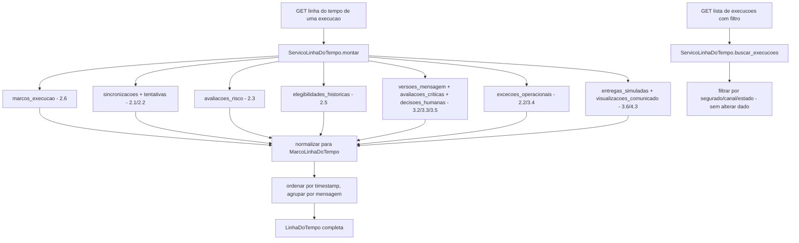

# História 4.4: Consultar a linha do tempo ponta a ponta — Design

**Spec**: `.specs/features/4-4-consultar-a-linha-do-tempo-ponta-a-ponta/spec.md`
**Status**: Approved

---

## Research (Knowledge Verification Chain)

**Codebase**: todas as fontes de marco já existem, cada uma já com timestamp e correlação por `execucao_id`/`mensagem_id`: `marcos_execucao` (2.6), `sincronizacoes_meteorologicas`+`tentativas_coleta_meteorologica` (2.1/2.2), `avaliacoes_risco` (2.3), `elegibilidades_historicas` (2.5), `versoes_mensagem`+`avaliacoes_criticas`+`decisoes_humanas` (3.2/3.3/3.5), `excecoes_operacionais` (2.2/3.4), `entregas_simuladas`+`visualizacoes_comunicado` (3.6/4.3). `execucao_preventiva.execucao_origem_id` (3.1) já correlaciona execuções. Esta é a história com mais fontes a agregar de todo o projeto, mas nenhuma delas é nova — é inteiramente uma camada de leitura/junção sobre tudo que já existe.

**Project docs**: AD-10 (correlação sem conteúdo sensível) — a linha do tempo mostra ação/resultado/correlação, nunca o conteúdo completo de um prompt ou mensagem (isso já é o detalhe de 4.2, referenciado por link, não duplicado aqui).

---

## Approach

`ServicoLinhaDoTempo`: consulta agregadora que lê de todas as fontes acima por `execucao_id`, normaliza cada linha para um `MarcoLinhaDoTempo` comum (`timestamp`, `ator`, `acao`, `resultado`, `correlacao`, `tipo`), ordena por `timestamp`, e agrupa marcos de mensagem sob sua respectiva mensagem dentro da cronologia geral. Nenhuma tabela nova. Nenhuma alternativa de arquitetura considerada — decorre diretamente da assunção já registrada no `spec.md` (fonte única, sem duplicar dado já persistido).

---

## Code Reuse Analysis

### Existing Components to Leverage

| Component | Location | How to Use |
| --- | --- | --- |
| Todos os repositórios de 2.1–2.6, 3.1–3.6, 4.1–4.3 | `adaptadores/persistencia/*.py` | Cada um contribui sua fatia de marcos, sem nenhuma tabela nova |
| `execucao_preventiva.execucao_origem_id` (3.1) | `adaptadores/persistencia/repositorio_execucao_preventiva.py` | Navegação origem↔retentativa reusada sem alteração |
| Padrão de timestamp UTC + convenção de coluna (`README.md` de persistência) | — | Reusado para a localização consistente de horários |

### Integration Points

| System | Integration Method |
| --- | --- |
| DuckDB | Nenhuma migração — consultas somente leitura, agregando múltiplas tabelas existentes por `execucao_id` |

---

## Components

### `ServicoLinhaDoTempo` (caso de uso, somente leitura)

- **Purpose**: Agrega, normaliza e ordena todos os marcos de uma execução; busca execuções por filtro (segurado/canal/estado); resolve a cadeia origem↔retentativas.
- **Location**: `aplicacao/linha_do_tempo.py`
- **Interfaces**:
  - `def montar(self, execucao_id: UUID) -> LinhaDoTempo` — `LinhaDoTempo` contém a lista ordenada de `MarcoLinhaDoTempo` e a cadeia de correlação (`execucao_origem_id` e lista de retentativas conhecidas).
  - `def buscar_execucoes(self, segurado: str | None, canal: Canal | None, estado: str | None) -> list[ExecucaoResumo]` — filtros combináveis, todos opcionais; nenhum efeito colateral.
- **Dependencies**: todos os repositórios listados em Code Reuse Analysis.
- **Reuses**: nenhum I/O novo — só leitura.

---

## Data Models

Nenhuma migração nova. `MarcoLinhaDoTempo`/`LinhaDoTempo`/`ExecucaoResumo` são DTOs de agregação em memória.

---

## Error Handling Strategy

| Error Scenario | Handling | User Impact |
| --- | --- | --- |
| Execução `sem_risco`/`sem_elegiveis` | `montar` só inclui os marcos até o terminal determinístico correspondente; nenhuma fonte de geração/crítica/simulação é consultada além de checar sua ausência esperada | Linha do tempo termina no motivo, sem etapa inexistente |
| `execucao_id` inexistente | `montar` retorna `None` → roteador responde `404` | Interface mostra "execução não encontrada" |
| Filtro sem nenhum resultado | `buscar_execucoes` retorna lista vazia; interface explica com texto, não como erro | Nenhum resultado técnico confuso |
| Comunicado reaberto várias vezes | `visualizacoes_comunicado` (4.3) já garante uma única linha por `entrega_simulada_id`; `montar` simplesmente lê essa única linha | Um único marco de visualização, sempre |

---

## Risks & Concerns

| Concern | Location (file:line) | Impact | Mitigation |
| --- | --- | --- | --- |
| A junção de até 9 fontes distintas numa única consulta agregadora pode degradar performance para execuções com muitas mensagens/tentativas | `aplicacao/linha_do_tempo.py` (a criar) | Tempo de resposta perceptível numa execução com muitas mensagens/tentativas | Aceitável para o volume de demonstração da PoC (conjunto sintético pequeno); cada repositório já filtra por `execucao_id`/`mensagem_id` antes de agregar, evitando varredura de tabela inteira |

---

## Tech Decisions

| Decision | Choice | Rationale |
| --- | --- | --- |
| Onde a localização temporal (UTC → horário local de demonstração) acontece | No frontend, no momento da renderização — o backend sempre devolve o timestamp UTC canônico sem conversão | Mantém o backend livre de fuso horário de exibição (preocupação de interface, não de domínio); o valor canônico UTC continua disponível para auditoria técnica, cumprindo o AC literalmente |
| Filtros do MVP | Aplicados na consulta `buscar_execucoes` (lista de execuções), não dentro de uma linha do tempo já aberta | A spec já delimita isso explicitamente nas Assumptions — a pesquisa é sobre "qual execução abrir", não sobre "filtrar marcos dentro dela" |
| Agrupamento de marcos por mensagem dentro da cronologia geral | Cada `MarcoLinhaDoTempo` carrega um `mensagem_id` opcional; o frontend agrupa visualmente por mensagem mantendo a ordem cronológica geral entre grupos | Cumpre "agrupar por mensagem... sem intercalar de forma confusa" sem exigir uma segunda estrutura de dados no backend — o agrupamento é uma projeção de apresentação sobre a lista já ordenada |

---

## Approval

Aprovado por extensão da mesma sessão — camada de agregação de leitura pura sobre todo o schema já existente dos Épicos 2/3/4, sem tabela nova nem componente estrutural de alto risco.
