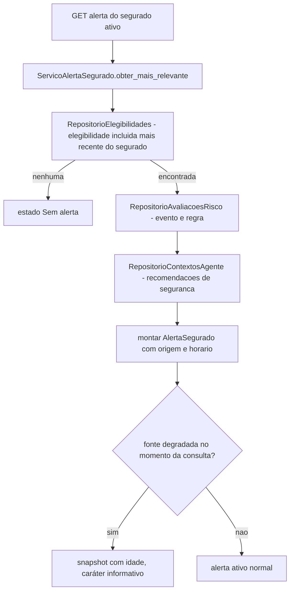

# História 5.1: Compreender o alerta mais relevante na visão geral — Design

**Spec**: `.specs/features/5-1-compreender-o-alerta-mais-relevante-na-visao-geral/spec.md`
**Status**: Approved

---

## Research (Knowledge Verification Chain)

**Codebase**: `VisaoGeralSegurado.tsx` (Épico 1) é hoje inteiramente estático — nenhuma chamada de API. `consultar_segurado_padrao`/`SEGURADO_PADRAO` (Épico 1) já resolve a identidade do segurado ativo. `elegibilidades_historicas`/`RepositorioElegibilidades` (2.5), `eventos_meteorologicos`/`sincronizacoes_meteorologicas` (2.1/2.2), `ContextoAgente`/`RepositorioContextosAgente` (3.1) já têm todo o dado que esta história precisa exibir — nenhuma tabela nova.

**Project docs**: AD-9 já proíbe dado fixo mascarando processamento real — esta história é a primeira a corrigir essa violação já existente no scaffold do Épico 1. AD-8 já define os estados de fonte degradada/indisponível que a Visão geral deve refletir (mesmo vocabulário de 2.2, do lado do segurado).

---

## Approach

`ServicoAlertaSegurado`: consulta somente leitura que resolve, para o segurado ativo, a elegibilidade mais recente ainda relevante (não expirada por tempo, ver Tech Decisions) e monta o alerta a partir do evento/elegibilidade/contexto já persistidos. Nenhuma tabela nova, nenhuma alternativa de arquitetura considerada — é a mesma camada de agregação de leitura já usada em 4.1/4.2/4.4, aplicada do lado do segurado.

---

## Code Reuse Analysis

### Existing Components to Leverage

| Component | Location | How to Use |
| --- | --- | --- |
| `consultar_segurado_padrao` | `aplicacao/contexto.py` (Épico 1) | Identidade do segurado ativo |
| `RepositorioElegibilidades.listar_por_execucao`/consulta por segurado | `adaptadores/persistencia/repositorio_elegibilidade.py` (2.5, estendido nesta história com consulta por `segurado_id`) | Fonte da elegibilidade mais recente do segurado |
| `RepositorioAvaliacoesRisco` | `adaptadores/persistencia/repositorio_avaliacoes_risco.py` (2.3) | Evento, severidade, período, regra |
| `RepositorioContextosAgente` | `adaptadores/persistencia/repositorio_contextos_agente.py` (3.1) | Orientações de segurança já minimizadas (reusadas como "recomendações preventivas", sem gerar texto novo) |
| Estados de fonte (`Operacional`…`Degradada`) | `RepositorioSincronizacoes` (2.1/2.2) | Reusados para o caráter "apenas informativo" do snapshot degradado |

### Integration Points

| System | Integration Method |
| --- | --- |
| DuckDB | Nenhuma migração — consultas somente leitura sobre schema já existente |

---

## Components

### Extensão de `RepositorioElegibilidades` — consulta por segurado

- **Purpose**: Encontra a elegibilidade `incluido` mais recente do segurado ativo.
- **Location**: `adaptadores/persistencia/repositorio_elegibilidade.py` (extensão de 2.5)
- **Interfaces**: `def obter_mais_recente_por_segurado(self, segurado_id: UUID) -> ResultadoElegibilidade | None`
- **Dependencies**: `abrir_conexao`.
- **Reuses**: mesma tabela `elegibilidades_historicas`.

### `ServicoAlertaSegurado` (caso de uso, somente leitura)

- **Purpose**: Monta o `AlertaSegurado` (tipo, severidade, período, localização, impactos, recomendações, origem, horário) a partir da elegibilidade mais recente do segurado ativo.
- **Location**: `aplicacao/alerta_segurado.py`
- **Interfaces**: `def obter_mais_relevante(self, segurado_id: UUID) -> AlertaSegurado | None`
- **Dependencies**: `RepositorioElegibilidades` (extensão acima), `RepositorioAvaliacoesRisco` (2.3), `RepositorioContextosAgente` (3.1), `RepositorioSincronizacoes` (2.1/2.2, para o estado de fonte).
- **Reuses**: nenhum I/O novo.

---

## Data Models

Nenhuma migração nova. `AlertaSegurado` é um DTO de agregação em memória.

---

## Error Handling Strategy

| Error Scenario | Handling | User Impact |
| --- | --- | --- |
| Nenhuma elegibilidade `incluido` para o segurado ativo | `obter_mais_relevante` retorna `None` | Frontend mostra estado vazio explicativo, com navegação para as demais superfícies preservada |
| Fonte meteorológica degradada no momento da consulta | `AlertaSegurado.estado_fonte` reflete `Degradada`, com `idade_snapshot` calculada | Frontend mostra o snapshot como só informativo, sem sugerir alerta novo |
| Falha de consulta (erro técnico) | Erro propagado como `application/problem+json` | Frontend mostra `Erro` com impacto/próxima ação, preservando o último contexto válido em memória (não uma nova consulta apagando o que já era exibido) |

---

## Risks & Concerns

> None found — camada de agregação de leitura pura sobre schema já existente, análoga a 4.1/4.2, corrigindo um mockup estático já sinalizado como dívida (AD-9).

---

## Tech Decisions

| Decision | Choice | Rationale |
| --- | --- | --- |
| Fonte de "recomendações preventivas" | Reusa as orientações de segurança do `ContextoAgente` (3.1), não um texto gerado à parte | Já registrado como assunção confirmada no `spec.md`; evita segunda fonte de recomendação divergente do que a mensagem gerada realmente contém |
| Critério de "mais relevante" entre múltiplos eventos | A elegibilidade `incluido` com o `criado_em` mais recente entre as que ainda não têm execução em estado terminal de simulação concluída há mais de N dias (mesmo critério de "ativo" usado por 5.2) | Critério objetivo e único, sem ambiguidade; alinhado ao mesmo corte que a História 5.2 vai usar para "ativos vs. anteriores" |
| Preservação do "último contexto válido" em erro | Responsabilidade do frontend (estado local React), não do backend — o backend sempre responde o estado real da consulta atual | O AC fala de comportamento de interface ("não apagar"), que é uma decisão de estado de UI, não de persistência |

---

## Approval

Aprovado por extensão da mesma sessão — camada de agregação de leitura sobre schema já existente de 2.1–3.1, corrigindo diretamente a violação de dado fixo já sinalizada no scaffold do Épico 1.
