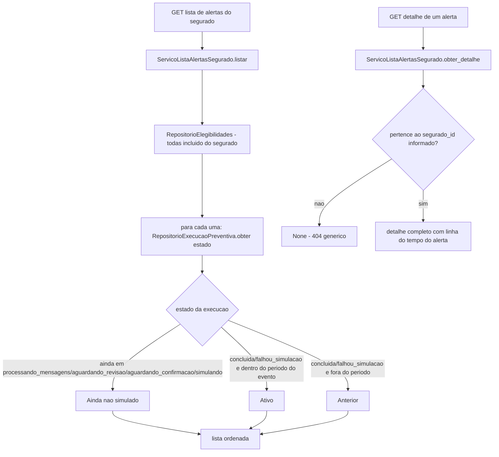

# História 5.2: Consultar alertas ativos e anteriores — Design

**Spec**: `.specs/features/5-2-consultar-alertas-ativos-e-anteriores/spec.md`
**Status**: Approved

---

## Research (Knowledge Verification Chain)

**Codebase**: `ServicoAlertaSegurado` (5.1) já resolve o alerta mais relevante — esta história generaliza para a lista completa, reusando o mesmo DTO `AlertaSegurado` e as mesmas fontes (`RepositorioElegibilidades`, `RepositorioAvaliacoesRisco`, `RepositorioContextosAgente`, 2.3/2.5/3.1). `RepositorioExecucaoPreventiva` (2.2) já expõe `EstadoExecucao`, usado para decidir "ativo"/"anterior"/"ainda não simulado".

**Project docs**: nenhum ADR novo necessário — mesma camada de leitura.

---

## Approach

`ServicoListaAlertasSegurado`: estende a mesma consulta de 5.1 para retornar todas as elegibilidades `incluido` do segurado (não só a mais recente), classificando cada uma em ativo/anterior/ainda-não-simulado pelo estado da execução associada. O detalhe de um alerta específico reusa o mesmo padrão de não-enumeração de 4.2/4.3 (mensagem idêntica para inexistente e para "de outro segurado"). Nenhuma alternativa de arquitetura considerada — extensão direta de 5.1.

---

## Code Reuse Analysis

### Existing Components to Leverage

| Component | Location | How to Use |
| --- | --- | --- |
| `AlertaSegurado` (DTO) | `aplicacao/alerta_segurado.py` (5.1) | Reusado como o item da lista, sem redefinir a forma do dado |
| `RepositorioElegibilidades` | `adaptadores/persistencia/repositorio_elegibilidade.py` (2.5, estendido nesta história com `listar_todas_por_segurado`) | Fonte de todas as elegibilidades do segurado, não só a mais recente |
| `RepositorioExecucaoPreventiva` | `adaptadores/persistencia/repositorio_execucao_preventiva.py` (2.2) | Estado da execução para classificar ativo/anterior/ainda-não-simulado |
| Padrão de não-enumeração | mesmo padrão de 4.2/4.3 | Reusado para o detalhe de alerta inexistente/de outro segurado |
| `ServicoLinhaDoTempo` | `aplicacao/linha_do_tempo.py` (4.4) | Reusado (com filtro reduzido a marcos relevantes ao segurado) para a "linha do tempo" do detalhe do alerta |

### Integration Points

| System | Integration Method |
| --- | --- |
| DuckDB | Nenhuma migração — consultas somente leitura |

---

## Components

### Extensão de `RepositorioElegibilidades` — `listar_todas_por_segurado`

- **Purpose**: Lista todas as elegibilidades `incluido` de um segurado, não só a mais recente.
- **Location**: `adaptadores/persistencia/repositorio_elegibilidade.py` (extensão de 2.5/5.1)
- **Interfaces**: `def listar_todas_por_segurado(self, segurado_id: UUID) -> list[ResultadoElegibilidade]`
- **Dependencies**: `abrir_conexao`.
- **Reuses**: mesma tabela `elegibilidades_historicas`.

### `ServicoListaAlertasSegurado` (caso de uso, somente leitura)

- **Purpose**: Lista e classifica todos os alertas do segurado; obtém o detalhe de um alerta específico com verificação de pertencimento.
- **Location**: `aplicacao/lista_alertas_segurado.py`
- **Interfaces**:
  - `def listar(self, segurado_id: UUID) -> list[AlertaSegurado]`
  - `def obter_detalhe(self, segurado_id: UUID, elegibilidade_id: UUID) -> DetalheAlertaSegurado | None`
- **Dependencies**: `RepositorioElegibilidades` (extensão acima), `RepositorioExecucaoPreventiva` (2.2), `ServicoLinhaDoTempo` (4.4).
- **Reuses**: `AlertaSegurado` (5.1), sem redefinir sua forma.

---

## Data Models

Nenhuma migração nova.

---

## Error Handling Strategy

| Error Scenario | Handling | User Impact |
| --- | --- | --- |
| `elegibilidade_id` inexistente ou de outro segurado | `obter_detalhe` retorna `None` → `404` genérico | `Não encontrado`, com retorno à lista |
| Nenhum alerta para o segurado | `listar` retorna lista vazia | Estado vazio explicativo, navegação preservada |
| Evento relevante ainda em processamento (não terminal de simulação) | Classificado como "Ainda não simulado" no detalhe | Nenhum comunicado/visualização exibido antecipadamente |

---

## Risks & Concerns

> None found — extensão direta de 5.1, mesma camada de leitura, sem componente estrutural novo.

---

## Tech Decisions

| Decision | Choice | Rationale |
| --- | --- | --- |
| Componente de mapa | **Correção pós-implementação (Verifier, 5.2)**: não existe nenhum componente de mapa em 2.1 nem em nenhum outro lugar do projeto — a suposição original desta linha estava incorreta. A superfície de Fonte meteorológica (2.1) só tem uma tabela acessível. A equivalência mapa↔lista de ALERTAS-04 é satisfeita por construção: a lista/tabela é a única representação que existe, então não há seleção de mapa para tornar equivalente | Nenhum componente de mapa novo, porque nenhum existe para reusar |
| Ordenação da lista | `criado_em` da elegibilidade, decrescente (mais recente primeiro), determinística em caso de empate por `id` decrescente | Garante ordem estável entre carregamentos, evitando posição instável |
| Classificação `ainda_nao_simulado` | Qualquer estado de execução fora de `{concluida, falhou_simulacao}` — não só os 4 estados do diagrama do Approach (`processando_mensagens`/`aguardando_revisao`/`aguardando_confirmacao`/`simulando`) | **Correção pós-implementação (Verifier, 5.2)**: o diagrama original enumerava só 4 estados; a implementação generaliza para "qualquer estado sem desfecho de simulação definido", cobrindo também um terminal técnico anterior à simulação (ex.: `falhou_preparacao_ia`) — nenhum desses tem `ativo`/`anterior` como classificação correta, e a spec não define uma quarta categoria para eles |

---

## Approval

Aprovado por extensão da mesma sessão — extensão direta de 5.1, sem componente estrutural novo.
