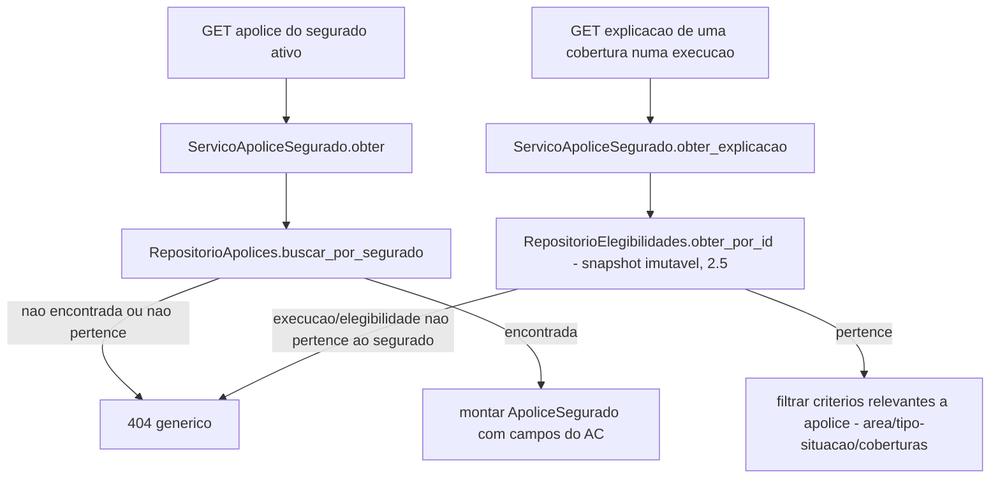

# História 5.3: Consultar a apólice sintética e seu uso preventivo — Design

**Spec**: `.specs/features/5-3-consultar-a-apolice-sintetica-e-seu-uso-preventivo/spec.md`
**Status**: Approved

---

## Research (Knowledge Verification Chain)

**Codebase**: a tabela `apolices` já existe no schema do Épico 1 (`numero`, `tipo`, `situacao`, `vigencia_inicio/fim`, `coberturas`, `endereco_risco_sintetico`, `codigo_ibge_area`, `segurado_id`), mas **nenhum repositório de leitura de `apolices` existe ainda** — só `repositorio_segurados.py`. Esta é a primeira história a ler `apolices` em código de produção. `elegibilidades_historicas.criterios` (2.5) já é o snapshot imutável de "como cada critério foi comparado" — reusado como fonte da explicação, sem recalcular.

**Project docs**: AD-11 já garante que `elegibilidades_historicas` preserva snapshot imutável — esta história só o lê do lado do segurado, sem novo mecanismo de imutabilidade.

---

## Approach

`RepositorioApolices` (novo, primeira leitura de `apolices`) + `ServicoApoliceSegurado`: consulta que junta a apólice ativa do segurado com a explicação de critérios já persistida (2.5), quando existir uma execução histórica relacionada. Nenhuma alternativa de arquitetura considerada — mesma camada de leitura das histórias anteriores do Épico 5.

---

## Code Reuse Analysis

### Existing Components to Leverage

| Component | Location | How to Use |
| --- | --- | --- |
| Tabela `apolices` (schema Épico 1) | — | Lida pela primeira vez em código de produção nesta história |
| `elegibilidades_historicas.criterios` (2.5) | `adaptadores/persistencia/repositorio_elegibilidade.py` | Fonte imutável da explicação de critérios, sem recálculo |
| `consultar_segurado_padrao` | `aplicacao/contexto.py` (Épico 1) | Identidade do segurado ativo |
| Padrão de não-enumeração | 4.2/4.3/5.2 | Reusado para apólice de outro segurado |

### Integration Points

| System | Integration Method |
| --- | --- |
| DuckDB | Nenhuma migração — `apolices` já existe; consultas somente leitura |

---

## Components

### `RepositorioApolices`

- **Purpose**: Primeira leitura de produção da tabela `apolices`.
- **Location**: `adaptadores/persistencia/repositorio_apolices.py`
- **Interfaces**:
  - `def buscar_por_segurado(self, segurado_id: UUID) -> Apolice | None`
  - `def buscar_por_id(self, apolice_id: UUID) -> Apolice | None`
- **Dependencies**: `abrir_conexao`.
- **Reuses**: padrão de repositório de `repositorio_segurados.py`.

### `ServicoApoliceSegurado` (caso de uso, somente leitura)

- **Purpose**: Monta `ApoliceSegurado` (dados cadastrais + estado objetivo) e a explicação de critérios de uma execução específica, ambos com verificação de pertencimento ao segurado.
- **Location**: `aplicacao/apolice_segurado.py`
- **Interfaces**:
  - `def obter(self, segurado_id: UUID) -> ApoliceSegurado | None`
  - `def obter_explicacao(self, segurado_id: UUID, elegibilidade_id: UUID) -> ExplicacaoApolice | None`
- **Dependencies**: `RepositorioApolices`, `RepositorioElegibilidades` (2.5).
- **Reuses**: `elegibilidades_historicas.criterios` sem recálculo.

---

## Data Models

Nenhuma migração nova — `apolices` já existe integralmente no schema do Épico 1.

---

## Error Handling Strategy

| Error Scenario | Handling | User Impact |
| --- | --- | --- |
| Apólice de outro segurado ou inexistente | `obter`/`obter_explicacao` retornam `None` → `404` genérico | `Não encontrada`, sem revelar outro registro |
| Apólice `cancelada`/`suspensa` ou sem cobertura relacionada ao evento | `ApoliceSegurado.estado_objetivo` descreve a condição textualmente | Interface explica objetivamente, sem indicador de erro |
| Explicação de execução histórica com apólice já alterada no cadastro atual | `obter_explicacao` usa exclusivamente `elegibilidades_historicas.criterios` (snapshot), nunca `RepositorioApolices` atual | Explicação sempre reflete o momento da execução, não o presente |

---

## Risks & Concerns

> None found — primeira leitura de uma tabela já existente e estável do Épico 1, mesma camada de agregação já validada em 4.1–5.2.

---

## Tech Decisions

| Decision | Choice | Rationale |
| --- | --- | --- |
| Fonte da explicação de critério | Exclusivamente `elegibilidades_historicas.criterios` (2.5), filtrado às categorias de área/tipo-situação/coberturas | Já registrado como assunção confirmada; evita duplicar lógica de comparação de critério |
| Estado objetivo da apólice | Texto derivado diretamente de `apolices.situacao` + comparação de `vigencia_fim` com a data atual — nunca tratado como exceção/erro no backend | Cumpre "não deverá transformar a condição em falha técnica"; é um valor de domínio normal, não uma falha |

---

## Approval

Aprovado por extensão da mesma sessão — primeira leitura de uma tabela já existente e estável, mesma camada de agregação das histórias anteriores do Épico 5.
