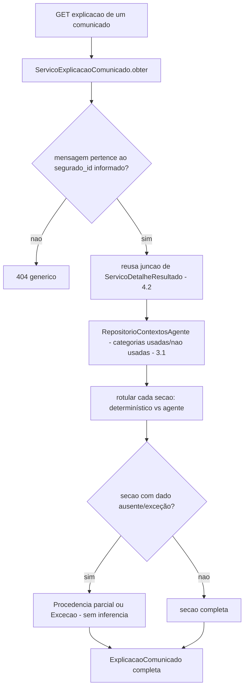

# História 5.4: Entender como a mensagem foi criada — Design

**Spec**: `.specs/features/5-4-entender-como-a-mensagem-foi-criada/spec.md`
**Status**: Approved

---

## Research (Knowledge Verification Chain)

**Codebase**: `ServicoDetalheResultado` (4.2) já junta mensagem+versões+avaliações críticas+decisões humanas+entrega simulada+elegibilidade+evento+regra por `mensagem_id`, com verificação de pertencimento (hoje a `execucao_id`, do lado de Marina). Esta história reusa a mesma junção, trocando a verificação de pertencimento para `segurado_id` (do lado de Carlos) e adicionando uma camada de tradução para linguagem acessível + rótulo determinístico/IA. `RepositorioContextosAgente` (3.1) já expõe `categorias_usadas`/`categorias_nao_usadas`.

**Project docs**: AD-5/AD-9 já são o contrato desta história — nunca descrever a IA como responsável por risco/elegibilidade/cobertura, e nunca expor dado além do minimizado.

---

## Approach

`ServicoExplicacaoComunicado`: reusa a junção de dados de `ServicoDetalheResultado` (4.2) via um novo método de pertencimento por segurado, e adiciona uma camada de rotulagem (`OrigemInformacao.DETERMINISTICA`/`OrigemInformacao.AGENTE`) e de detecção de lacuna (`Procedência parcial`/`Exceção`) por seção. Nenhuma alternativa de arquitetura considerada — extensão direta e reuso de 4.2/3.1/3.4.

---

## Code Reuse Analysis

### Existing Components to Leverage

| Component | Location | How to Use |
| --- | --- | --- |
| `ServicoDetalheResultado` (junção) | `aplicacao/detalhe_resultado.py` (4.2) | Reusado internamente — mesma junção de dados, verificação de pertencimento trocada para `segurado_id` |
| `RepositorioContextosAgente` | `adaptadores/persistencia/repositorio_contextos_agente.py` (3.1) | Fonte das categorias usadas/não usadas |
| `RepositorioAvaliacoesCriticas`/`RepositorioDecisoesHumanas` | 3.3/3.5 | Fonte de tentativas, decisão crítica e aprovação humana |
| Padrão de não-enumeração | 4.2/4.3/5.2/5.3 | Reusado para comunicado de outro segurado |

### Integration Points

| System | Integration Method |
| --- | --- |
| DuckDB | Nenhuma migração — reusa integralmente o schema já existente |

---

## Components

### `ServicoExplicacaoComunicado` (caso de uso, somente leitura)

- **Purpose**: Monta `ExplicacaoComunicado` traduzindo os dados já agregados por 4.2 em seções rotuladas (determinístico/IA), com detecção de lacuna, verificado por pertencimento ao segurado.
- **Location**: `aplicacao/explicacao_comunicado.py`
- **Interfaces**:
  - `def obter(self, segurado_id: UUID, entrega_simulada_id: UUID) -> ExplicacaoComunicado | None`
- **Dependencies**: mesma junção interna de `ServicoDetalheResultado` (4.2, reusada por composição, não duplicada), `RepositorioContextosAgente` (3.1).
- **Reuses**: toda a lógica de junção de 4.2 — esta história não reimplementa nenhuma consulta já existente.

---

## Data Models

Nenhuma migração nova. `ExplicacaoComunicado` é um DTO de tradução em memória sobre o `DetalheResultado` (4.2) já existente.

---

## Error Handling Strategy

| Error Scenario | Handling | User Impact |
| --- | --- | --- |
| Comunicado de outro segurado ou inexistente | `obter` retorna `None` → `404` genérico | `Não encontrado` |
| Avaliação crítica de uma tentativa intermediária ausente (dado incompleto) | Seção correspondente marcada `Procedência parcial`, nunca preenchida com inferência | Carlos vê exatamente o que está e não está disponível |
| Mensagem em exceção (`falhou_conteudo`/`falhou_integracao_ia`) | Seção agêntica mostra `Exceção` com a causa sanitizada, sem seção de crítica vazia parecendo incompleta por engano | Explicação honesta sobre o que de fato aconteceu |
| Prévia da mensagem final | Copiada diretamente de `entregas_simuladas.apresentacao` (3.6/4.1), nunca de `versoes_mensagem` diretamente, para garantir identidade com o que foi de fato simulado | Prévia sempre correspondente ao conteúdo realmente simulado |

---

## Risks & Concerns

> None found — reuso por composição da junção já existente de 4.2, sem consulta nova ao banco além das já validadas em 3.1/3.3/3.5.

---

## Tech Decisions

| Decision | Choice | Rationale |
| --- | --- | --- |
| Reuso de `ServicoDetalheResultado` | Composição direta (o novo serviço injeta/chama a lógica de junção de 4.2), não duplicação de query | Já registrado como assunção confirmada — a única diferença real é a audiência e a verificação de pertencimento |
| Rotulagem determinístico vs. agente | Enum `OrigemInformacao` (`DETERMINISTICA`, `AGENTE`) anexado a cada seção do DTO de resposta, decidido estaticamente por qual história produziu o dado (evento/regra = 2.1–2.4; geração/crítica = 3.2/3.3) | Torna a separação visual do frontend trivial — não depende de heurística, é uma classificação fixa por origem do dado |

---

## Approval

Aprovado por extensão da mesma sessão — reuso por composição de 4.2, sem consulta nova ao banco além das já validadas nos Épicos 3/4.
