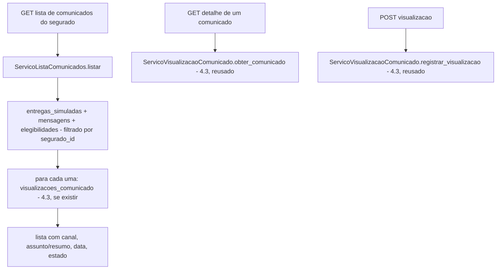

# História 5.5: Consultar o histórico de comunicados — Design

**Spec**: `.specs/features/5-5-consultar-o-historico-de-comunicados/spec.md`
**Status**: Approved

---

## Research (Knowledge Verification Chain)

**Codebase**: `entregas_simuladas` (3.6), `visualizacoes_comunicado` (4.3), `mensagens`/`elegibilidades_historicas` (3.2/2.5, para chegar ao `segurado_id`) já têm todo o dado necessário. `ServicoVisualizacaoComunicado` (4.3) já implementa o registro idempotente da primeira visualização — reusado sem alteração pelo detalhe desta história.

**Project docs**: nenhum ADR novo — mesma camada de leitura + reuso do mecanismo de idempotência de 4.3.

---

## Approach

`ServicoListaComunicados`: consulta que lista `entregas_simuladas` do segurado ativo (via `mensagens`→`elegibilidades_historicas`), com o estado atual (incluindo `visualizacoes_comunicado`, se existir). O detalhe reusa diretamente `ServicoVisualizacaoComunicado.obter_comunicado`/`registrar_visualizacao` (4.3), sem duplicar a lógica de idempotência. Nenhuma alternativa de arquitetura considerada.

---

## Code Reuse Analysis

### Existing Components to Leverage

| Component | Location | How to Use |
| --- | --- | --- |
| `ServicoVisualizacaoComunicado` | `aplicacao/visualizacao_comunicado.py` (4.3) | Reusado integralmente para o detalhe e o registro de visualização — nenhuma duplicação |
| `RepositorioEntregasSimuladas` | `adaptadores/persistencia/repositorio_entregas_simuladas.py` (3.6, estendido nesta história com `listar_por_segurado`) | Fonte da lista |
| `RepositorioVisualizacoesComunicado` | `adaptadores/persistencia/repositorio_visualizacoes_comunicado.py` (4.3) | Estado de visualização de cada item da lista |
| `ServicoLinhaDoTempo` | `aplicacao/linha_do_tempo.py` (4.4) | Reusado para a "linha do tempo correspondente" do detalhe |

### Integration Points

| System | Integration Method |
| --- | --- |
| DuckDB | Nenhuma migração — consultas somente leitura |

---

## Components

### Extensão de `RepositorioEntregasSimuladas` — `listar_por_segurado`

- **Purpose**: Lista entregas simuladas de um segurado, com assunto/resumo derivado.
- **Location**: `adaptadores/persistencia/repositorio_entregas_simuladas.py` (extensão de 3.6)
- **Interfaces**: `def listar_por_segurado(self, segurado_id: UUID) -> list[EntregaSimulada]`
- **Dependencies**: `abrir_conexao`.
- **Reuses**: mesma tabela `entregas_simuladas`, junção com `mensagens`/`elegibilidades_historicas`.

### `ServicoListaComunicados` (caso de uso, somente leitura)

- **Purpose**: Monta a lista de comunicados do segurado com canal, assunto/resumo, data, estado.
- **Location**: `aplicacao/lista_comunicados.py`
- **Interfaces**: `def listar(self, segurado_id: UUID) -> list[ComunicadoResumo]`
- **Dependencies**: `RepositorioEntregasSimuladas` (extensão acima), `RepositorioVisualizacoesComunicado` (4.3).
- **Reuses**: nenhum I/O novo além dos repositórios acima.

---

## Data Models

Nenhuma migração nova.

---

## Error Handling Strategy

| Error Scenario | Handling | User Impact |
| --- | --- | --- |
| Nenhum comunicado para o segurado | `listar` retorna lista vazia | Estado vazio explicativo, navegação preservada |
| Falha de consulta | Erro propagado como `application/problem+json` | Erro visível com impacto/próxima ação, sem conteúdo fixo |
| Reabertura de comunicado já visualizado | `ServicoVisualizacaoComunicado.registrar_visualizacao` (4.3) já é idempotente — nenhuma mudança de comportamento necessária aqui | Estado/data inalterados |

---

## Risks & Concerns

> None found — reuso direto de 4.3 para detalhe/visualização, camada de leitura pura para a lista, análoga a 4.1/5.1/5.2.

---

## Tech Decisions

| Decision | Choice | Rationale |
| --- | --- | --- |
| Assunto/resumo por canal | `email`: usa `assunto` real da apresentação simulada; `whatsapp`/`sms`: resumo truncado das primeiras ~60 caracteres Unicode do `corpo`, com reticências se truncado | Já registrado como assunção revisável; evita inventar um campo de assunto para canais que não têm um, sem esconder conteúdo do resumo |
| Consulta de segurado | Junção `entregas_simuladas`→`mensagens`→`elegibilidades_historicas.segurado_id`, mesmo caminho que 4.3 já percorre para validar pertencimento | Reusa exatamente o mesmo caminho de dados já validado, sem introduzir uma segunda forma de resolver "de quem é este comunicado" |

---

## Approval

Aprovado por extensão da mesma sessão — reuso direto do mecanismo de visualização de 4.3, camada de leitura pura para a lista.
