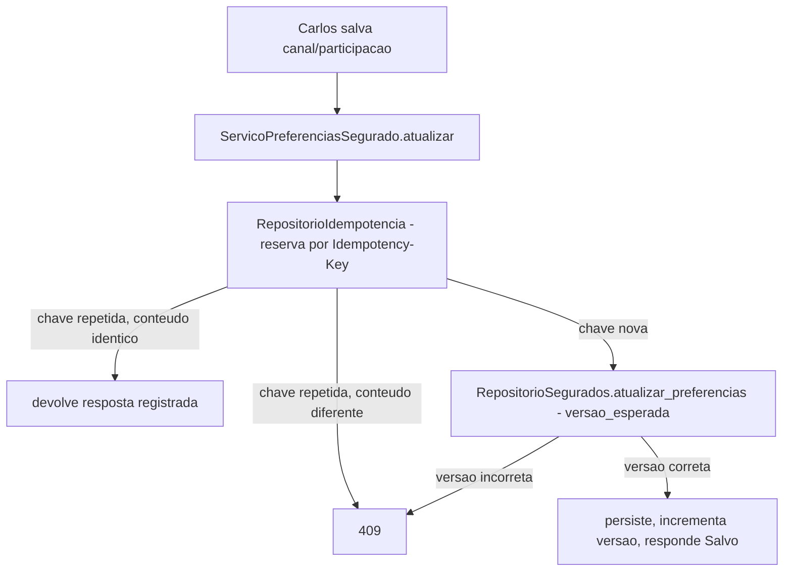

# História 5.6: Atualizar preferências para alertas futuros — Design

**Spec**: `.specs/features/5-6-atualizar-preferencias-para-alertas-futuros/spec.md`
**Status**: Approved

---

## Research (Knowledge Verification Chain)

**Codebase**: `segurados` (schema Épico 1) tem `canal_preferido`/`participa_de_alertas`, mas **nenhuma coluna de versão** — nenhuma história anterior escreveu nessa tabela (só leitura, via `RepositorioSegurados`/2.5). Esta é a primeira escrita em `segurados`. `elegibilidades_historicas.canal` (2.5) já é o snapshot congelado do canal no momento da elegibilidade — garante por si só que uma mudança futura de `segurados.canal_preferido` nunca afeta histórico, sem trabalho adicional nesta história.

**Project docs**: mesmo padrão de concorrência otimista (`versao_esperada`) e idempotência (AD-002) já usado em `RepositorioExecucaoPreventiva` (2.2), `RepositorioMensagens` (3.2), `RepositorioRegras` (2.4) — quarta aplicação do mesmo padrão, sem decisão nova.

---

## Approach

`RepositorioSegurados` (existente, Épico 1) estendido com escrita versionada; `ServicoPreferenciasSegurado` orquestra validação + mutação idempotente. Nenhuma alternativa de arquitetura considerada — é a mesma receita de concorrência otimista + idempotência já usada quatro vezes no projeto.

---

## Code Reuse Analysis

### Existing Components to Leverage

| Component | Location | How to Use |
| --- | --- | --- |
| `RepositorioSegurados` | `adaptadores/persistencia/repositorio_segurados.py` (Épico 1) | Estendido com escrita versionada — leitura já existente não muda |
| AD-002 (`Idempotency-Key`) | `chaves_idempotencia` | Reusado sem alteração |
| Padrão de concorrência otimista | `RepositorioExecucaoPreventiva.transicionar` (2.2) | Mesmo padrão aplicado a `segurados` |
| `elegibilidades_historicas.canal` | 2.5 | Já garante, por si só, que histórico nunca é afetado — nenhum trabalho extra necessário |

### Integration Points

| System | Integration Method |
| --- | --- |
| DuckDB | Migração `0014` adiciona `versao INTEGER NOT NULL DEFAULT 1` a `segurados` |

---

## Components

### Extensão de `RepositorioSegurados` — escrita versionada

- **Purpose**: Atualiza `canal_preferido`/`participa_de_alertas` com concorrência otimista.
- **Location**: `adaptadores/persistencia/repositorio_segurados.py` (extensão de Épico 1)
- **Interfaces**: `def atualizar_preferencias(self, segurado_id: UUID, versao_esperada: int, canal_preferido: Canal, participa_de_alertas: bool) -> Segurado` — levanta `ConflitoVersao` se `versao_esperada` não bater.
- **Dependencies**: `abrir_conexao`.
- **Reuses**: mesmo padrão de `RepositorioExecucaoPreventiva.transicionar` (2.2).

### `ServicoPreferenciasSegurado` (caso de uso)

- **Purpose**: Valida entrada, aplica idempotência, chama a escrita versionada.
- **Location**: `aplicacao/preferencias_segurado.py`
- **Interfaces**: `def atualizar(self, segurado_id: UUID, versao_esperada: int, canal_preferido: Canal, participa_de_alertas: bool, chave_idempotencia: str) -> Segurado`
- **Dependencies**: `RepositorioSegurados` (extensão acima), `RepositorioIdempotencia`.
- **Reuses**: mesmo padrão de idempotência de `ServicoGestaoRegras.ativar` (2.4).

---

## Data Models

### Migração `0014_versao_segurados.sql`

| Coluna adicionada a `segurados` | Tipo | Restrições |
| --- | --- | --- |
| `versao` | `INTEGER` | `NOT NULL`, padrão `1` |

---

## Error Handling Strategy

| Error Scenario | Handling | User Impact |
| --- | --- | --- |
| `versao_esperada` desatualizada | `ConflitoVersao` → `409` | Valores editados preservados no frontend, erro explicado |
| `Idempotency-Key` repetida, conteúdo idêntico | Devolve resposta registrada, sem nova versão | `Salvo` exibido normalmente, sem duplicar mutação |
| `Idempotency-Key` repetida, conteúdo diferente | `409` | Erro explicado, nenhuma mutação aplicada |
| Canal para o mesmo valor já vigente | Tratado como mutação válida normal (não é erro) | `Salvo`, versão incrementada normalmente |

---

## Risks & Concerns

> None found — quarta aplicação do mesmo padrão de concorrência otimista + idempotência já validado em 2.2/2.4/3.2; snapshot histórico já protegido por `elegibilidades_historicas.canal` (2.5), sem trabalho adicional.

---

## Tech Decisions

| Decision | Choice | Rationale |
| --- | --- | --- |
| Coluna de versão em `segurados` | `versao INTEGER NOT NULL DEFAULT 1`, mesma convenção de `regras.versao`/`execucao_preventiva.versao` | Consistência total com o padrão já usado em toda mutação versionada do projeto |
| Garantia de "efeito só futuro" | Nenhum mecanismo novo — decorre inteiramente do fato de `elegibilidades_historicas.canal` (2.5) já ser um snapshot imutável, nunca uma referência viva a `segurados` | Já resolvido pelo Épico 2; esta história não precisa proteger o histórico, só não quebrá-lo |

---

## Approval

Aprovado por extensão da mesma sessão — quarta aplicação do mesmo padrão de concorrência/idempotência já validado, sem decisão de produto nova.
