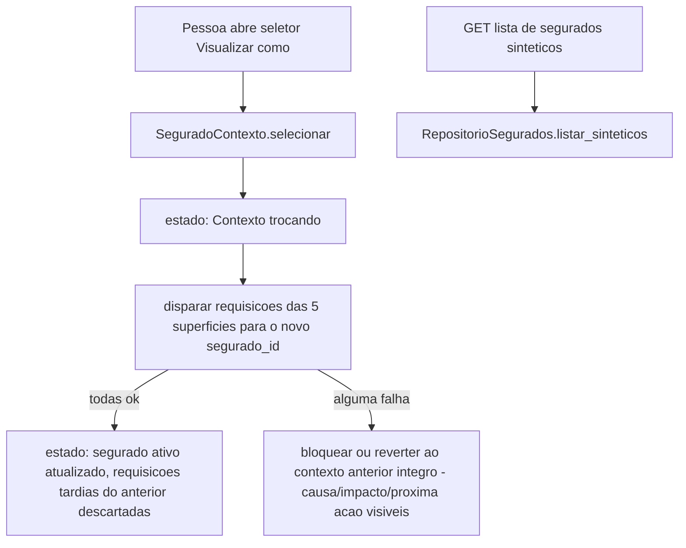

# História 5.7: Alternar o segurado sintético com contexto consistente — Design

**Spec**: `.specs/features/5-7-alternar-o-segurado-sintetico-com-contexto-consistente/spec.md`
**Status**: Approved

---

## Research (Knowledge Verification Chain)

**Codebase**: `PerfilContexto.tsx` (Épico 1, História 1.4) já implementa exatamente o padrão que esta história precisa, uma dimensão acima: `PerfilProvider`/`usePerfilContexto`, persistência em `localStorage` (`CHAVE_ARMAZENAMENTO_PERFIL`), `SUPERFICIES_POR_PERFIL` restringindo o que cada perfil pode acessar. `dominio/identificadores_demonstracao.py` já nomeia os segurados sintéticos do seed (`segurado/chuva-elegivel`, etc., via `identificador_demonstracao`). Todas as histórias 5.1–5.6 já parametrizam seus endpoints por `segurado_id` — esta história só precisa fornecer **qual** `segurado_id` usar, não alterar nenhum desses endpoints.

**Project docs**: ADR-0009 já proíbe qualquer autenticação real — o seletor é puramente uma preferência de demonstração local, mesmo espírito de `PerfilContexto`.

---

## Approach

`SeguradoContexto` (novo provider React, mesmo padrão de `PerfilContexto`): mantém `seguradoAtivoId`, estado de transição (`Contexto trocando`), e a lista de segurados sintéticos disponíveis (via um endpoint novo de leitura). Todas as cinco superfícies de 5.1–5.6 passam a ler `seguradoAtivoId` deste contexto em vez de um `SEGURADO_PADRAO` fixo — mudança pontual em cada componente já existente, não uma reescrita. Nenhuma alternativa de arquitetura considerada — é a extensão direta e simétrica do padrão já aprovado em 1.4.

---

## Code Reuse Analysis

### Existing Components to Leverage

| Component | Location | How to Use |
| --- | --- | --- |
| `PerfilContexto.tsx` (padrão) | `src/frontend/src/contexto/PerfilContexto.tsx` (1.4) | Mesmo padrão de provider+hook+`localStorage`, replicado para `SeguradoContexto` — não a mesma instância (dimensões diferentes: perfil vs. segurado) |
| `RepositorioSegurados` | `adaptadores/persistencia/repositorio_segurados.py` (Épico 1) | Estendido com `listar_sinteticos` (todos os segurados do seed, sem dado sensível) |
| Todos os endpoints de 5.1–5.6 | `adaptadores/http/*.py` | Já recebem `segurado_id` como parâmetro — nenhuma mudança de contrato necessária |
| `SUPERFICIES_POR_PERFIL` (1.4) | `PerfilContexto.tsx` | Já garante que o perfil Segurado nunca lista superfícies administrativas — reusado sem alteração para o AC de "ausência de ações administrativas" |

### Integration Points

| System | Integration Method |
| --- | --- |
| DuckDB | Nenhuma migração — `segurados` já existe |
| Frontend | Novo `SeguradoContexto`, consumido pelas 5 superfícies já existentes de 5.1–5.6 |

---

## Components

### Extensão de `RepositorioSegurados` — `listar_sinteticos`

- **Purpose**: Lista todos os segurados do conjunto sintético, para popular o seletor.
- **Location**: `adaptadores/persistencia/repositorio_segurados.py` (extensão de Épico 1)
- **Interfaces**: `def listar_sinteticos(self) -> list[Segurado]`
- **Dependencies**: `abrir_conexao`.
- **Reuses**: mesma tabela `segurados`.

### `SeguradoContexto` (provider React, novo)

- **Purpose**: Mantém `seguradoAtivoId`, lista de segurados disponíveis, estado de transição (`ocioso`/`trocando`/`erro`), persistido em `localStorage`.
- **Location**: `src/frontend/src/contexto/SeguradoContexto.tsx`
- **Interfaces**: `SeguradoProvider`, `useSeguradoContexto()` — mesma forma de `PerfilContexto`/`usePerfilContexto` (1.4).
- **Dependencies**: endpoint de `listar_sinteticos`.
- **Reuses**: padrão estrutural idêntico ao `PerfilContexto.tsx` (1.4) — mesmo autor de decisão, dimensão diferente.

### Extensão das superfícies de 5.1–5.6

- **Purpose**: Cada uma passa a consumir `seguradoAtivoId` de `useSeguradoContexto()` em vez de um valor fixo, e a cancelar/descartar requisições pendentes quando o segurado ativo mudar.
- **Location**: `VisaoGeralSegurado.tsx`, `SuperficieAlertas.tsx`, `SuperficieApolice.tsx`, `SuperficieComunicados.tsx`, `SuperficieMeusDados.tsx` (5.1–5.6, extensão pontual em cada)
- **Dependencies**: `SeguradoContexto`.
- **Reuses**: componentes já existentes — mudança de fonte do `segurado_id`, não reescrita.
- **Implementado como (T5, dobrado de volta do código)**: as cinco superfícies em si não foram alteradas — cada uma já expunha a prop opcional `seguradoId` construída em 5.1–5.6 exatamente como o seam desta história. Um novo componente, `PainelSegurado.tsx` (`src/frontend/src/funcionalidades/segurado/`), é o único ponto que chama `useSeguradoContexto()` e injeta `seguradoAtivoId` como essa prop em cada uma das cinco, mais o `SeletorSegurado`. Isso evita reescrever as cinco suítes de teste existentes (hoje renderizadas isoladamente, sem `SeguradoProvider`) só para acomodar uma dependência de contexto nova — "mudança de fonte do segurado_id" acontece na composição, não em cada arquivo.

---

## Data Models

Nenhuma migração nova.

---

## Error Handling Strategy

| Error Scenario | Handling | User Impact |
| --- | --- | --- |
| Falha ao carregar parte do novo contexto (uma das 5 superfícies falha) | `SeguradoContexto` reverte `seguradoAtivoId` ao valor anterior íntegro, mantendo o estado `erro` consultável | Interface volta ao contexto anterior, com causa/impacto/próxima ação visíveis |
| Requisição tardia de um segurado já trocado | Descartada por comparação de `seguradoAtivoId` no momento da resposta vs. no momento do disparo (padrão AbortController/id de requisição) | Nenhuma combinação de dado entre segurados |
| Nenhum segurado sintético disponível (seed ausente) | `listar_sinteticos` retorna lista vazia; seletor explica a ausência | Nenhuma lista vazia sem explicação |
| Endereço administrativo acessado a partir do perfil Segurado | `SUPERFICIES_POR_PERFIL` (1.4) já bloqueia — comportamento reusado, não reimplementado | Retorno ao contexto correto, sem permissão produtiva |

---

## Risks & Concerns

| Concern | Location (file:line) | Impact | Mitigation |
| --- | --- | --- | --- |
| Requisições tardias de um segurado anterior podem chegar depois da troca e, sem descarte explícito, sobrescrever dado do novo segurado | `src/frontend/src/funcionalidades/segurado/*.tsx` (5.1–5.6, extensão) | Uma corrida de rede poderia misturar dado de dois segurados, violando diretamente o AC central desta história | Cada superfície descarta respostas cujo `segurado_id` da requisição não bate mais com `seguradoAtivoId` no momento da resposta — mesmo padrão de guarda já necessário em qualquer troca de contexto assíncrona |

---

## Tech Decisions

| Decision | Choice | Rationale |
| --- | --- | --- |
| Onde vive o "segurado ativo" | `SeguradoContexto` (React, `localStorage`), simétrico a `PerfilContexto` (1.4) | Já registrado como assunção confirmada; mesma natureza de preferência de demonstração local, nunca autenticação |
| Descarte de resposta tardia | Cada chamada de API inclui o `segurado_id` no momento do disparo; ao receber a resposta, compara com `seguradoAtivoId` corrente antes de aplicar ao estado | Padrão simples e testável sem exigir cancelamento real de rede (`AbortController` é bônus, não obrigatório para a garantia) |

---

## Approval

Aprovado por extensão da mesma sessão — extensão simétrica e direta do padrão já aprovado em `PerfilContexto` (1.4), sem decisão de produto nova.
