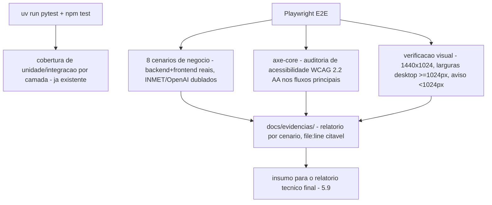

# História 5.8: Executar e comprovar os cenários ponta a ponta — Design

**Spec**: `.specs/features/5-8-executar-e-comprovar-os-cenarios-ponta-a-ponta/spec.md`
**Status**: Approved

---

## Research (Knowledge Verification Chain)

**Codebase**: o backend já tem `pytest` com um piso consistente de testes de integração por camada (2.1–5.7); o frontend tem `vitest`+`@testing-library/react` (jsdom, sem renderização real de CSS/layout) — nenhum runner de navegador real existe ainda. `docs/desafio-5.md`, `docs/design/` (`DESIGN.md`/`EXPERIENCE.md`) já são os contratos visuais/de acessibilidade referenciados pelo AC.

**Web search (E2E + acessibilidade)**: confirmado que **Playwright + `@axe-core/playwright`** é o par padrão atual para auditoria de acessibilidade automatizada em navegador real (Chromium/Chrome), cobrindo contraste, ARIA, rótulos — exatamente o que os critérios de zoom 200%/resolução/contraste/WCAG 2.2 AA do AC exigem e que `vitest`+jsdom não consegue verificar (jsdom não renderiza CSS real). Nenhuma dessas duas dependências existe ainda no projeto — nenhuma versão é fixada aqui (mesma disciplina de 3.1 para `langchain`); a task que as adiciona verifica a versão estável mais recente no momento da implementação.

---

## Approach

Introduzir Playwright como o runner de E2E/navegador real, cobrindo (a) os 8 cenários de negócio ponta a ponta (backend real + frontend real, sem rede externa — INMET e OpenAI substituídos por dublês configuráveis no processo de teste) e (b) a auditoria de acessibilidade via `@axe-core/playwright` nos fluxos principais. Um script `gerar_evidencias.py` (ou equivalente) roda a suíte e organiza os artefatos (relatórios, capturas) em `docs/evidencias/`, citados por `file:line` de teste. Nenhuma alternativa de arquitetura considerada — é o par padrão de mercado confirmado pela pesquisa, e o único caminho que satisfaz literalmente "Chrome estável", "zoom 200%", "contraste" do AC.

---

## Code Reuse Analysis

### Existing Components to Leverage

| Component | Location | How to Use |
| --- | --- | --- |
| Toda a suíte `pytest` (2.1–5.7) | `src/backend/testes/` | Reusada como está — 5.8 não reescreve testes de unidade/integração já existentes, só os referencia como evidência |
| Toda a suíte `vitest` (Épico 1–5.7) | `src/frontend/src/**/*.test.tsx` | Idem — reusada como evidência de componente |
| Dublês de INMET/OpenAI já usados nos testes de integração (2.1–3.6) | `testes/dubles/*.py` | Reusados nos cenários E2E de Playwright, para nunca chamar rede real também na camada de navegador |
| `README.md` (comandos reproduzíveis) | raiz do projeto | Estendido com os comandos de Playwright/axe, não recriado |

### Integration Points

| System | Integration Method |
| --- | --- |
| Chrome/Chromium | Via Playwright, contra o backend/frontend reais rodando localmente (`127.0.0.1`), nunca contra produção |
| DuckDB | Nenhuma migração — os cenários E2E usam o banco restaurado pelo comando já existente (`composicao.inicializador`), que repõe o estado inicial completo, incluindo as tabelas de execução (AD-014) |

---

## Components

### Suíte Playwright de cenários de negócio

- **Purpose**: Executa os 8 cenários do AC ponta a ponta (backend+frontend reais, INMET/OpenAI dublados) e falha explicitamente se algo divergir do esperado.
- **Location**: `testes-e2e/cenarios/*.spec.ts` (novo diretório na raiz, paralelo a `src/backend`/`src/frontend`, já que cruza as duas stacks)
- **Interfaces**: um arquivo de teste por cenário (`chuva-intensa.spec.ts`, `granizo.spec.ts`, `sem-risco.spec.ts`, `sem-elegivel.spec.ts`, `regeneracao.spec.ts`, `contingencia-inmet.spec.ts`, `indisponibilidade-openai.spec.ts`, `retentativa.spec.ts`).
- **Dependencies**: Playwright, backend/frontend rodando localmente, dublês de INMET/OpenAI injetados via configuração de ambiente de teste (nunca produção real).
- **Reuses**: os mesmos dublês de dados já usados pelos testes de integração backend, para consistência de cenário.

### Suíte de auditoria de acessibilidade

- **Purpose**: Roda `@axe-core/playwright` contra os fluxos principais (Visão geral, Alertas, Apólice, Comunicados, Meus Dados, Monitoramento, Regras, Revisão, Resultados, Linha do tempo) e registra violações WCAG 2.2 AA.
- **Location**: `testes-e2e/acessibilidade/*.spec.ts`
- **Interfaces**: um teste por fluxo principal, cada um navegando a superfície real e rodando a análise `axe-core`.
- **Dependencies**: Playwright, `@axe-core/playwright`.
- **Reuses**: mesma infraestrutura de Playwright dos cenários de negócio.

### Verificação visual/responsiva

- **Purpose**: Confirma que os fluxos principais funcionam em 1440×1024 e larguras desktop ≥1024px, e que o aviso de resolução não suportada aparece abaixo de 1024px.
- **Location**: `testes-e2e/responsividade/*.spec.ts`
- **Interfaces**: testes parametrizados por viewport (`page.setViewportSize`).
- **Dependencies**: Playwright.
- **Reuses**: mesma infraestrutura de Playwright.

### Script de organização de evidências

- **Purpose**: Roda a suíte completa (unidade+integração+E2E+acessibilidade) e organiza os artefatos em `docs/evidencias/`, um relatório markdown por cenário citando `file:line` dos testes.
- **Location**: `scripts/gerar_evidencias.py` (raiz do projeto, fora de `src/backend`/`src/frontend`, pois orquestra ambas as stacks)
- **Interfaces**: `python3 scripts/gerar_evidencias.py` — comando único documentado no README.
- **Dependencies**: `pytest`, `vitest`, Playwright, todos já configurados.
- **Reuses**: nenhum componente de produção — script de orquestração de teste, não código de aplicação.

---

## Data Models

Nenhuma migração — esta história não toca o schema de produção.

---

## Error Handling Strategy

| Error Scenario | Handling | User Impact |
| --- | --- | --- |
| Cenário E2E falha por dado sintético alterado por execução anterior | Cada cenário roda sobre um banco recém-restaurado (`composicao.inicializador` no `beforeAll`) — a restauração repõe o estado inicial completo, tabelas de execução incluídas (AD-014), garantindo isolamento real | Falha diagnosticável, nunca resultado parcial silencioso |
| Suíte executada duas vezes seguidas | Restauração do banco antes de cada execução garante determinismo — o wipe catalog-driven do AD-014 elimina colisões de `UNIQUE` e resíduos de execuções anteriores entre rodadas | Nenhum efeito cumulativo |
| Critério WCAG não atendido por limitação já documentada (`SPEC_DEVIATION` de história anterior) | Registrado explicitamente no relatório de evidência como desvio conhecido, não removido do relatório nem ocultado | Avaliador vê o desvio documentado, não uma auditoria falsamente limpa |

---

## Risks & Concerns

| Concern | Location (file:line) | Impact | Mitigation |
| --- | --- | --- | --- |
| Playwright e `@axe-core/playwright` são dependências novas, sem versão fixada por pesquisa oficial nesta sessão | `testes-e2e/` (a criar), `package.json` raiz ou de `src/frontend` | Versão incompatível poderia quebrar a suíte E2E já na primeira execução | A task de implementação que adiciona a dependência deve consultar a documentação/NPM oficiais no momento da implementação antes de fixar a versão — mesma disciplina já aplicada em 3.1 para `langchain` |
| Esta história depende de TODOS os Épicos 1–4 e Histórias 5.1–5.7 estarem implementados para os cenários passarem | `testes-e2e/cenarios/*.spec.ts` | Nenhum cenário pode ser verificado antes das dependências existirem | Documentado explicitamente aqui e em `STATE.md`: 5.8 só pode ser executada (Execute) depois que todo o restante estiver implementado — a fase de planejamento (Specify/Design/Tasks) não depende disso, só a execução real dos testes |

---

## Tech Decisions

| Decision | Choice | Rationale |
| --- | --- | --- |
| Ferramenta de E2E/acessibilidade | Playwright + `@axe-core/playwright` | Único par que satisfaz literalmente "Chrome estável", zoom 200%, contraste, WCAG 2.2 AA — `vitest`+jsdom não renderiza CSS real; confirmado como padrão atual por pesquisa |
| Onde vivem os testes E2E | Diretório `testes-e2e/` na raiz do projeto, não dentro de `src/backend/testes/` nem `src/frontend/src/` | Cruza as duas stacks (dirige o backend real e o frontend real simultaneamente); não é nem um teste de unidade backend nem um teste de componente frontend isolado |
| Onde as evidências ficam | `docs/evidencias/`, um relatório markdown por cenário | Local versionado, citável por `file:line`, consumido diretamente pela História 5.9 |

---

## Approval

Aprovado por extensão da mesma sessão — introdução de Playwright/`axe-core` como par padrão de mercado (confirmado por pesquisa), sem decisão de produto nova; depende funcionalmente de todo o restante do projeto estar implementado antes de Execute.
