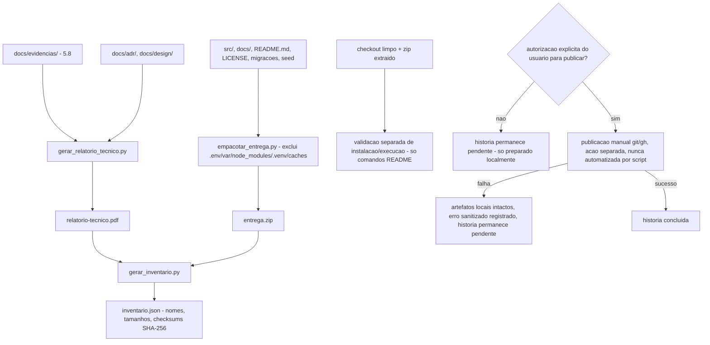

# História 5.9: Preparar e empacotar a entrega final — Design

**Spec**: `.specs/features/5-9-preparar-e-empacotar-a-entrega-final/spec.md`
**Status**: Approved

---

## Research (Knowledge Verification Chain)

**Codebase**: `docs/evidencias/` (5.8) já será a fonte estruturada de evidências/exemplos sanitizados; `docs/adr/`, `docs/design/` já existem como artefatos canônicos a citar no relatório. `.gitignore` do projeto já define a lista de artefatos operacionais a nunca incluir (`.env`, `var/`, `node_modules/`, `.venv/`, caches) — reusada como a lista de exclusão do ZIP, sem redefinição.

**Project docs**: o próprio texto do AC já é o contrato completo desta história (PDF, ZIP, README+MIT, checkout limpo, inventário+checksums, publicação só autorizada). Nenhum ADR novo necessário — esta história não introduz decisão de arquitetura de produto, só de processo de entrega.

---

## Approach

Três scripts independentes e sequenciais, cada um só de orquestração (nenhum código de aplicação): `gerar_relatorio_tecnico.py` (Markdown→PDF a partir de `docs/evidencias/`+ADRs+design), `empacotar_entrega.py` (monta o ZIP sanitizado por lista de exclusão), `gerar_inventario.py` (nomes/tamanhos/checksums SHA-256 de PDF+ZIP+demais arquivos). A publicação em si é uma ação separada, fora do escopo de qualquer script desta história — feita manualmente por comando `git`/`gh` só após autorização explícita do usuário, nunca automatizada. Nenhuma alternativa de arquitetura considerada — é puramente orquestração de arquivos já existentes.

---

## Code Reuse Analysis

### Existing Components to Leverage

| Component | Location | How to Use |
| --- | --- | --- |
| `docs/evidencias/` (5.8) | — | Fonte única das evidências/exemplos sanitizados citados no relatório |
| `.gitignore` | raiz do projeto | Lista de exclusão do ZIP reusada, não redefinida |
| `docs/adr/README.md`, `docs/design/README.md` | — | Citados como artefatos canônicos no relatório técnico |
| Comandos já documentados no `README.md` (instalação, seed, execução) | raiz do projeto | Reusados tal como estão para a validação de checkout limpo/ZIP — nenhum comando novo criado só para esta história |

### Integration Points

| System | Integration Method |
| --- | --- |
| Sistema de arquivos local | Todos os três scripts operam só sobre o repositório local — nenhuma chamada de rede |
| Serviço de publicação (GitHub ou outro) | Fora do escopo dos scripts — ação manual separada, só após autorização explícita (blast radius) |

---

## Components

### `gerar_relatorio_tecnico.py`

- **Purpose**: Monta o relatório técnico em Markdown a partir de `docs/evidencias/` (5.8) + ADRs + design, e converte a PDF.
- **Location**: `scripts/gerar_relatorio_tecnico.py`
- **Interfaces**: `python3 scripts/gerar_relatorio_tecnico.py` → `docs/entrega/relatorio-tecnico.pdf`.
- **Dependencies**: `docs/evidencias/` já populado por 5.8; ferramenta de conversão Markdown→PDF verificada e fixada no momento da implementação (não fabricada aqui).
- **Reuses**: nenhum código de aplicação — só leitura de artefatos já versionados.

### `empacotar_entrega.py`

- **Purpose**: Monta o ZIP sanitizado do pacote completo.
- **Location**: `scripts/empacotar_entrega.py`
- **Interfaces**: `python3 scripts/empacotar_entrega.py` → `docs/entrega/entrega.zip`.
- **Dependencies**: mesma lista de exclusão do `.gitignore`.
- **Reuses**: nenhum código de aplicação.

### `gerar_inventario.py`

- **Purpose**: Registra nomes, tamanhos e checksums SHA-256 do PDF, ZIP e demais artefatos finais.
- **Location**: `scripts/gerar_inventario.py`
- **Interfaces**: `python3 scripts/gerar_inventario.py` → `docs/entrega/inventario.json`.
- **Dependencies**: PDF (`gerar_relatorio_tecnico.py`) e ZIP (`empacotar_entrega.py`) já gerados.
- **Reuses**: nenhum código de aplicação.

---

## Data Models

Nenhuma migração — esta história não toca o schema de produção. `docs/entrega/inventario.json` é um artefato de documentação, não um dado de domínio.

---

## Error Handling Strategy

| Error Scenario | Handling | User Impact |
| --- | --- | --- |
| Evidência referenciada por `docs/evidencias/` ausente no momento da geração do relatório | `gerar_relatorio_tecnico.py` falha explicitamente, citando a evidência ausente | Nenhum PDF com lacuna silenciosa é gerado |
| PDF/ZIP já existentes de geração anterior | Sobrescritos de forma limpa e determinística a cada execução | Nenhuma mistura de conteúdo entre gerações |
| Publicação sem autorização explícita | Nenhum script desta história chama qualquer API de publicação — a ação é manual e separada, gated pelo processo de aprovação do usuário (blast radius), não por código | História permanece pendente até autorização e execução manual explícitas |
| Falha da publicação autorizada (ação manual, fora dos scripts) | Artefatos locais (`docs/entrega/`) permanecem intactos, pois nenhum script os apaga ou modifica em função do resultado da publicação | Nova tentativa possível sem reconstruir nada localmente |

---

## Risks & Concerns

| Concern | Location (file:line) | Impact | Mitigation |
| --- | --- | --- | --- |
| Ferramenta de conversão Markdown→PDF ainda não escolhida/verificada nesta sessão de planejamento | `scripts/gerar_relatorio_tecnico.py` (a criar) | Uma ferramenta incompatível com o ambiente de build poderia bloquear a geração do PDF | A task de implementação verifica a ferramenta disponível no ambiente (ou adiciona uma dependência leve) no momento da implementação, documentando a escolha — não fabricada nesta sessão |
| Publicação é, por definição do AC, uma ação de blast radius alto (remota, externa, possivelmente irreversível) | fora de qualquer script desta história | Publicar sem autorização violaria diretamente o processo de aprovação já estabelecido para este projeto | Nenhum script desta história automatiza publicação; a ação é sempre manual, fora do escopo de Execute desta história, e só ocorre com aprovação explícita do usuário no momento em que for solicitada |

---

## Tech Decisions

| Decision | Choice | Rationale |
| --- | --- | --- |
| Escopo dos três scripts | Cada um só de orquestração de arquivos já existentes — nenhum gera conteúdo novo além de agregar/converter/formatar o que 5.8 e os ADRs já produziram | Evita qualquer decisão de produto nova; esta história é inteiramente sobre empacotar o que já existe |
| Local dos artefatos finais | `docs/entrega/` (novo diretório, ignorado pelo Git — mesmo espírito de `var/`) | Artefatos de entrega são operacionais/gerados, não código-fonte versionado; consistente com a convenção já usada para `var/central_preventiva.duckdb` |
| Checksum | SHA-256, formato já amplamente padrão para verificação de integridade de arquivo | Nenhuma decisão nova necessária — é o padrão de fato para esse propósito |
| Local do relatório de validação de checkout/ZIP (T4) | `docs/evidencias/validacao-checkout-entrega.md` — **não** `docs/entrega/` | Correção pós-Verifier (achado Fix 6, primeira rodada): a decisão acima cobre os três artefatos *gerados* (PDF, ZIP, inventário), que são regeneráveis e por isso corretamente ignorados; mas a evidência de ENTREGA-04 precisa acompanhar a entrega publicada, então segue a convenção já existente de `docs/evidencias/` (rastreada pelo Git), não a de `var/` |

---

## Approval

Aprovado por extensão da mesma sessão — orquestração pura de artefatos já produzidos por 5.8 e pelos ADRs existentes, sem decisão de produto nova; a publicação em si permanece explicitamente fora do escopo de qualquer automação, por design.
