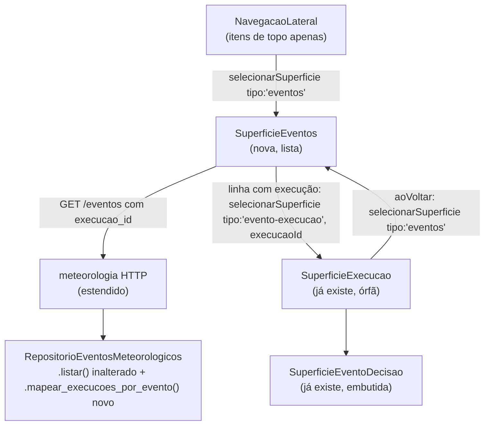

# História 6.1: Navegar o painel administrativo e monitorar eventos climáticos — Design

**Spec**: `.specs/features/6-1-navegar-o-painel-administrativo-e-monitorar-eventos-climaticos/spec.md`
**Status**: Approved (arquitetura de navegação confirmada pelo usuário: Abordagem A — Superfície com payload)

---

## Architecture Overview

Duas decisões compõem esta história: (1) como a navegação por perfil passa a suportar telas de detalhe parametrizadas (decisão compartilhada por todo o Épico 6 — vira AD-016), e (2) como a lista de eventos climáticos é montada a partir de um backend que, hoje, não liga um evento à sua execução.



**Abordagem A confirmada** (ver spec.md/histórico da conversa): `Superficie` deixa de ser um union de strings simples e passa a ser um union de objetos discriminados por `tipo`, com payload opcional. `PerfilContexto` guarda o objeto inteiro; `NavegacaoLateral` só lista e seleciona os `tipo`s "de topo" (sem payload); uma superfície "de detalhe" só é alcançada por uma ação dentro da superfície de topo correspondente, nunca pela navegação lateral.

---

## Code Reuse Analysis

### Existing Components to Leverage

| Component | Location | How to Use |
| --- | --- | --- |
| `PerfilProvider`/`usePerfilContexto` | `src/frontend/src/contexto/PerfilContexto.tsx` | Estendido (não recriado) — `Superficie` vira union discriminado, `SUPERFICIES_POR_PERFIL` vira `SUPERFICIES_TOPO_POR_PERFIL` (só tipos de topo), `superficieValida` ganha a regra de detalhe |
| `NavegacaoLateral` | `src/frontend/src/componentes/NavegacaoLateral.tsx` | Estendido: itera `SUPERFICIES_TOPO_POR_PERFIL[perfil]`, rótulos e ícones novos para os 5 itens de negócio do admin |
| `SuperficieExecucao` | `src/frontend/src/funcionalidades/execucao/SuperficieExecucao.tsx` | Reusado sem alteração — já recebe `execucaoId`; só precisa ser montado pelo novo `case 'evento-execucao'` do switch em `App.tsx` |
| `RepositorioEventosMeteorologicos` | `src/backend/central_preventiva/adaptadores/persistencia/repositorio_meteorologia.py:91` | `listar()` permanece inalterado; ganha um método novo e independente, `mapear_execucoes_por_evento()` (ver Data Models) |
| Tabela `avaliacoes_risco` (já tem `execucao_id` + `evento_id` juntos, migração `0004_avaliacao_risco.sql`) | `adaptadores/persistencia/migracoes/0004_avaliacao_risco.sql` | Fonte do vínculo evento→execução — nenhuma migração nova necessária |
| Padrão de erro `problem+json` (`ProblemaAvaliacaoRisco`, `ProblemaExecucao`) | `adaptadores/http/*.py` | Mesmo padrão para qualquer erro novo desta história |

### Integration Points

| System | Integration Method |
| --- | --- |
| `GET /api/v1/eventos` (existente, estendido) | Resposta ganha `execucao_id: UUID \| None` e `execucao_estado: str \| None` por evento |
| `GET /api/v1/execucoes/{execucao_id}` (existente, sem alteração) | Consumido por `SuperficieExecucao`, já implementado |

---

## Components

### `Superficie` (tipo estendido) + `PerfilContexto`

- **Purpose**: Fonte única de verdade de qual superfície está ativa, agora com payload opcional para telas de detalhe.
- **Location**: `src/frontend/src/contexto/PerfilContexto.tsx`
- **Interfaces**:
  ```typescript
  type SuperficieTopo =
    | { tipo: 'prontidao' }
    | { tipo: 'restaurar-dados-sinteticos' }
    | { tipo: 'documentacao-api' }
    | { tipo: 'eventos' }              // NOVO — 6.1
    | { tipo: 'regras' }               // NOVO — 6.3 (design próprio)
    | { tipo: 'segurados' }            // NOVO — 6.4 (design próprio)
    | { tipo: 'comunicacoes' }         // NOVO — 6.5 (design próprio)
    | { tipo: 'fontes-de-dados' }      // NOVO — 6.7 (design próprio)
    | { tipo: 'visao-geral' }

  type SuperficieDetalhe =
    | { tipo: 'evento-execucao'; execucaoId: string; perfilPai: 'administrador' } // NOVO — 6.1

  type Superficie = SuperficieTopo | SuperficieDetalhe

  const SUPERFICIES_TOPO_POR_PERFIL: Record<Perfil, readonly SuperficieTopo[]>
  ```
  - `selecionarSuperficie(superficie: Superficie): void` — assinatura inalterada, só o tipo do parâmetro cresce.
  - `superficieValida: boolean` — passa a ser `true` quando `superficie.tipo` está em `SUPERFICIES_TOPO_POR_PERFIL[perfil]` **ou** quando é uma `SuperficieDetalhe` cujo `perfilPai` é igual ao `perfil` ativo.
- **Dependencies**: nenhuma nova.
- **Reuses**: mecanismo de `localStorage`/`ehPerfilValido` inalterado.

> Cada nova história do Épico 6 que introduzir sua própria superfície de detalhe (6.5, 6.6) estende este mesmo union — não recria um mecanismo paralelo. É o motivo pelo qual isso vira AD-016.

### `SuperficieEventos` (novo)

- **Purpose**: Lista os eventos climáticos identificados com o status da execução associada; ponto de entrada para `SuperficieExecucao`.
- **Location**: `src/frontend/src/funcionalidades/eventos/SuperficieEventos.tsx` (pasta nova, paralela às demais `funcionalidades/*`)
- **Interfaces**:
  - `export function SuperficieEventos(): JSX.Element` — sem props, lê `selecionarSuperficie` de `usePerfilContexto()`.
- **Dependencies**: `GET /api/v1/eventos` (estendido), `usePerfilContexto`.
- **Reuses**: padrão de estado de carregamento/erro/vazio já usado em `SuperficieFonteMeteorologica`/`SuperficieApolice` (estados nomeados `carregando`/`disponivel`/`vazio`/`erro`, nunca um booleano solto).

### `NavegacaoLateral` (estendido)

- **Purpose**: idêntico ao atual; ganha 5 novos itens de topo do perfil Administrador.
- **Location**: `src/frontend/src/componentes/NavegacaoLateral.tsx`
- **Mudança**: `ROTULOS`/`IconeSuperficie` passam a indexar por `Superficie['tipo']` restrito a `SuperficieTopo['tipo']` (o `.map` já opera só sobre `SUPERFICIES_TOPO_POR_PERFIL`, então nunca recebe um `tipo` de detalhe — não precisa de rótulo/ícone para eles).

### Backend: `RespostaEvento` (estendida) + novo método de repositório dedicado ao vínculo

- **Purpose**: Expor o vínculo evento→execução sem introduzir uma tabela ou migração nova, e **sem** poluir o dataclass de domínio `EventoMeteorologico` (`dominio/evento_meteorologico.py`) — esse dataclass é reusado por `salvar()`/`buscar_por_id()`/`listar_sinteticos_por_tipo()`, nenhum dos quais tem relação com execução; carregar `execucao_id` nele obrigaria todo esses call sites a preencher um campo que não lhes diz respeito.
- **Location**: `src/backend/central_preventiva/adaptadores/http/meteorologia.py` (`RespostaEvento`, `consultar_eventos`), `src/backend/central_preventiva/adaptadores/persistencia/repositorio_meteorologia.py` (novo método em `RepositorioEventosMeteorologicos`, `listar()` inalterado)
- **Interfaces**:
  - `RespostaEvento` ganha `execucao_id: UUID | None` e `execucao_estado: str | None`.
  - Novo método `RepositorioEventosMeteorologicos.mapear_execucoes_por_evento() -> dict[UUID, tuple[UUID, str]]`: uma única query `SELECT evento_id, execucao_id, estado FROM avaliacoes_risco JOIN execucao_preventiva ON avaliacoes_risco.execucao_id = execucao_preventiva.id`, reduzida a um dict `evento_id → (execucao_id, estado)` mantendo a ocorrência mais recente por `evento_id` (`ORDER BY avaliacoes_risco.criado_em DESC`, primeira vitória — protege contra uma reavaliação futura do mesmo evento, ver Risks).
  - `consultar_eventos()` (HTTP) passa a chamar `eventos_repo.listar()` (inalterado) **e** `eventos_repo.mapear_execucoes_por_evento()`, combinando os dois na resposta.
- **Dependencies**: tabelas já existentes (`avaliacoes_risco`, `execucao_preventiva`) — nenhuma migração.
- **Reuses**: `AD-005` (sem `REFERENCES` declarado) não impede o `JOIN` explícito na query; é exatamente o padrão já usado por `avaliacao_risco.py`.

---

## Data Models

### `RespostaEvento` (estendida)

```python
class RespostaEvento(BaseModel):
    id: UUID
    tipo: str
    area: str
    periodo_inicio: datetime
    periodo_fim: datetime
    intensidade: float
    proveniencia: str
    instante_observado: datetime
    execucao_id: UUID | None      # NOVO — 6.1: nulo quando o evento não gerou avaliação/execução
    execucao_estado: str | None   # NOVO — 6.1: estado atual da execução, nulo quando execucao_id é nulo
```

**Relationships**: `execucao_id` aponta para `execucao_preventiva.id` via a linha correspondente em `avaliacoes_risco` (`evento_id` + `execucao_id` já coexistem lá, migração `0004_avaliacao_risco.sql:8-9`), resolvido pelo novo `mapear_execucoes_por_evento()` — nenhuma relação nova declarada no schema (mantém AD-005), e o dataclass de domínio `EventoMeteorologico` permanece sem esse campo.

### `Superficie` (frontend, ver Components acima)

---

## Error Handling Strategy

| Error Scenario | Handling | User Impact |
| --- | --- | --- |
| `GET /eventos` falha (rede/servidor) | `SuperficieEventos` entra em estado `erro` com ação "Tentar novamente" | Mensagem explícita, nunca lista vazia silenciosa |
| Evento sem execução (`execucao_id: null`) | Renderizado com um selo "Sem execução iniciada", sem link clicável | Distinção visual clara, sem simular uma execução inexistente |
| `superficie` inválida para o perfil (ex.: `evento-execucao` sobrevive a uma troca de perfil) | `ContextoInconsistente` já existente é acionado, com `aoVoltar` levando a `SUPERFICIES_TOPO_POR_PERFIL[perfil][0]` | Mesmo comportamento já implementado para as 3 superfícies técnicas — sem novo componente |

---

## Risks & Concerns

| Concern | Location (file:line) | Impact | Mitigation |
| --- | --- | --- | --- |
| `Superficie` como union de objetos é um breaking change de tipo tocando 4 arquivos existentes fora desta história | `App.tsx`, `App.test.tsx`, `PerfilContexto.test.tsx`, `NavegacaoLateral.test.tsx` | Testes existentes que constroem `superficieAtiva` como string literal (`'prontidao'` etc.) deixam de compilar até serem ajustados para `{ tipo: 'prontidao' }` | Escopo explícito de uma task desta história: atualizar os 4 arquivos para o novo formato de objeto — é um ajuste mecânico (find/replace guiado por tipo), não uma reescrita de comportamento; confirmado pelo `grep` já rodado no Design (blast radius pequeno e conhecido) |
| Extensão de `RespostaEvento` muda um contrato já documentado no OpenAPI consumido por `test_openapi_sincronizado.py` (lição já registrada em `.specs/LESSONS.md`) | `src/backend/testes/test_openapi_sincronizado.py` | Adicionar campo sem atualizar esse teste quebra o gate de sincronização OpenAPI | Mitigação: task própria atualiza `test_openapi_sincronizado.py` e `test_saude.py` juntos, exatamente como a lição consolidada já pede |
| `mapear_execucoes_por_evento()` pode ver mais de uma linha de `avaliacoes_risco` por evento se ele for reavaliado (não deveria ocorrer, mas o schema não impede) | `avaliacoes_risco` (sem `UNIQUE` por `evento_id`) | Um evento apontar para uma execução desatualizada na listagem | Mitigação: a query usa `QUALIFY ROW_NUMBER() OVER (PARTITION BY evento_id ORDER BY criado_em DESC) = 1` (sintaxe DuckDB) para manter só a avaliação mais recente por evento |

---

## Tech Decisions (only non-obvious ones)

| Decision | Choice | Rationale |
| --- | --- | --- |
| Como parametrizar uma superfície de detalhe | `Superficie` como union discriminado com payload (Abordagem A) | Confirmado com o usuário; menor diff, reusa 100% do mecanismo existente, nenhuma dependência nova. Vira **AD-016** em `.specs/STATE.md` por ser convenção que todo o Épico 6 segue |
| Onde obter o vínculo evento→execução | Estender `RespostaEvento` via `JOIN` contra `avaliacoes_risco` (que já guarda os dois ids juntos) em vez de criar uma tabela/endpoint novo | Menor mudança possível no backend; usa uma relação que já existe fisicamente no schema, só nunca foi exposta nesse endpoint |

> **Registrar como AD-016**: a convenção "Superfície com payload" (`Superficie` como union discriminado por `tipo`, superfícies de detalhe alcançáveis só por ação dentro da superfície de topo, nunca listadas em `NavegacaoLateral`) é o mecanismo padrão de drill-down do projeto daqui em diante — toda história futura que precisar de uma tela parametrizada por id (6.5, 6.6, e qualquer uma além do Épico 6) segue este mesmo padrão em vez de introduzir roteamento ou estado paralelo.

---

## Tips (não removido do template — referência rápida do autor do design)

- Componentes pequenos: `SuperficieEventos` só lista e navega; não embute a decisão do evento (isso é `SuperficieExecucao`/`SuperficieEventoDecisao`, já existentes).
- Interfaces primeiro: o `type Superficie` novo é o contrato que toda a Tasks phase desta história e das seguintes (6.5, 6.6) implementa contra.
