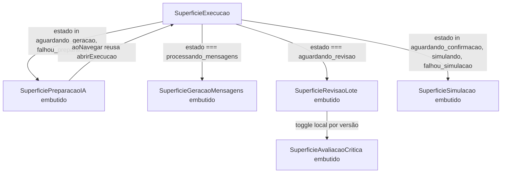

# História 6.5: Design

**Spec**: `.specs/features/6-5-gerar-revisar-e-confirmar-o-envio-simulado-das-comunicacoes/spec.md`
**Status**: Approved

---

## Architecture Overview

`SuperficieExecucao` (6.2) já embute uma superfície condicionalmente a partir de `execucao.estado` (`SuperficieEventoDecisao`, quando `estado !== 'coletando' && estado !== 'falhou_coleta'`). Esta história estende exatamente esse padrão, sem introduzir mecanismo novo: adiciona quatro blocos condicionais, cada um mapeado 1:1 a um subconjunto de `EstadoExecucao` (`central_preventiva/dominio/estados_execucao.py`), que embutem as superfícies já existentes e testadas — nenhuma delas ganha um `Superficie` de topo novo em `PerfilContexto.tsx`, porque nenhuma precisa de navegação a partir de fora de `SuperficieExecucao` (AD-016 continua reservado para destinos alcançáveis a partir de uma lista de topo).

A única peça de navegação secundária (avaliação crítica por mensagem/versão, `mensagemId`+`versaoId`) também não usa o `Superficie` global: é um `useState` local dentro de `SuperficieRevisaoLote`, no mesmo padrão que esse componente já usa para `mensagemAberta` (abrir/fechar um item do lote).

`estado === 'concluida'` não embute nada novo aqui — é o início do escopo da História 6.6 (resultado consolidado).

---

## Code Reuse Analysis

### Existing Components to Leverage

| Component | Location | How to Use |
| --- | --- | --- |
| `SuperficiePreparacaoIA` | `funcionalidades/preparacao-ia/SuperficiePreparacaoIA.tsx` | Embutir sem alteração; `aoNavegar` recebe o `abrirExecucao` já existente em `SuperficieExecucao` |
| `SuperficieGeracaoMensagens` | `funcionalidades/geracao-mensagens/SuperficieGeracaoMensagens.tsx` | Embutir com `embutido` sem alteração |
| `SuperficieRevisaoLote` | `funcionalidades/revisao-lote/SuperficieRevisaoLote.tsx` | Embutir com `embutido`; ganha um toggle local novo por versão para abrir `SuperficieAvaliacaoCritica` |
| `SuperficieAvaliacaoCritica` | `funcionalidades/avaliacao-critica/SuperficieAvaliacaoCritica.tsx` | Embutir sem alteração, a partir do toggle novo em `SuperficieRevisaoLote` |
| `SuperficieSimulacao` | `funcionalidades/simulacao/SuperficieSimulacao.tsx` | Embutir com `embutido` sem alteração |
| `abrirExecucao` (callback) | `funcionalidades/execucao/SuperficieExecucao.tsx:174-183` | Já usado pela seção "Execuções correlacionadas"; reusado como `aoNavegar` de `SuperficiePreparacaoIA` |

### Integration Points

| System | Integration Method |
| --- | --- |
| `GET /execucoes/{id}` (já consumido por `SuperficieExecucao`) | `execucao.estado` decide qual superfície embutir — nenhuma chamada nova |
| `POST /execucoes/{id}/simulacao` (já usado por `SuperficieSimulacao`) | Sem mudança — já gera `Idempotency-Key` nova a cada envio (AD-002) |

Nenhuma rota de backend nova. Nenhum tipo de `api/*.ts` novo.

---

## Components

### `SuperficieExecucao` (estendido)

- **Purpose**: Além do progresso já exibido (6.1/6.2), embute a superfície correspondente à etapa de produção agêntica em que a execução está.
- **Location**: `funcionalidades/execucao/SuperficieExecucao.tsx`
- **Mudança de interface**: nenhuma prop nova (`PropriedadesSuperficieExecucao` inalterada).
- **Lógica nova**:
  - `mostrarPreparacaoIa = estado in {aguardando_geracao, falhou_preparacao_ia}` → embute `<SuperficiePreparacaoIA execucaoId aoNavegar={abrirExecucao} />`
  - `mostrarGeracaoMensagens = estado === 'processando_mensagens'` → embute `<SuperficieGeracaoMensagens embutido execucaoId />`
  - `mostrarRevisaoLote = estado === 'aguardando_revisao'` → embute `<SuperficieRevisaoLote embutido execucaoId />`
  - `mostrarSimulacao = estado in {aguardando_confirmacao, simulando, falhou_simulacao}` → embute `<SuperficieSimulacao embutido execucaoId />`
  - a seção genérica "Execuções correlacionadas" (linhas 243-278 atuais) passa a **não renderizar quando `mostrarPreparacaoIa` é verdadeiro** — ver Tech Decisions, D-1.
- **Dependencies**: nenhuma nova.
- **Reuses**: as cinco superfícies listadas acima, sem alteração de contrato.

### `SuperficieRevisaoLote` (estendido)

- **Purpose**: Além da revisão já implementada (3.5), permite abrir a avaliação crítica completa de qualquer tentativa de qualquer item do lote.
- **Location**: `funcionalidades/revisao-lote/SuperficieRevisaoLote.tsx`
- **Interfaces**: `PropriedadesSuperficieRevisaoLote` inalterada.
- **Estado local novo**: `versaoAvaliacaoAberta: string | null` (guarda `versao.id` da tentativa aberta; fecha ao trocar de item ou re-clicar).
- **UI nova**: dentro da seção "Contexto de IA, origem e proveniência" (`data-secao="contexto-ia"`), cada `<li>` de tentativa ganha um botão "Ver avaliação crítica completa" / "Fechar avaliação crítica"; quando aberto, embute `<SuperficieAvaliacaoCritica embutido mensagemId={item.mensagemId} versaoId={versao.id} />` logo abaixo do item.
- **Dependencies**: `SuperficieAvaliacaoCritica` (import novo).
- **Reuses**: `item.versoes[].id` já existe em `LoteRevisao`/`ItemLote` (`api/revisaoLote.ts`) — nenhum tipo novo.

---

## Data Models

Nenhum modelo novo. `EstadoExecucao` (backend, `central_preventiva/dominio/estados_execucao.py`) já define todos os estados usados nas condições acima; o frontend já recebe `execucao.estado` como `string` livre (sem enum espelhado) — mantido assim, mesmo padrão de `SuperficieExecucao`/`SuperficieEventoDecisao` já em produção.

---

## Error Handling Strategy

| Error Scenario | Handling | User Impact |
| --- | --- | --- |
| Qualquer uma das cinco superfícies embutidas falha ao consultar sua API | Cada componente já trata sua própria falha (`role="alert"`, ocorrência/impacto/próxima ação) — nenhum tratamento novo | O bloco daquela etapa mostra o alerta; o restante da tela (progresso, decisão de risco) continua visível |
| Execução muda de estado enquanto uma superfície embutida está aberta (ex.: usuário com duas abas) | Cada superfície embutida já reconsulta na própria montagem; `SuperficieExecucao` já faz polling enquanto `estaEmAndamento` — como as etapas de mensagens não estão em `ESTADOS_EM_ANDAMENTO`, a transição só é percebida ao reabrir/revisitar a tela (comportamento herdado, não uma regressão desta história) | Sem impacto novo — mesma limitação de polling já aceita em 6.2 |

---

## Risks & Concerns

| Concern | Location (file:line) | Impact | Mitigation |
| --- | --- | --- | --- |
| Duplicação de UI: `SuperficiePreparacaoIA` já renderiza sua própria seção "Execuções correlacionadas" (`aoNavegar`) e `SuperficieExecucao` já tem uma seção genérica com o mesmo propósito | `funcionalidades/preparacao-ia/SuperficiePreparacaoIA.tsx:202-218`, `funcionalidades/execucao/SuperficieExecucao.tsx:243-278` | Sem mitigação, o administrador veria dois blocos "Execuções correlacionadas" repetindo a mesma execução de origem/retentativas quando `estado` está em `aguardando_geracao`/`falhou_preparacao_ia` | D-1 abaixo: suprimir a seção genérica de `SuperficieExecucao` especificamente nesses dois estados |
| `SuperficieGeracaoMensagens` não expõe nome do destinatário por item (`Mensagem` não tem campo de nome) | `funcionalidades/geracao-mensagens/SuperficieGeracaoMensagens.tsx:106-109`, `api/mensagens.ts:18-27` | FLUXOMSG-02 fala em "lista de destinatários"; o componente existente mostra canal/categoria/tentativa, não o nome do segurado | Aceito por decisão de escopo (ver Assumption da spec: as cinco superfícies já existem prontas, a integração não deve alterar o conteúdo delas) — registrado aqui, não é um SPEC_DEVIATION porque o Independent Test da AC (`spec.md:49`) só verifica correspondência com o que a API persiste, não o nome do destinatário |
| Duplo clique em "Confirmar simulação" (edge case da spec) depende de `disabled={enviando}` em `SuperficieSimulacao`, que já existe, mas não tem teste próprio cobrindo o cenário | `funcionalidades/simulacao/SuperficieSimulacao.tsx:307` | Sem teste, uma regressão futura no `disabled` não seria pega | Task nova: adicionar teste de duplo clique em `SuperficieSimulacao.test.tsx` (comportamento já existente, só ganha cobertura) |

> Nenhum risco de segurança, performance ou tech debt novo identificado além dos três acima.

---

## Tech Decisions

| Decision | Choice | Rationale |
| --- | --- | --- |
| D-1: seção genérica "Execuções correlacionadas" em `SuperficieExecucao` | Suprimida quando `estado in {aguardando_geracao, falhou_preparacao_ia}` (`SuperficiePreparacaoIA` já cobre o mesmo conteúdo, com `aoNavegar` funcional) | Evita duplicar a mesma informação duas vezes na tela; decisão local a esta história, não promovida a AD-NNN — é um ajuste de composição, não um padrão novo de arquitetura |
| D-2: onde fica o drill-down para avaliação crítica | Dentro de `SuperficieRevisaoLote` (usa `item.versoes[].id` já existente), não em `SuperficieGeracaoMensagens` | `GeracaoMensagens`/`api/mensagens.ts` não expõe `versaoId` estruturado; `RevisaoLote`/`api/revisaoLote.ts` já expõe `versao.id` — menor diff, sem mudança de tipo de API |
| D-3: navegação entre as cinco etapas | Nenhum `Superficie` de topo novo — todas embutidas condicionalmente por `estado` dentro de `SuperficieExecucao`, seguindo o padrão já usado para `SuperficieEventoDecisao` (6.2) | Nenhuma das cinco telas precisa ser alcançada de fora do contexto de uma execução específica; reabrir a discussão de AD-016 aqui seria over-engineering |

Nenhuma decisão acima estabelece um padrão novo de projeto (todas conformam a AD-016); nenhum `AD-NNN` novo necessário.

---

## Requirement → Component Mapping

| Requirement ID | Component/Change |
| --- | --- |
| FLUXOMSG-01 | `SuperficieExecucao` embute `SuperficiePreparacaoIA` |
| FLUXOMSG-02 | `SuperficieExecucao` embute `SuperficieGeracaoMensagens` |
| FLUXOMSG-03 | Idem (categoria `excecao` já tratada por `SuperficieGeracaoMensagens`) |
| FLUXOMSG-04 | `SuperficieRevisaoLote` ganha drill-down para `SuperficieAvaliacaoCritica` |
| FLUXOMSG-05 | Idem |
| FLUXOMSG-06 | `SuperficieExecucao` embute `SuperficieRevisaoLote` |
| FLUXOMSG-07 | Já implementado em `SuperficieRevisaoLote` (REVISAO-06) — só alcançável agora |
| FLUXOMSG-08 | `SuperficieExecucao` embute `SuperficieSimulacao` |
