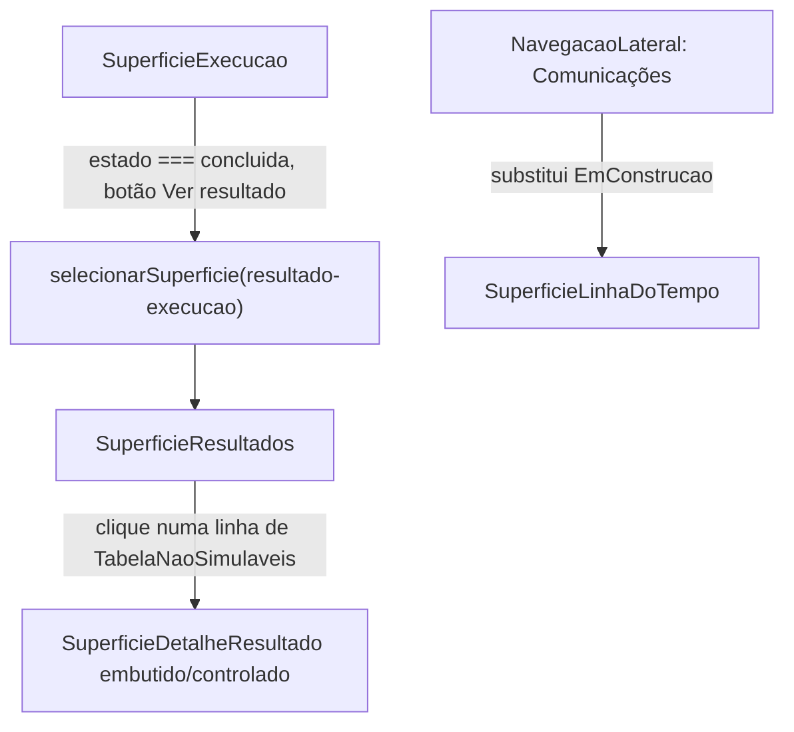

# História 6.6: Design

**Spec**: `.specs/features/6-6-consultar-resultados-da-simulacao-e-a-linha-do-tempo/spec.md`
**Status**: Approved

---

## Architecture Overview

Três superfícies pré-existentes e testadas isoladamente (`SuperficieResultados`, `SuperficieDetalheResultado`, `SuperficieLinhaDoTempo`) ganham dois pontos de entrada diferentes, cada um seguindo um padrão já estabelecido no Épico 6 — nenhum mecanismo de navegação novo:

1. **`SuperficieResultados`** vira um novo destino de detalhe (AD-016: `Superficie` com payload), alcançado por um botão em `SuperficieExecucao` quando `estado === 'concluida'` — mesmo padrão de `evento-execucao` (6.1), não um embed inline (ver D-1: `SuperficieResultados` renderiza seu próprio `<main>`, embuti-la dentro do `<main>` de `SuperficieExecucao` duplicaria o landmark).
2. **`SuperficieLinhaDoTempo`** é autossuficiente (busca própria por segurado/canal/estado, sem precisar de `execucaoId` de fora) e vira o conteúdo do item de topo `'comunicacoes'`, hoje um placeholder `EmConstrucao` em `App.tsx` — mesmo padrão de "só montar" já usado em 6.3 (`SuperficieRegras`) e 6.7 (`SuperficieFonteMeteorologica`).
3. **`SuperficieDetalheResultado`** já é um drawer controlado (`aberto`/`mensagemId`/`onFechar`) — passa a ser controlado por um `useState` local dentro de `SuperficieResultados`, mesmo padrão de `mensagemAberta` já usado em `SuperficieRevisaoLote` (6.5).



---

## Code Reuse Analysis

### Existing Components to Leverage

| Component | Location | How to Use |
| --- | --- | --- |
| `SuperficieResultados` | `funcionalidades/resultados/SuperficieResultados.tsx` | Monta em `App.tsx` sem alteração de assinatura; ganha lógica interna nova (stats derivadas, filtro, drawer, export) |
| `SuperficieDetalheResultado` | `funcionalidades/resultados/SuperficieDetalheResultado.tsx` | Controlado por estado local novo em `SuperficieResultados`, sem alteração |
| `SuperficieLinhaDoTempo` | `funcionalidades/linha-do-tempo/SuperficieLinhaDoTempo.tsx` | Montada sem alteração no case `'comunicacoes'` |
| `abrirExecucao`/`selecionarSuperficie` (padrão AD-016) | `funcionalidades/execucao/SuperficieExecucao.tsx`, `contexto/PerfilContexto.tsx` | Extendido com um novo tipo de detalhe (`resultado-execucao`), mesmo mecanismo de `evento-execucao` |

### Integration Points

| System | Integration Method |
| --- | --- |
| `GET /resultados/{execucaoId}` (já usado por `SuperficieResultados`) | Sem mudança |
| `GET /detalhe-resultado/{execucaoId}/{mensagemId}` (já usado por `SuperficieDetalheResultado`) | Sem mudança |
| `buscarExecucoes`/`getLinhaDoTempo` (já usados por `SuperficieLinhaDoTempo`) | Sem mudança |

Nenhuma rota de backend nova.

---

## Assumption Corrections (registradas em spec.md)

Ver spec.md `## Assumptions & Open Questions` para o detalhe completo — resumo:

- **PAINELRES-01**: "gerada/processada/entregue/com falha" não existem como campos persistidos; viram uma seção de estatísticas derivadas de `totaisPorEstado` (soma total = "processado"; `simulada_entregue` = "entregue"; soma de `falhou_conteudo`+`falhou_integracao_ia` = "com falha").
- **PAINELRES-02/03**: "tabela de itens filtrável" só existe como `TabelaNaoSimulaveis` (única tabela por item, com `canal`+`estado`+`motivo`); o filtro se aplica a ela, não a um "lote inteiro" que não existe como lista de itens em lugar nenhum do sistema hoje.
- **PAINELRES-04/05**: "selecionar um item" só é possível a partir de `TabelaNaoSimulaveis`, pelo mesmo motivo.
- **Nova**: o item de topo `'comunicacoes'` (placeholder desde 6.1) recebe `SuperficieLinhaDoTempo` — fecha uma lacuna que nem a spec.md da 6.5 nem a original da 6.6 haviam reclamado.

---

## Components

### `SuperficieExecucao` (estendido)

- **Purpose**: Ao chegar em `concluida`, oferece o caminho para o resultado consolidado.
- **Location**: `funcionalidades/execucao/SuperficieExecucao.tsx`
- **Mudanças**:
  - `ROTULOS_ENCERRAMENTO.concluida = 'Concluída — resultado disponível'` (hoje cai no fallback bruto `execucao.estado`, ou seja, mostra o texto "concluida" cru — PAINELRES-01 pede que o admin veja quando o resultado está disponível)
  - Novo botão "Ver resultado consolidado", visível só quando `estado === 'concluida'`, chamando `selecionarSuperficie({ tipo: 'resultado-execucao', execucaoId, perfilPai: 'administrador' })` (mesma função `selecionarSuperficie` já obtida via `usePerfilContexto`, mesmo padrão de `abrirExecucao`)
- **Reuses**: `selecionarSuperficie` já importado.

### `PerfilContexto` (estendido)

- **Purpose**: `SuperficieDetalhe` vira union discriminado (hoje é um único objeto, só `evento-execucao`), ganhando `resultado-execucao`.
- **Location**: `contexto/PerfilContexto.tsx`
- **Mudança de tipo**:
  ```typescript
  export type SuperficieDetalhe =
    | { tipo: 'evento-execucao'; execucaoId: string; perfilPai: 'administrador' }
    | { tipo: 'resultado-execucao'; execucaoId: string; perfilPai: 'administrador' }
  ```
- **Reuses**: `superficieValida`/`selecionarSuperficie` já são genéricos por `'perfilPai' in superficieAtiva` — nenhuma lógica nova ali.

### `App.tsx` (estendido)

- **Purpose**: Monta as duas novas superfícies.
- **Location**: `App.tsx`
- **Mudanças**: novo `case 'resultado-execucao': return <SuperficieResultados execucaoId={superficieAtiva.execucaoId} />`; `case 'comunicacoes'` passa a retornar `<SuperficieLinhaDoTempo />` em vez de `<EmConstrucao titulo="Comunicações" />`. Como esse era o único uso de `EmConstrucao`, a função é removida (dead code).

### `SuperficieResultados` (estendido)

- **Purpose**: Estatísticas rápidas derivadas, tabela de itens não simulados filtrável por canal/estado, drill-down para o detalhe, exportação CSV do que está filtrado.
- **Location**: `funcionalidades/resultados/SuperficieResultados.tsx`
- **Estado local novo**: `mensagemAberta: string | null` (controla `SuperficieDetalheResultado`); `filtroCanal: string`, `filtroEstado: string` (`''` = sem filtro, valores vêm dos próprios `naoSimulaveis` presentes, sem lista fixa hardcoded)
- **UI nova**:
  - Seção "Resumo" antes das tabelas existentes: total processado, total entregue, total com falha (derivados de `totaisPorEstado` via funções puras `totalProcessado`, `totalEntregue`, `totalComFalha`)
  - `TabelaNaoSimulaveis` ganha dois `<select>` de filtro (canal, estado) e cada `<tr>` vira clicável (`onClick`/`role="button"` na linha ou um botão "Ver detalhe" por linha, abrindo `mensagemAberta`)
  - Botão "Exportar CSV" que gera um `Blob` client-side a partir dos itens de `naoSimulaveis` **após o filtro ativo** (P3) — sem `<a download>` (bloqueado em ambiente de artifact, mas isto é a aplicação real servida localmente, não um artifact; ainda assim, gerar o Blob e usar `URL.createObjectURL` + `<a download>` é o padrão nativo do browser, aceitável aqui)
  - `<SuperficieDetalheResultado aberto={mensagemAberta !== null} execucaoId={execucaoId} mensagemId={mensagemAberta ?? ''} onFechar={() => definirMensagemAberta(null)} />` montado sempre (padrão já usado no próprio teste do componente — `aberto` controla a presença visual/foco, não a montagem)
- **Reuses**: `SuperficieDetalheResultado` sem alteração; `MensagemNaoSimulavel.canal`/`.estado` já existem para os filtros.

---

## Data Models

Nenhum modelo novo. Funções puras derivadas (não persistidas):

```typescript
function totalProcessado(totais: TotalPorChave[]): number // soma de todos os totais
function totalEntregue(totais: TotalPorChave[]): number // total de 'simulada_entregue'
function totalComFalha(totais: TotalPorChave[]): number // soma de 'falhou_conteudo' + 'falhou_integracao_ia'
```

---

## Error Handling Strategy

| Error Scenario | Handling | User Impact |
| --- | --- | --- |
| Execução ainda não `concluido` (`resultados.concluido === false`) | Já tratado pelo componente existente (`SuperficieResultados.tsx:340-345`) — mensagem de status, nenhuma tabela vazia | Sem mudança — satisfaz o Edge Case 1 da spec sem nenhum código novo |
| Filtro elimina todos os itens de `naoSimulaveis` | `TabelaNaoSimulaveis` já trata lista vazia (`itens.length === 0`) — reusado com a lista já filtrada | Mensagem "Nenhuma mensagem nesta categoria" (ajustada para refletir o filtro ativo) |
| `SuperficieDetalheResultado` falha ao buscar o detalhe | Já tratado pelo próprio componente (estado `indisponivel`), sem mudança | Alerta dentro do drawer |

---

## Risks & Concerns

| Concern | Location (file:line) | Impact | Mitigation |
| --- | --- | --- | --- |
| `EmConstrucao` fica sem nenhum chamador após esta história | `App.tsx:18-25` (única chamada em `App.tsx:66`) | Código morto se não removido | Remover a função no mesmo commit que troca o `case 'comunicacoes'` |
| Ordenação estável da tabela (Edge Case 2 da spec) | `SuperficieResultados.tsx:120-127` (`ordenarTotais`, usa `Array.prototype.sort`, que é estável em todos os motores JS modernos — ECMA-262 desde 2019) | Nenhum — já é estável por especificação da linguagem, sem código próprio de desempate | Nenhuma ação necessária; registrar isso como evidência do AC no Verifier, não como gap |
| Exportação CSV (P3) sem confirmação de formato pelo produto | spec.md Assumption "Exportação de relatório" | Formato pode não ser o esperado pelo produto no futuro | Aceito pela spec como decisão explícita de P3; escopo desta história é só o CSV client-side do que está filtrado |

---

## Tech Decisions

| Decision | Choice | Rationale |
| --- | --- | --- |
| D-1: `SuperficieResultados` como embed ou como destino de topo/detalhe | Destino de detalhe novo via AD-016 (`resultado-execucao`), não embutida dentro de `SuperficieExecucao` | `SuperficieResultados` já renderiza seu próprio `<main id="conteudo-principal">` (diferente das 5 superfícies da 6.5, que tinham `embutido`) — embuti-la duplicaria o landmark/id; e semanticamente é uma tela final própria, não um sub-painel do acompanhamento em andamento |
| D-2: onde aplicar o filtro de PAINELRES-02/03 | Só em `TabelaNaoSimulaveis` | É a única tabela por item que existe; as duas `TabelaTotais` são agregadas e não têm granularidade de item para filtrar |
| D-3: slot de navegação de `SuperficieLinhaDoTempo` | Reusa o item de topo `'comunicacoes'` já existente | Fecha a lacuna aberta desde o Design da 6.1 sem criar um `SuperficieTopo` novo; a busca própria do componente (por segurado/canal/estado) é conceitualmente "consultar comunicações" |
| D-4: sem botão "Voltar" dedicado em `SuperficieResultados` | Nenhum — mesmo padrão de `SuperficieExecucao`/`evento-execucao` (6.1/6.2), que também não tem | `NavegacaoLateral` está sempre visível no shell administrativo; nenhuma tela de detalhe do Épico 6 até agora tem botão de voltar dedicado |

Nenhuma decisão acima estabelece um padrão novo além de estender o já registrado em AD-016 (agora com um segundo `tipo` de detalhe). Nenhum `AD-NNN` novo necessário.

---

## Requirement → Component Mapping

| Requirement ID | Component/Change |
| --- | --- |
| PAINELRES-01 | `SuperficieExecucao` (botão "Ver resultado"), `App.tsx`/`PerfilContexto` (novo destino), `SuperficieResultados` (seção de resumo derivado) |
| PAINELRES-02 | `SuperficieResultados` (filtro canal/estado em `TabelaNaoSimulaveis`) |
| PAINELRES-03 | Idem (soma dos itens filtrados ≤ total, propriedade do próprio filtro client-side) |
| PAINELRES-04 | `SuperficieResultados` (clique numa linha abre `SuperficieDetalheResultado`) |
| PAINELRES-05 | Já implementado em `SuperficieDetalheResultado` (pré-existente) — só alcançável agora |
| PAINELRES-06 | `App.tsx` (monta `SuperficieLinhaDoTempo` em `'comunicacoes'`) |
| PAINELRES-07 | `SuperficieResultados` (botão "Exportar CSV") |
