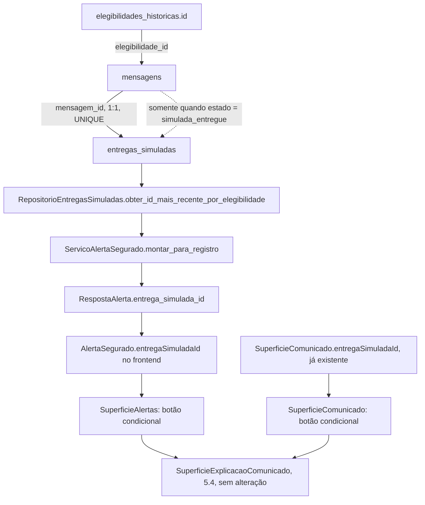

# História 6.8 Design

**Spec**: `.specs/features/6-8-acessar-a-explicacao-da-mensagem-a-partir-do-alerta-e-do-comunicado/spec.md`
**Status**: Approved

---

## Architecture Overview

Duas origens distintas, dois custos distintos:

- **Comunicado → explicação**: `SuperficieComunicado` já recebe `entregaSimuladaId` como prop obrigatória (4.3/5.5). Basta montar `SuperficieExplicacaoComunicado` (5.4, já pronta) localmente, sem nenhuma mudança de backend.
- **Alerta → explicação**: `AlertaSegurado` (domínio e contrato HTTP) não carrega `entrega_simulada_id` hoje — confirmado por grep, sem nenhuma ocorrência em `alerta_segurado.py`/`lista_alertas_segurado.py`. É preciso resolver esse id a partir do `elegibilidade_id` já carregado pelo alerta e expô-lo através da mesma cadeia (domínio → HTTP → cliente TS) antes que a UI tenha o que passar ao drawer.



`mensagens (elegibilidade_id, canal)` é `UNIQUE`, não `elegibilidade_id` sozinho (migração `0010`) — uma elegibilidade pode ter mais de uma mensagem (um canal por preferência do segurado, na prática quase sempre um só). Quando houver mais de uma entrega associada à mesma elegibilidade, a mais recente (`criado_em DESC`) é a escolhida — mesmo critério de desempate já usado em "elegibilidade mais recente" (5.1) e "versão mais recente da mensagem" (`obter_versao_atual`, `RepositorioMensagens`).

---

## Code Reuse Analysis

### Existing Components to Leverage

| Component | Location | How to Use |
| --- | --- | --- |
| `SuperficieExplicacaoComunicado` | `src/frontend/src/funcionalidades/segurado/SuperficieExplicacaoComunicado.tsx` | Montada sem alteração nos dois pontos de entrada — só `aberto`/`seguradoId`/`entregaSimuladaId`/`onFechar` mudam |
| `RepositorioEntregasSimuladas` | `src/backend/.../repositorio_entregas_simuladas.py` | Ganha um método novo de leitura; `obter_por_id`/`listar_por_segurado` seguem intocados |
| `ServicoAlertaSegurado.montar_para_registro` | `src/backend/.../aplicacao/alerta_segurado.py` | Já é o único lugar que monta `AlertaSegurado` para VISAO (5.1) e ALERTAS (5.2) — ganha uma porta nova, nenhuma duplicação |
| Padrão de foco de `SuperficieExplicacaoComunicado` (captura/restaura `document.activeElement`) | mesmo arquivo | Cobre ABRIREXP-06/07 de graça: nenhum código novo de foco é necessário nos dois pontos de entrada, só manter o botão que abre como o elemento focado no momento do clique (comportamento padrão de um `<button onClick>`) |

### Integration Points

| System | Integration Method |
| --- | --- |
| `RespostaAlerta` (HTTP) | Novo campo opcional `entrega_simulada_id: UUID \| None`; compartilhado por `alerta_segurado.py` (VISAO, fora de escopo desta história) e `lista_alertas_segurado.py` (ALERTAS) — os dois ganham o campo, só o segundo o expõe na UI |
| Snapshot OpenAPI (`composicao/openapi.json`) | Regenerado via `uv run --directory src/backend python -m central_preventiva.composicao.openapi_export` |
| Tipos TS gerados (`api/tipos-gerados.ts`) | Regenerado via `npm run gerar-tipos-api --prefix src/frontend` (exige backend no ar); `npm run verificar-tipos-api` como gate de drift |

---

## Components

### `RepositorioEntregasSimuladas.obter_id_mais_recente_por_elegibilidade` (backend, extend)

- **Purpose**: Resolver, para uma elegibilidade, o id da entrega simulada mais recente cuja mensagem de origem já está em `simulada_entregue` — ou `None`.
- **Location**: `src/backend/central_preventiva/adaptadores/persistencia/repositorio_entregas_simuladas.py`
- **Interfaces**:
  - `obter_id_mais_recente_por_elegibilidade(elegibilidade_id: UUID) -> UUID | None`
- **Dependencies**: `entregas_simuladas` JOIN `mensagens` (mesmo par já usado por `listar_por_segurado`)
- **Reuses**: Mesmo padrão de conexão/leitura do resto do repositório; devolve só o id (não o `EntregaSimulada` inteiro) porque é só o que `AlertaSegurado` precisa carregar.

### `ServicoAlertaSegurado` (backend, extend)

- **Purpose**: `montar_para_registro` passa a resolver `entrega_simulada_id` junto do resto do alerta.
- **Location**: `src/backend/central_preventiva/aplicacao/alerta_segurado.py`
- **Interfaces**: `AlertaSegurado` ganha o campo `entrega_simulada_id: UUID | None`; `PortasAlertaSegurado` ganha a porta `entregas: _RepositorioEntregasSimuladas` (protocolo mínimo, só o método novo).
- **Dependencies**: `RepositorioEntregasSimuladas` (composição em `lista_alertas_segurado.py` e `alerta_segurado.py`, os dois módulos HTTP que compõem `ServicoAlertaSegurado`)
- **Reuses**: Nenhuma lógica de risco/evento muda; só mais uma consulta de leitura no mesmo método.

### `RespostaAlerta` (backend HTTP, extend)

- **Purpose**: Expor `entrega_simulada_id` no contrato público.
- **Location**: `src/backend/central_preventiva/adaptadores/http/alerta_segurado.py` (schema compartilhado, importado por `lista_alertas_segurado.py`)
- **Interfaces**: `entrega_simulada_id: UUID | None = Field(...)`
- **Reuses**: `_resposta_alerta` (ambos os roteadores) — um só ponto de tradução por roteador, já existente.

### `AlertaSegurado` (frontend, extend)

- **Purpose**: Carregar `entregaSimuladaId` até a UI.
- **Location**: `src/frontend/src/api/alertaSegurado.ts` (tipo) e `src/frontend/src/api/listaAlertasSegurado.ts` (`paraAlerta`, tradutor duplicado usado pela lista/detalhe)
- **Interfaces**: `entregaSimuladaId: string | null`
- **Reuses**: Mesmo padrão `snake_case → camelCase` já aplicado a todo campo existente do tipo.

### `SuperficieAlertas` (frontend, extend)

- **Purpose**: No detalhe do alerta (`estadoDetalhe === 'pronto'`), exibir "Ver como esta mensagem foi criada" quando `detalhe.alerta.entregaSimuladaId` não for nulo; abrir/fechar `SuperficieExplicacaoComunicado`.
- **Location**: `src/frontend/src/funcionalidades/segurado/SuperficieAlertas.tsx`
- **Interfaces**: novo estado local `explicacaoAberta: boolean`; nenhuma prop nova.
- **Dependencies**: `SuperficieExplicacaoComunicado`
- **Reuses**: `seguradoId`/`idSeguradoResolvidoRef` já resolvidos pela superfície.

### `SuperficieComunicado` (frontend, extend)

- **Purpose**: No conteúdo carregado (`estadoCarregamento === 'disponivel'`), exibir o mesmo botão, usando `entregaSimuladaId` (prop já existente, sem depender do backend).
- **Location**: `src/frontend/src/funcionalidades/segurado/SuperficieComunicado.tsx`
- **Interfaces**: novo estado local `explicacaoAberta: boolean`.
- **Dependencies**: `SuperficieExplicacaoComunicado`

---

## Data Models

### `AlertaSegurado` (backend domínio, extend)

```python
@dataclass(frozen=True, slots=True)
class AlertaSegurado:
    elegibilidade_id: UUID
    # ...campos existentes, inalterados...
    entrega_simulada_id: UUID | None
```

**Relationships**: `entrega_simulada_id` resolvido via `mensagens.elegibilidade_id = AlertaSegurado.elegibilidade_id`, filtrado por `mensagens.estado = 'simulada_entregue'`; sem `REFERENCES` (AD-005), a mesma convenção do resto do schema.

---

## Error Handling Strategy

| Error Scenario | Handling | User Impact |
| --- | --- | --- |
| Elegibilidade sem nenhuma mensagem `simulada_entregue` (ALERTAS-* "ainda_nao_simulado") | `obter_id_mais_recente_por_elegibilidade` devolve `None`; `entrega_simulada_id` vai `null` na resposta | Botão não aparece para aquele alerta (ABRIREXP-03) — nenhum drawer vazio |
| `SuperficieExplicacaoComunicado` falha ao carregar (404/erro de rede) | Já tratado por EXPLICACAO-* (5.4), sem mudança | Mensagem de erro já existente dentro do drawer |
| Troca de segurado ativo com drawer aberto | `explicacaoAberta` reseta para `false` num `useEffect` chaveado em `seguradoId`, nos dois componentes | Drawer fecha, sem misturar contexto de segurados (Edge Case da spec) |

---

## Risks & Concerns

| Concern | Location (file:line) | Impact | Mitigation |
| --- | --- | --- | --- |
| `RespostaAlerta` é compartilhado por dois roteadores (`alerta_segurado.py` VISAO e `lista_alertas_segurado.py` ALERTAS) | `src/backend/central_preventiva/adaptadores/http/alerta_segurado.py:35-65` | O campo novo aparece também na resposta de VISAO (5.1), fora do escopo desta história — a spec já marca essa origem como Out of Scope | Nenhuma ação na UI de VisaoGeralSegurado; o campo fica presente mas não consumido ali, sem quebrar nada (mesmo padrão de contrato aditivo já usado nas outras extensões do épico) |
| Elegibilidade com mais de uma mensagem/canal poderia, em tese, ter mais de uma entrega simulada | `entregas_simuladas.mensagem_id UNIQUE`, `mensagens (elegibilidade_id, canal) UNIQUE` | Escolha "mais recente" pode não ser a intuitiva se o segurado tiver múltiplos canais simulados para o mesmo alerta | Cenário raro no dataset sintético (um canal preferido por segurado); documentado aqui como Tech Decision, não uma lacuna silenciosa |

> Nenhum outro concern encontrado nas áreas tocadas.

---

## Tech Decisions

| Decision | Choice | Rationale |
| --- | --- | --- |
| Onde resolver `entrega_simulada_id` | Dentro de `ServicoAlertaSegurado.montar_para_registro` (nova porta), não num serviço/endpoint separado | É o único ponto que já monta `AlertaSegurado` para as duas origens (VISAO e ALERTAS) — resolver em outro lugar duplicaria a consulta |
| Múltiplas entregas para a mesma elegibilidade | Devolve a mais recente (`ORDER BY criado_em DESC LIMIT 1`) | Mesmo critério de desempate já estabelecido em duas outras decisões do projeto (elegibilidade mais recente, versão mais recente da mensagem) — nenhum mecanismo novo |
| Escopo do botão em `SuperficieAlertas` | Só no detalhe do alerta (não na linha da lista) | Consistente com o resto das ações contextuais do alerta (linha do tempo, contexto da apólice), todas já só no detalhe — a lista só tem "Ver detalhe" |
