# Central Preventiva — Mockups de referência

Este documento apresenta, em sequência, os mockups da **Central Preventiva**, uma prova de conceito para comunicação proativa com segurados baseada em eventos meteorológicos.

O fluxo demonstra a coleta de dados meteorológicos, a identificação de eventos relevantes, a aplicação de regras de negócio, a seleção dos segurados afetados, a geração de mensagens personalizadas com IA e a simulação do envio das notificações.

> Todos os nomes, apólices, endereços, contatos, eventos e resultados apresentados nas telas são fictícios e destinados exclusivamente à demonstração.

## 1. Visão geral do segurado

Tela principal do perfil **Segurado**. Apresenta o alerta meteorológico relevante para a localização e a apólice da pessoa selecionada, o nível de risco, o período previsto, os impactos esperados e as recomendações preventivas personalizadas.

Também exibe o contexto da apólice e a linha do tempo da comunicação simulada. No topo, o usuário pode alternar entre os perfis Administrador e Segurado e selecionar qual segurado fictício será visualizado.

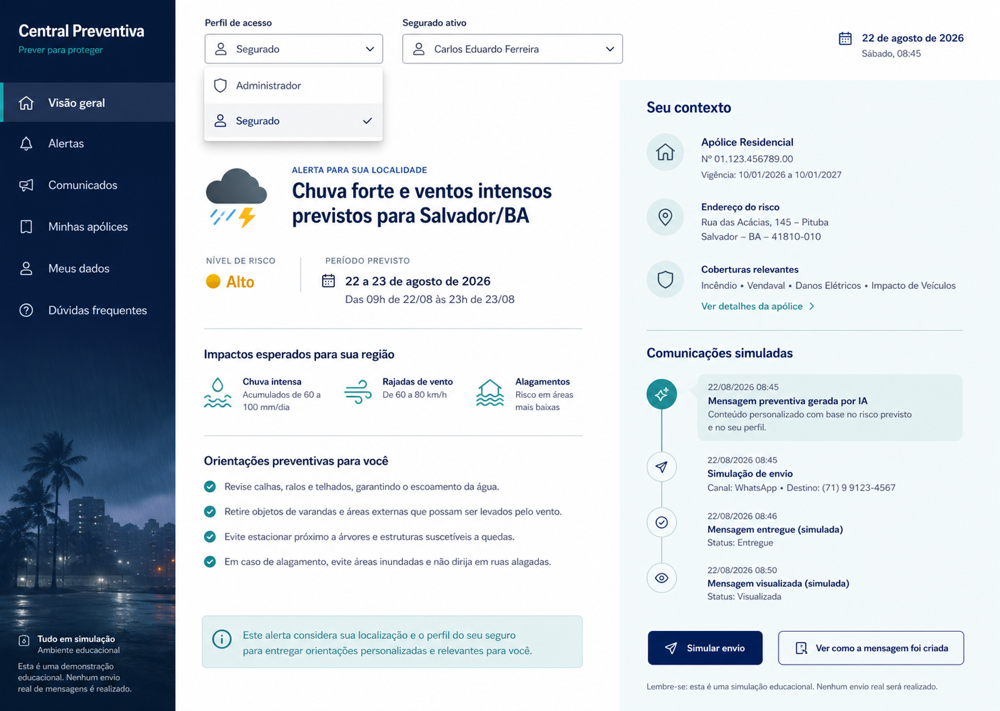

## 2. Monitoramento climático do administrador

Tela inicial do perfil **Administrador**. Centraliza os eventos climáticos detectados automaticamente a partir de uma fonte pública de dados meteorológicos.

O mapa facilita a identificação das regiões afetadas, enquanto o painel lateral apresenta a severidade, a fonte, o período previsto e o andamento do processamento automático: coleta dos dados, identificação do evento, aplicação da regra, seleção do público e preparação da mensagem.

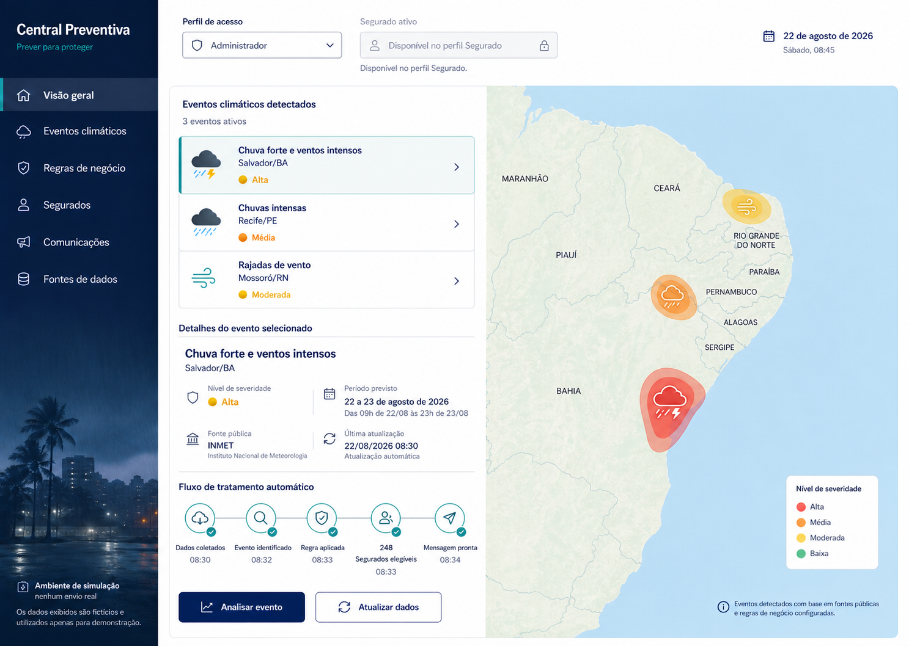

## 3. Análise do evento, aplicação da regra e seleção do público

Detalha um evento climático selecionado e torna a decisão do sistema auditável. A tela relaciona as evidências meteorológicas às condições da regra de negócio e mostra quais critérios foram atendidos.

Como resultado, apresenta a quantidade de segurados elegíveis e uma prévia do público selecionado, incluindo localização, tipo de apólice, canal preferencial e motivo da elegibilidade.

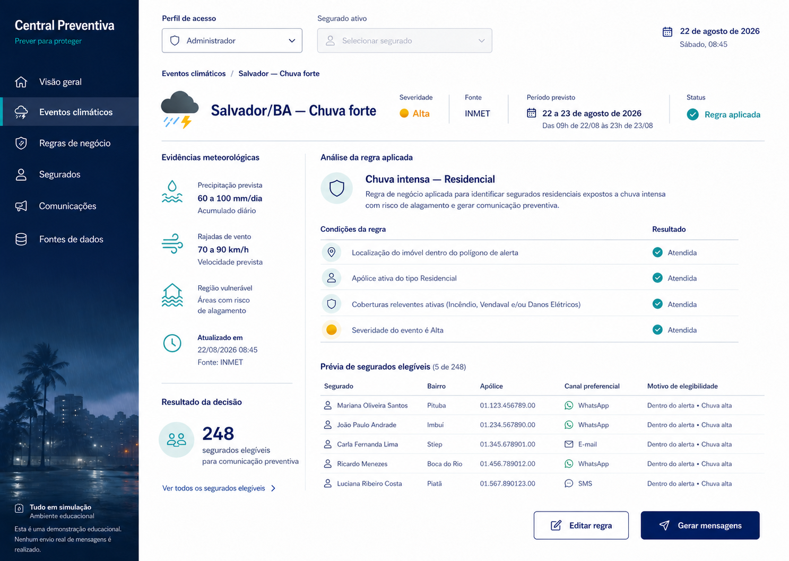

## 4. Geração e revisão das mensagens personalizadas

Tela utilizada pelo Administrador para revisar as mensagens geradas por IA antes da simulação do envio.

Permite navegar pelos destinatários, conferir o conteúdo personalizado, regenerar uma mensagem e verificar quais dados foram considerados: evento, localização, apólice, coberturas e canal preferencial. Também apresenta verificações de segurança, como tom preventivo e ausência de promessa de cobertura.

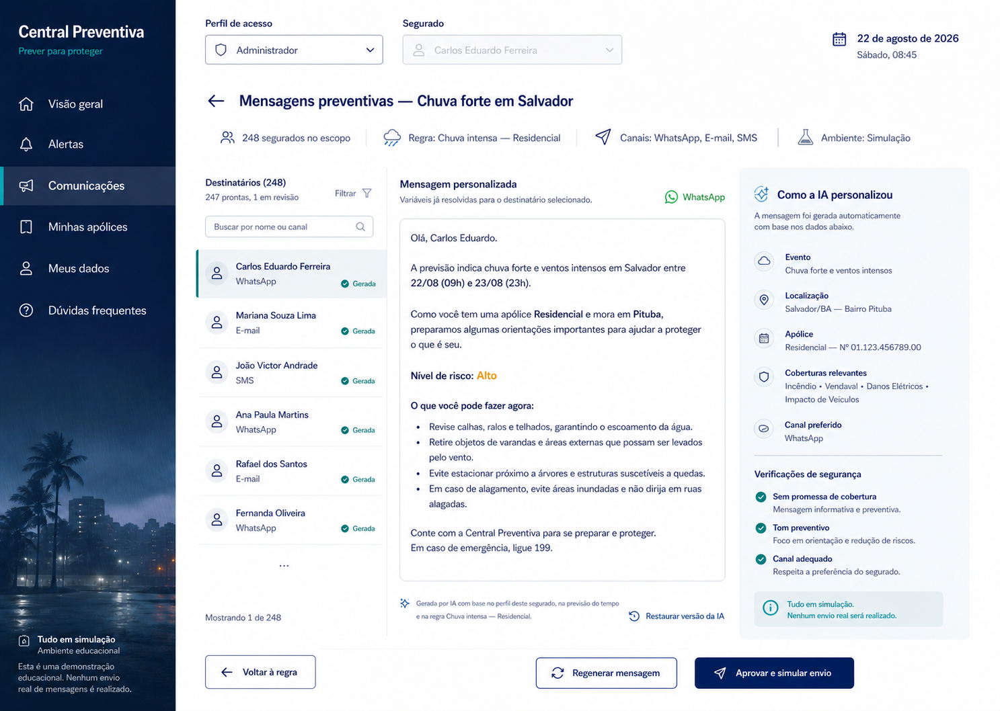

## 5. Confirmação do envio simulado

Estado de confirmação exibido antes de iniciar a simulação. Resume o evento, a regra aplicada, a quantidade de destinatários e a distribuição das mensagens entre WhatsApp, e-mail e SMS.

A interface deixa explícito que nenhuma mensagem real será enviada. O usuário precisa reconhecer essa condição antes de iniciar a simulação.

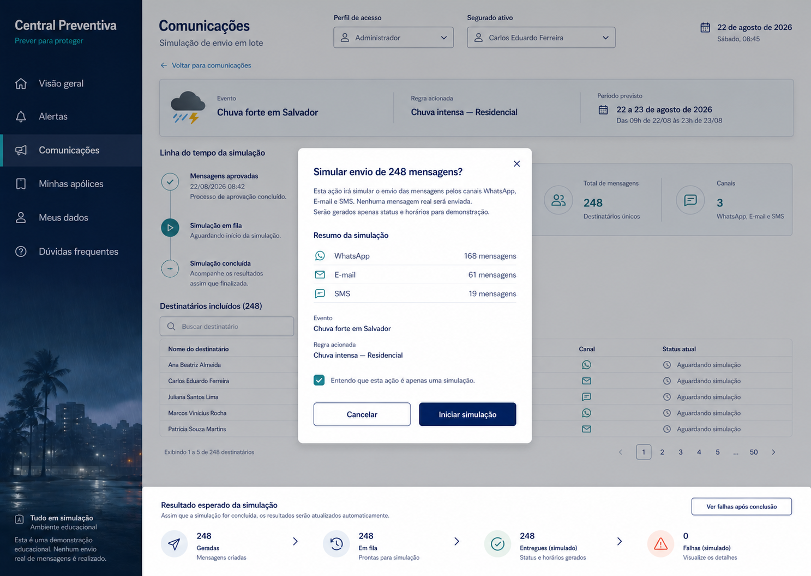

## 6. Resultado da simulação e tratamento de falhas

Apresenta os resultados consolidados da simulação: mensagens geradas, processadas, entregues e com falha.

O Administrador pode filtrar e pesquisar destinatários, consultar o status individual, visualizar a mensagem correspondente e inspecionar falhas simuladas. A tela também oferece ações para corrigir dados, repetir a simulação e exportar um relatório dos resultados.

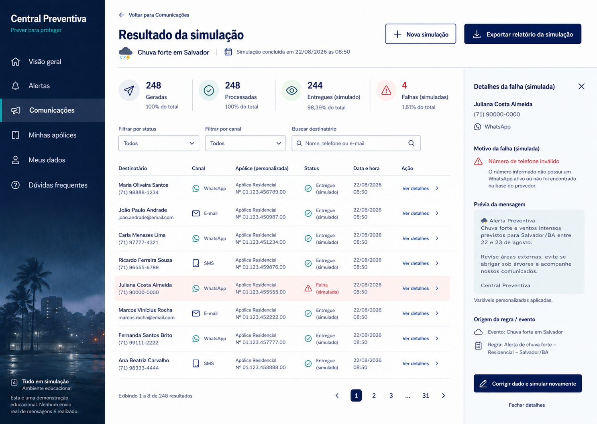

## 7. Seleção do segurado ativo

Interação disponível no perfil **Segurado** para escolher qual pessoa fictícia será utilizada na demonstração.

O seletor permite pesquisar pelo nome e informa a cidade e o tipo de apólice de cada opção. Ao trocar o segurado, o painel atualiza os alertas, a apólice, as recomendações e o histórico de comunicações apresentados. A alteração afeta somente os dados exibidos na simulação.

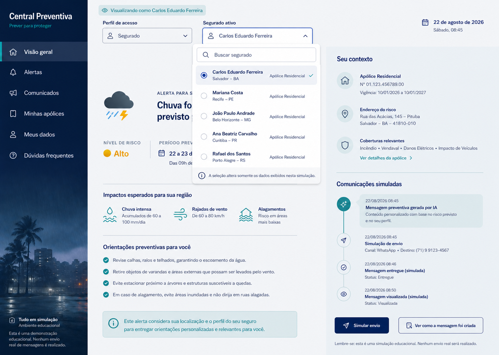

## 8. Central de alertas do segurado

Reúne os alertas ativos e anteriores do segurado selecionado. O detalhe do alerta apresenta severidade, período previsto, impactos para a região, localização do risco, recomendações preventivas, coberturas relacionadas e fonte meteorológica.

A linha do tempo lateral mostra a geração da mensagem, a simulação do envio, a entrega e a visualização. A partir desta tela também é possível consultar a apólice ou entender como a mensagem foi criada.

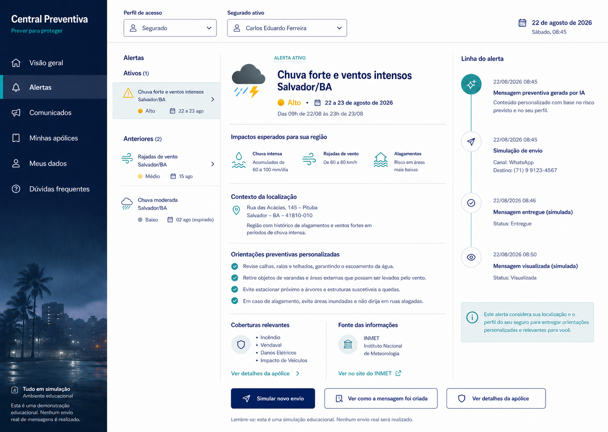

## 9. Explicação da mensagem gerada por IA

Painel de transparência destinado ao segurado. Explica, em linguagem simples, as quatro etapas usadas para produzir a comunicação: dados meteorológicos, regra de negócio, personalização por IA e envio simulado.

A tela identifica a fonte dos dados e a regra aplicada, apresenta uma prévia da mensagem e esclarece quais categorias de informações sensíveis não foram utilizadas.

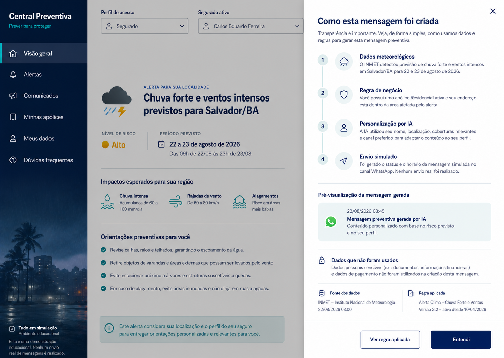

## 10. Detalhes da apólice

Apresenta as informações da apólice vinculada ao segurado ativo: vigência, endereço do risco, coberturas relevantes e preferências de comunicação.

Uma seção específica explica como o tipo e o status da apólice, a localização do risco e as coberturas são considerados pelas regras dos alertas. A tela também conecta a apólice ao alerta meteorológico mais recente.

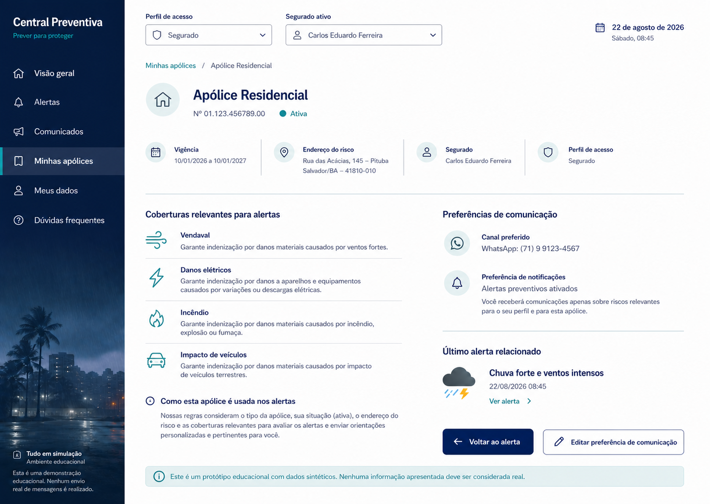

## 11. Edição da regra de negócio

Tela administrativa para configurar as condições que determinam quando uma comunicação preventiva deve ser gerada.

O formulário organiza a regra em três partes: características do evento, público elegível e estratégia de comunicação. Um resumo em linguagem natural permite revisar o comportamento configurado, enquanto a estimativa de segurados elegíveis e o teste com o evento atual apoiam a validação antes de salvar.

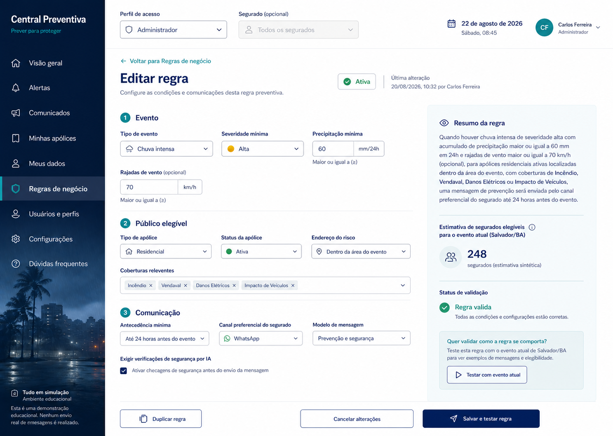

## 12. Monitoramento da fonte meteorológica

Tela auxiliar para acompanhar a integração com a fonte pública de dados meteorológicos. O exemplo representa um estado de instabilidade na conexão com o INMET.

O sistema informa a última atualização válida, a tentativa mais recente, o próximo processamento automático e o histórico de sincronizações. Durante a indisponibilidade, os dados em cache permanecem visíveis, mas novos alertas não são criados. O Administrador pode tentar novamente ou utilizar um cenário de demonstração.

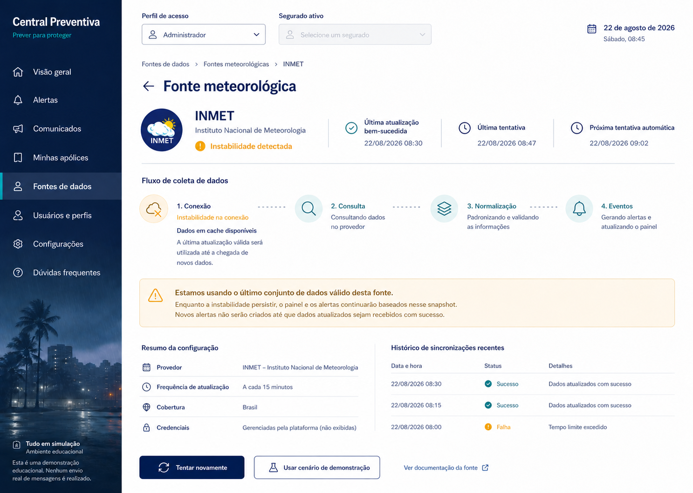

## Fluxo principal resumido

1. O Administrador monitora os eventos climáticos detectados.
2. O sistema analisa o evento e aplica as regras de negócio.
3. Os segurados elegíveis são identificados automaticamente.
4. A IA gera mensagens personalizadas para cada destinatário.
5. O Administrador revisa e aprova as mensagens.
6. O envio é simulado nos canais configurados.
7. Os resultados e eventuais falhas ficam disponíveis para consulta.
8. No perfil Segurado, é possível selecionar uma pessoa fictícia e visualizar sua experiência personalizada.
